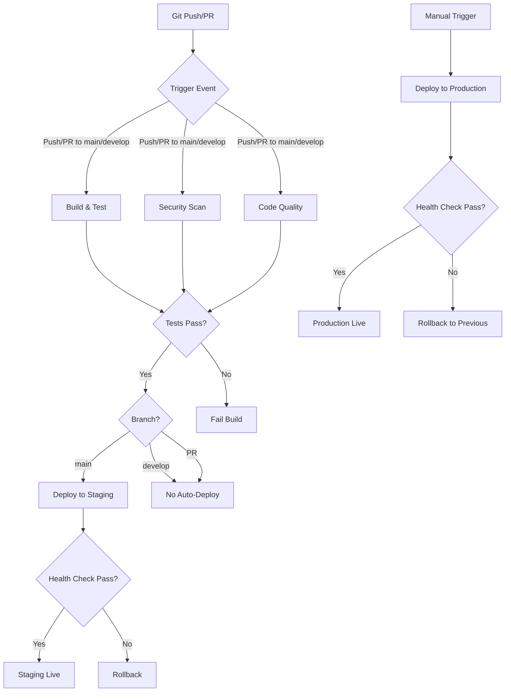

# CI/CD Pipeline Guide

## Overview

The SunnySeat CI/CD pipeline automates building, testing, security scanning, and deployment using GitHub Actions. This guide explains the pipeline architecture, workflows, and how to use them effectively.

## Pipeline Architecture



## Workflows

### 1. Build and Test (`build-and-test.yml`)

**Triggers:**

- Push to `main` or `develop` branches
- Pull requests to `main` or `develop`

**Jobs:**

#### Test Job

- Sets up .NET 8 environment
- Spins up PostgreSQL 15 + PostGIS 3.4 service container
- Spins up Redis 7 service container
- Restores NuGet dependencies (with caching)
- Builds solution in Release configuration
- Initializes test database with PostGIS extensions
- Runs database migrations
- Executes all tests (unit + integration)
- Uploads test results as artifacts

**Environment Variables:**

- `DOTNET_VERSION: 8.0.x`
- `ConnectionStrings__DefaultConnection` - Test database connection
- `ASPNETCORE_ENVIRONMENT: Testing`

**Duration:** ~4-6 minutes

**Cache Strategy:**

- NuGet packages cached using hash of all `.csproj` files
- Cache key: `${{ runner.os }}-nuget-${{ hashFiles('**/*.csproj') }}`

### 2. Security Scan (`build-and-test.yml` - security-scan job)

**Triggers:** After successful build (runs in parallel with tests)

**Actions:**

- Scans all NuGet packages for known vulnerabilities
- Checks transitive dependencies
- Uses `dotnet list package --vulnerable --include-transitive`
- Fails build if critical vulnerabilities found

**Duration:** ~1-2 minutes

### 3. Code Quality (`build-and-test.yml` - code-quality job)

**Triggers:** After successful build (runs in parallel)

**Actions:**

- Runs `dotnet format --verify-no-changes` to check code formatting
- Executes .NET analyzers and code style rules
- Fails if formatting issues or style violations detected

**Duration:** ~2-3 minutes

### 4. Architecture Tests (`build-and-test.yml` - part of test job)

**Actions:**

- Runs `ArchitectureComplianceTests.cs`
- Validates project references follow layered architecture
- Ensures Core has no external dependencies
- Checks Data layer doesn't reference API layer
- Enforces dependency direction rules

### 5. Deploy to Staging (`deploy-staging.yml`)

**Triggers:**

- Automatic on push to `main` branch
- After successful build-and-test workflow

**Environment:** `staging`

**Steps:**

1. Checkout code
2. Setup .NET 8
3. Publish application (`dotnet publish`)
4. Azure Login using `AZURE_CREDENTIALS` secret
5. Deploy to Azure Web App (`sunnyseat-staging`)
6. Run health check against staging endpoint
7. If health check fails, automatic rollback

**Secrets Required:**

- `AZURE_CREDENTIALS` - Service principal for Azure authentication
- Configured in GitHub Settings > Secrets and variables > Actions

**Duration:** ~3-5 minutes

**Staging URL:** `https://sunnyseat-staging.azurewebsites.net`

### 6. Deploy to Production (`deploy-production.yml`)

**Triggers:**

- Manual workflow dispatch only
- Requires manual approval in GitHub UI

**Environment:** `production` (with protection rules)

**Steps:**

1. Checkout code
2. Setup .NET 8
3. Publish application
4. Azure Login
5. Deploy to production slot (`sunnyseat-production-slot`)
6. Run health check against staging slot
7. If healthy, swap staging slot to production
8. If swap fails, automatic rollback
9. Final health check on production

**Deployment Strategy:** Blue/Green deployment using Azure deployment slots

**Secrets Required:**

- `AZURE_CREDENTIALS`
- `AZURE_PROD_PUBLISH_PROFILE` (optional)

**Duration:** ~5-7 minutes

**Production URL:** `https://sunnyseat.azurewebsites.net`

**Approval Required:** Yes - configured in GitHub Environment settings

### 7. Deploy Frontend (`deploy-frontend.yml`)

**Triggers:**

- Push to `main` branch with changes in `src/frontend/**`
- Manual workflow dispatch

**Steps:**

1. Checkout code
2. Setup Node.js 20
3. Install dependencies (`npm ci`)
4. Build frontend (`npm run build`)
5. Deploy static files to Azure Static Web Apps

**Duration:** ~3-4 minutes

### 8. Lighthouse CI (`lighthouse-ci.yml`)

**Triggers:**

- Pull requests that modify frontend code
- Scheduled nightly runs

**Actions:**

- Builds frontend application
- Runs Lighthouse performance audits
- Reports performance scores, accessibility, best practices, SEO
- Posts results as PR comment

**Thresholds:**

- Performance: ≥90
- Accessibility: ≥95
- Best Practices: ≥90
- SEO: ≥90

**Duration:** ~5-8 minutes

## Interpreting Build Results

### ✅ Successful Build

All jobs show green checkmarks:

- ✓ Build and Test
- ✓ Security Scan
- ✓ Code Quality
- ✓ (If main branch) Deploy to Staging

**Next Steps:**

- For PRs: Request code review, merge when approved
- For main branch: Verify staging deployment, prepare for production release

### ❌ Failed Build

#### Test Failures

**Indicators:**

- Red X on "Build and Test" job
- Error in test execution step
- Test results show failures

**Actions:**

1. Click on failed job
2. Expand "Run unit tests" step
3. Review failed test output
4. Download test results artifact for detailed analysis
5. Fix failing tests locally
6. Push fix and re-run pipeline

#### Build Failures

**Indicators:**

- Red X on "Build solution" step
- Compilation errors in logs

**Actions:**

1. Review compilation errors in job logs
2. Ensure code compiles locally: `dotnet build`
3. Check for missing dependencies or broken references
4. Fix compilation errors
5. Push fix

#### Security Vulnerabilities

**Indicators:**

- Red X on "Security Scan" job
- Vulnerable packages listed

**Actions:**

1. Review vulnerable packages and CVE details
2. Update packages: `dotnet add package <PackageName> --version <SafeVersion>`
3. Run `dotnet list package --vulnerable` locally to verify
4. Push updated `.csproj` files

#### Code Quality Issues

**Indicators:**

- Red X on "Code Quality" job
- Formatting or style violations

**Actions:**

1. Run `dotnet format` locally to auto-fix formatting
2. Review analyzer warnings and fix manually
3. Commit formatting changes
4. Push fix

#### Deployment Failures

**Indicators:**

- Red X on "Deploy to Staging/Production" job
- Health check failures
- Azure deployment errors

**Actions:**

1. Check Azure Portal for application logs
2. Verify Azure services are running
3. Check health endpoint manually
4. Review deployment logs in GitHub Actions
5. See [Troubleshooting Guide](ci-cd-troubleshooting.md) for common issues

## Adding New Jobs to Pipeline

### Example: Adding a New Test Category

1. **Modify test execution in `build-and-test.yml`:**

```yaml
- name: Run performance tests
  run: dotnet test --no-build --configuration Release --filter "Category=Performance" --logger trx
  env:
    ConnectionStrings__DefaultConnection: "Host=localhost;Database=sunnyseat_test;Username=postgres;Password=postgres"
```

2. **Add corresponding test class:**

```csharp
[Trait("Category", "Performance")]
public class PerformanceTests
{
    [Fact]
    public void Api_ShouldRespondWithin200ms()
    {
        // Test implementation
    }
}
```

### Example: Adding Static Analysis Tool

1. **Add new job to `build-and-test.yml`:**

```yaml
sonarqube:
  name: SonarQube Analysis
  runs-on: ubuntu-latest
  needs: build

  steps:
    - uses: actions/checkout@v4

    - name: SonarQube Scan
      uses: sonarsource/sonarcloud-github-action@master
      env:
        GITHUB_TOKEN: ${{ secrets.GITHUB_TOKEN }}
        SONAR_TOKEN: ${{ secrets.SONAR_TOKEN }}
```

2. **Add `SONAR_TOKEN` to repository secrets**

3. **Create `sonar-project.properties` configuration file**

## Branch Strategy & Deployment Flow

### Development Branch (`develop`)

- Feature branches merge here
- CI runs build, test, security, quality checks
- **No automatic deployment**
- Used for integration testing before merging to main

### Main Branch (`main`)

- Only accepts PRs from `develop` or hotfix branches
- Represents staging-ready code
- **Automatically deploys to staging environment**
- Staging serves as pre-production validation

### Production Deployment

- **Manual trigger only** via GitHub Actions UI
- Navigate to Actions > Deploy to Production > Run workflow
- Requires approval from designated approvers
- Uses blue/green deployment with automatic rollback

### Recommended Flow

```
feature/xyz → develop → PR → main → auto-deploy staging → manual approve → production
```

## Monitoring & Observability

### Build Status

- View all workflow runs: Repository > Actions tab
- Filter by workflow, branch, or status
- Download artifacts (test results, coverage reports)

### Performance Metrics

- Lighthouse CI results posted to PRs
- Frontend performance tracked over time
- Alerts on performance regression

### Deployment Health

- Staging health check: `https://sunnyseat-staging.azurewebsites.net/health`
- Production health check: `https://sunnyseat.azurewebsites.net/health`
- Azure Application Insights for detailed monitoring

## Secrets Management

### Required GitHub Secrets

| Secret Name                    | Description                                     | Used By           |
| ------------------------------ | ----------------------------------------------- | ----------------- |
| `AZURE_CREDENTIALS`            | Service principal JSON for Azure authentication | Deploy workflows  |
| `AZURE_WEBAPP_PUBLISH_PROFILE` | Staging publish profile (optional)              | Deploy Staging    |
| `AZURE_PROD_PUBLISH_PROFILE`   | Production publish profile (optional)           | Deploy Production |

### Setting Up Azure Credentials

1. Create Azure Service Principal:

```bash
az ad sp create-for-rbac \
  --name "github-actions-sunnyseat" \
  --role contributor \
  --scopes /subscriptions/{subscription-id}/resourceGroups/{resource-group} \
  --sdk-auth
```

2. Copy JSON output
3. Add to GitHub: Settings > Secrets and variables > Actions > New repository secret
4. Name: `AZURE_CREDENTIALS`, Value: (paste JSON)

### Security Best Practices

- ✅ Never commit secrets to source control
- ✅ Rotate secrets every 90 days
- ✅ Use least-privilege service principals
- ✅ Enable GitHub secret scanning
- ✅ Use environment-specific secrets for staging vs production

## Cache Management

### What's Cached

- **NuGet packages** - Significantly speeds up restore
- **Node modules** (frontend) - Faster npm install

### Cache Invalidation

Cache automatically invalidates when:

- `.csproj` files change (NuGet cache)
- `package-lock.json` changes (npm cache)

### Manual Cache Clear

If you suspect cache corruption:

1. Go to Actions tab
2. Click "Caches" in left sidebar
3. Find and delete problematic cache
4. Re-run workflow to rebuild cache

## Performance Optimization

### Current Pipeline Performance

- Build & Test: ~4-6 minutes
- Security Scan: ~1-2 minutes (parallel)
- Code Quality: ~2-3 minutes (parallel)
- Deploy to Staging: ~3-5 minutes
- **Total (main branch):** ~8-11 minutes

### Optimization Tips

1. **Leverage caching** - Already implemented for NuGet
2. **Parallel jobs** - Independent jobs run concurrently
3. **Conditional steps** - Skip unnecessary steps based on file changes
4. **Matrix builds** - Only if testing multiple .NET versions needed
5. **Self-hosted runners** - Consider for very high build volume

## Workflow Customization

### Changing Workflow Triggers

Edit `.github/workflows/*.yml` trigger section:

```yaml
on:
  push:
    branches: [main, develop]
    paths:
      - "src/**" # Only trigger on source code changes
  pull_request:
    branches: [main]
```

### Adding Environment Variables

```yaml
env:
  CUSTOM_VAR: "value"

jobs:
  build:
    env:
      JOB_SPECIFIC_VAR: "value"
```

### Conditional Job Execution

```yaml
jobs:
  deploy:
    if: github.ref == 'refs/heads/main'
    runs-on: ubuntu-latest
```

## Best Practices

### For Developers

1. ✅ **Run tests locally** before pushing
2. ✅ **Check build status** before requesting PR review
3. ✅ **Fix failing builds immediately** - don't merge over failures
4. ✅ **Keep commits small** - easier to identify build-breaking changes
5. ✅ **Review test results** even for passing builds (flaky tests)

### For DevOps

1. ✅ **Monitor workflow execution times** - optimize slow jobs
2. ✅ **Keep workflows DRY** - use reusable workflows for common tasks
3. ✅ **Version pin actions** - avoid breaking changes from action updates
4. ✅ **Set up notifications** - Slack/Teams integration for failed builds
5. ✅ **Regular security audits** - review secrets, permissions, dependencies

## Related Documentation

- [Troubleshooting Guide](ci-cd-troubleshooting.md) - Common issues and solutions
- [Architecture Guide](../architecture.md) - System design and architecture
- [Development Setup](../../README-Development.md) - Local development environment
- [GitHub Actions Documentation](https://docs.github.com/en/actions) - Official GitHub Actions docs

## Support

For pipeline issues:

1. Check [Troubleshooting Guide](ci-cd-troubleshooting.md)
2. Review workflow logs in GitHub Actions
3. Contact DevOps team: [devops@example.com]
4. Create issue: [GitHub Issues](https://github.com/your-org/sunnyseat/issues)
