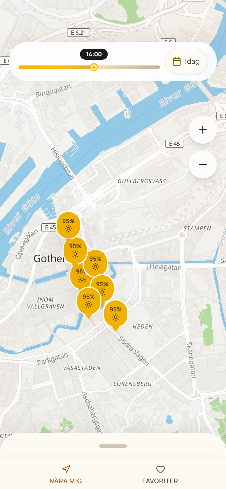
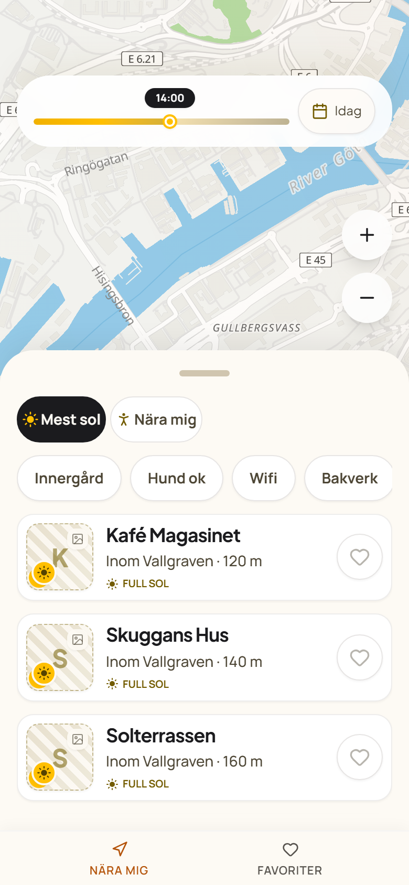
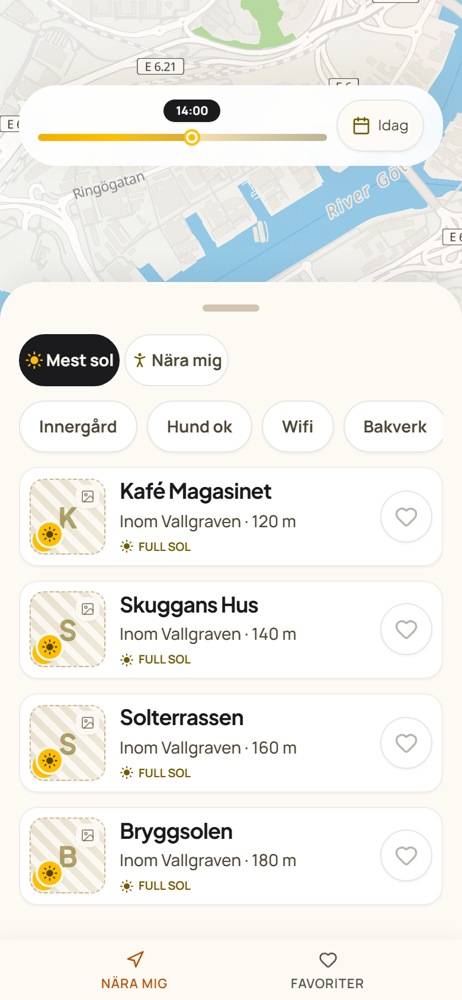
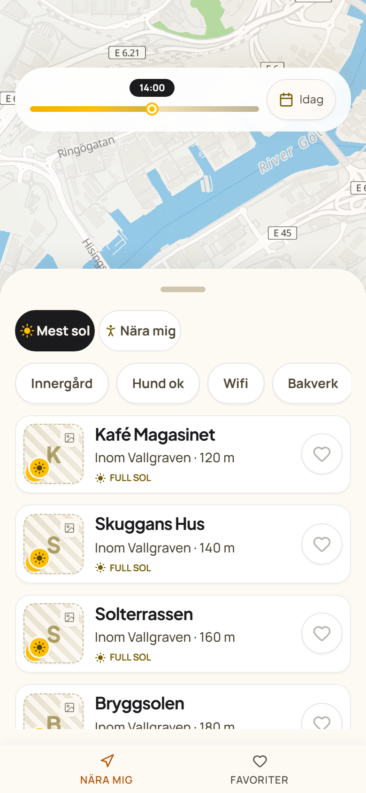

# Story 12.9 non-authoritative slider/date candidate captures

Captured 2026-07-24T13:56:24.412Z from the running SunnySeat implementation. These files are **candidate review evidence only**. They do not replace or bless any authoritative reference PNG.

## Capture environment

- Application command: `npm run dev` from `C:\Users\Rasmus\sunnyseat\nextjs-app` when no reusable server was already answering.
- Capture origin and port: `http://localhost:3000`
- Dev server: started by this script (pid 23708; logs `dev-server.stdout.log`, `dev-server.stderr.log`)
- Browser: Windows-native Playwright Chromium, headless
- Locale: `sv-SE`; `Accept-Language: sv-SE,sv;q=0.9`; `html[lang]` recorded per page
- Time zone: `Europe/Stockholm`
- Motion/color: reduced motion, light color scheme, screenshot animations disabled
- Active target viewport: mobile `390x844` at device scale factor 2.
- Onboarding: no preseeded localStorage; if the first-visit overlay appears, the script dismisses it through the product skip CTA after hydration and records any hydration pageError as a product observation.
- Data seam: Playwright `page.route('**/api/venues?**')` fulfills a deterministic 7-venue DTO response, matching the existing Epic 10/11 E2E convention and avoiding the transient hydration-seed `2026-05-20` API request during screenshot capture.
- Readiness: `domcontentloaded`, best-effort `networkidle`, font readiness, explicit product selectors, and a 1s settle before screenshot. The Next development portal was hidden as non-product chrome.
- Scope: Story 12.9 slider/date refinement plus row-count bottom sheet regression evidence. No canonical reference PNG was overwritten.

## Candidate inventory and reference comparison

| Viewport | Screen ID | Variant | Route | Candidate | PNG dimensions | Bytes | Candidate SHA-256 | Reference exists | Candidate vs reference SHA | Reference SHA-256 | Status |
|---|---|---|---|---|---:|---:|---|---|---|---|---|
| mobile | `map-primary` | `slim-slider-date-pill` | `/?_state=map-primary&_time=14:00` | `mobile-map-primary-slim-slider-date-pill.png` | 780x1688 | 838414 | `3a3beb45f26229c87cf4106e775748a30cf24d3644ee604024e12acd2161392a` | yes | different | `74b6685f267b9d4e578b99be7dfded6d3973d9bbf071fc7beeb54c2fdaca6c97` | captured |
| mobile | `map-panel-venues` | `rows-3` | `/?_state=map-panel-venues&_time=14:00&_sheetRows=3` | `mobile-map-panel-venues-rows-3.png` | 780x1688 | 450154 | `ea182e52412071c0588d78952e168206c0060b689fdcab8a42ecae78829cd1d3` | yes | different | `5b168fac021deb8e0b3e9567fa9fa8d4adf4837fee772cceb1f26ade3e98d3c6` | captured |
| mobile | `map-panel-venues` | `rows-max` | `/?_state=map-panel-venues&_time=14:00&_sheetRows=max` | `mobile-map-panel-venues-rows-max.png` | 780x1688 | 393802 | `cb91ee8fde17c16151623911fe362a55ba5f2ba3ef0d61d6e425b730bbf819f6` | yes | different | `5b168fac021deb8e0b3e9567fa9fa8d4adf4837fee772cceb1f26ade3e98d3c6` | captured |
| mobile | `map-panel-venues` | `mid-drag` | `/?_state=map-panel-venues&_time=14:00&_sheetDrag=mid` | `mobile-map-panel-venues-mid-drag.png` | 780x1688 | 425126 | `68fdb158f749a1da6cacc5df36f805d45e6f0e3c8446f6fa21019da94e0700ad` | yes | different | `5b168fac021deb8e0b3e9567fa9fa8d4adf4837fee772cceb1f26ade3e98d3c6` | captured |

## Result

- Captured: 4
- Failed/assertion-failed: 0
- Canonical refs promoted: 0
- Product errors observed: 0 console errors, 0 page errors, 0 HTTP >=400 responses, 0 failed requests.
- Non-failing warnings observed may include Motion's reduced-motion diagnostic plus MapLibre/WebGL screenshot-time warnings. These are browser/library capture noise; product request/page failures are treated as capture failures.

All candidate captures satisfied their DOM assertions before screenshot write.

## Per-target evidence

### mobile/map-primary/slim-slider-date-pill

- Route: `/?_state=map-primary&_time=14:00`
- URL: `http://localhost:3000/?_state=map-primary&_time=14:00`
- Candidate: `mobile-map-primary-slim-slider-date-pill.png`
- Reference compared: `C:\Users\Rasmus\sunnyseat\nextjs-app\docs\design\references\screens\mobile\map-primary.png`
- HTML lang: `sv`
- Status: `captured`

Assertions:
  - map visible: true
  - visible pin count: 7
  - planner visible and sized: {"box":{"x":16,"y":72,"width":358,"height":68},"className":"z-glass-panel bg-glass-slider text-text-primary backdrop-blur-heavy rounded-panel px-4 py-3 shadow-card-up lg:hidden absolute left-4 right-4 top-[calc(env(safe-area-inset-top)+var(--spacing)*18)]"}
  - mobile date trigger: {"box":{"x":284.109375,"y":84,"width":73.890625,"height":44},"svgCount":1,"nextVisible":0,"dateText":"Idag","ariaHaspopup":"dialog","ariaExpanded":"false"}
  - mobile slider geometry: {"track":{"x":32,"y":113,"width":244.109375,"height":6},"thumb":{"x":155.140625,"y":108.953125,"width":14.09375,"height":14.09375},"badge":{"x":138.1875,"y":84,"width":48,"height":19},"hit":{"x":32,"y":84,"width":244.109375,"height":44},"clearance":5.953125}
  - mobile row sheet state: {"visibleRows":0,"maxRows":4,"rowHeight":96,"sheetHeight":44,"attrs":{"state":"rows-0","visibleRows":"0","maxRows":"4","rowHeight":"96","sheetHeight":"44","dragging":"false","className":"absolute inset-x-0 bottom-[calc(var(--size-mobile-nav-h)+env(safe-area-inset-bottom))] z-bottom-sheet-peek flex flex-col overflow-hidden rounded-t-panel bg-surface-cream text-text-primary shadow-sheet-peek-up lg:hidden touch-pan-y","style":"height: 44px; max-height: 554px; opacity: 1;"},"bodyAttrs":{"ariaHidden":"true","inert":true,"className":"min-h-0 flex-1 px-4 pb-4 pointer-events-none","rect":{"width":390,"height":16}},"chromeBox":{"x":16,"y":792,"width":358,"height":112},"scrollBodyBox":{"x":16,"y":904,"width":358,"height":0},"sheetBox":{"x":0,"y":748,"width":390,"height":44},"navBox":{"x":0,"y":792,"width":390,"height":52}}
  - map controls sheet-overlap state: {"overlap":"false","ariaHidden":null,"inert":false,"opacity":"1","pointerEvents":"auto","rect":{"top":200,"bottom":308,"height":108},"measuredCovered":false}

Assertion failures:
  - none

Console/page/request/HTTP observations:
  - console: 8
    - {"type":"warning","text":"You have Reduced Motion enabled on your device. Animations may not appear as expected.. For more information and steps for solving, visit https://motion.dev/troubleshooting/reduced-motion-disabled"}
    - {"type":"warning","text":"[.WebGL-0x2c02833600]GL Driver Message (OpenGL, Performance, GL_CLOSE_PATH_NV, High): GPU stall due to ReadPixels"}
    - {"type":"warning","text":"[.WebGL-0x2c02833600]GL Driver Message (OpenGL, Performance, GL_CLOSE_PATH_NV, High): GPU stall due to ReadPixels"}
    - {"type":"warning","text":"[.WebGL-0x2c02833600]GL Driver Message (OpenGL, Performance, GL_CLOSE_PATH_NV, High): GPU stall due to ReadPixels"}
    - {"type":"warning","text":"[.WebGL-0x2c02833600]GL Driver Message (OpenGL, Performance, GL_CLOSE_PATH_NV, High): GPU stall due to ReadPixels (this message will no longer repeat)"}
    - {"type":"warning","text":"Expected value to be of type number, but found null instead."}
    - {"type":"warning","text":"Expected value to be of type number, but found null instead."}
    - {"type":"warning","text":"Expected value to be of type number, but found null instead."}

### mobile/map-panel-venues/rows-3

- Route: `/?_state=map-panel-venues&_time=14:00&_sheetRows=3`
- URL: `http://localhost:3000/?_state=map-panel-venues&_time=14:00&_sheetRows=3`
- Candidate: `mobile-map-panel-venues-rows-3.png`
- Reference compared: `C:\Users\Rasmus\sunnyseat\nextjs-app\docs\design\references\screens\mobile\map-panel-venues.png`
- HTML lang: `sv`
- Status: `captured`

Assertions:
  - map visible: true
  - visible pin count: 7
  - planner visible and sized: {"box":{"x":16,"y":72,"width":358,"height":68},"className":"z-glass-panel bg-glass-slider text-text-primary backdrop-blur-heavy rounded-panel px-4 py-3 shadow-card-up lg:hidden absolute left-4 right-4 top-[calc(env(safe-area-inset-top)+var(--spacing)*18)]"}
  - mobile date trigger: {"box":{"x":284.109375,"y":84,"width":73.890625,"height":44},"svgCount":1,"nextVisible":0,"dateText":"Idag","ariaHaspopup":"dialog","ariaExpanded":"false"}
  - mobile slider geometry: {"track":{"x":32,"y":113,"width":244.109375,"height":6},"thumb":{"x":155.140625,"y":108.953125,"width":14.09375,"height":14.09375},"badge":{"x":138.1875,"y":84,"width":48,"height":19},"hit":{"x":32,"y":84,"width":244.109375,"height":44},"clearance":5.953125}
  - mobile row sheet state: {"visibleRows":3,"maxRows":4,"rowHeight":96,"sheetHeight":459,"rowVisibility":{"fullyVisible":3,"partiallyVisible":3,"rows":[{"index":0,"visible":true,"overlaps":true,"fullyVisible":true,"rect":{"top":489.5,"bottom":573,"height":83.5}},{"index":1,"visible":true,"overlaps":true,"fullyVisible":true,"rect":{"top":585,"bottom":668.5,"height":83.5}},{"index":2,"visible":true,"overlaps":true,"fullyVisible":true,"rect":{"top":680.5,"bottom":764,"height":83.5}},{"index":3,"visible":true,"overlaps":false,"fullyVisible":false,"rect":{"top":776,"bottom":859.5,"height":83.5}},{"index":4,"visible":true,"overlaps":false,"fullyVisible":false,"rect":{"top":871.5,"bottom":955,"height":83.5}},{"index":5,"visible":true,"overlaps":false,"fullyVisible":false,"rect":{"top":967,"bottom":1050.5,"height":83.5}},{"index":6,"visible":true,"overlaps":false,"fullyVisible":false,"rect":{"top":1062.5,"bottom":1146,"height":83.5}},{"index":7,"visible":false,"overlaps":false,"fullyVisible":false,"rect":{"top":0,"bottom":0,"height":0}},{"index":8,"visible":false,"overlaps":false,"fullyVisible":false,"rect":{"top":0,"bottom":0,"height":0}},{"index":9,"visible":false,"overlaps":false,"fullyVisible":false,"rect":{"top":0,"bottom":0,"height":0}},{"index":10,"visible":false,"overlaps":false,"fullyVisible":false,"rect":{"top":0,"bottom":0,"height":0}},{"index":11,"visible":false,"overlaps":false,"fullyVisible":false,"rect":{"top":0,"bottom":0,"height":0}},{"index":12,"visible":false,"overlaps":false,"fullyVisible":false,"rect":{"top":0,"bottom":0,"height":0}},{"index":13,"visible":false,"overlaps":false,"fullyVisible":false,"rect":{"top":0,"bottom":0,"height":0}}]},"attrs":{"state":"rows-3","visibleRows":"3","maxRows":"4","rowHeight":"96","sheetHeight":"459","dragging":"false","className":"absolute inset-x-0 bottom-[calc(var(--size-mobile-nav-h)+env(safe-area-inset-bottom))] z-bottom-sheet-peek flex flex-col overflow-hidden rounded-t-panel bg-surface-cream text-text-primary shadow-sheet-peek-up lg:hidden touch-pan-y","style":"height: 458.5px; max-height: 554px; opacity: 1;"},"bodyAttrs":{"ariaHidden":"false","inert":false,"className":"min-h-0 flex-1 px-4 pb-4","rect":{"width":390,"height":414.5}},"chromeBox":{"x":16,"y":377.5,"width":358,"height":112},"scrollBodyBox":{"x":16,"y":489.5,"width":358,"height":286.5},"sheetBox":{"x":0,"y":333.5,"width":390,"height":458.5},"navBox":{"x":0,"y":792,"width":390,"height":52}}
  - map controls sheet-overlap state: {"overlap":"false","ariaHidden":null,"inert":false,"opacity":"1","pointerEvents":"auto","rect":{"top":200,"bottom":308,"height":108},"measuredCovered":false}
  - venue row visibility geometry: {"fullyVisible":3,"partiallyVisible":3,"rows":[{"index":0,"visible":true,"overlaps":true,"fullyVisible":true,"rect":{"top":489.5,"bottom":573,"height":83.5}},{"index":1,"visible":true,"overlaps":true,"fullyVisible":true,"rect":{"top":585,"bottom":668.5,"height":83.5}},{"index":2,"visible":true,"overlaps":true,"fullyVisible":true,"rect":{"top":680.5,"bottom":764,"height":83.5}},{"index":3,"visible":true,"overlaps":false,"fullyVisible":false,"rect":{"top":776,"bottom":859.5,"height":83.5}},{"index":4,"visible":true,"overlaps":false,"fullyVisible":false,"rect":{"top":871.5,"bottom":955,"height":83.5}},{"index":5,"visible":true,"overlaps":false,"fullyVisible":false,"rect":{"top":967,"bottom":1050.5,"height":83.5}},{"index":6,"visible":true,"overlaps":false,"fullyVisible":false,"rect":{"top":1062.5,"bottom":1146,"height":83.5}},{"index":7,"visible":false,"overlaps":false,"fullyVisible":false,"rect":{"top":0,"bottom":0,"height":0}},{"index":8,"visible":false,"overlaps":false,"fullyVisible":false,"rect":{"top":0,"bottom":0,"height":0}},{"index":9,"visible":false,"overlaps":false,"fullyVisible":false,"rect":{"top":0,"bottom":0,"height":0}},{"index":10,"visible":false,"overlaps":false,"fullyVisible":false,"rect":{"top":0,"bottom":0,"height":0}},{"index":11,"visible":false,"overlaps":false,"fullyVisible":false,"rect":{"top":0,"bottom":0,"height":0}},{"index":12,"visible":false,"overlaps":false,"fullyVisible":false,"rect":{"top":0,"bottom":0,"height":0}},{"index":13,"visible":false,"overlaps":false,"fullyVisible":false,"rect":{"top":0,"bottom":0,"height":0}}]}

Assertion failures:
  - none

Console/page/request/HTTP observations:
  - console: 4
    - {"type":"warning","text":"You have Reduced Motion enabled on your device. Animations may not appear as expected.. For more information and steps for solving, visit https://motion.dev/troubleshooting/reduced-motion-disabled"}
    - {"type":"warning","text":"Expected value to be of type number, but found null instead."}
    - {"type":"warning","text":"Expected value to be of type number, but found null instead."}
    - {"type":"warning","text":"Expected value to be of type number, but found null instead."}

### mobile/map-panel-venues/rows-max

- Route: `/?_state=map-panel-venues&_time=14:00&_sheetRows=max`
- URL: `http://localhost:3000/?_state=map-panel-venues&_time=14:00&_sheetRows=max`
- Candidate: `mobile-map-panel-venues-rows-max.png`
- Reference compared: `C:\Users\Rasmus\sunnyseat\nextjs-app\docs\design\references\screens\mobile\map-panel-venues.png`
- HTML lang: `sv`
- Status: `captured`

Assertions:
  - map visible: true
  - visible pin count: 7
  - planner visible and sized: {"box":{"x":16,"y":72,"width":358,"height":68},"className":"z-glass-panel bg-glass-slider text-text-primary backdrop-blur-heavy rounded-panel px-4 py-3 shadow-card-up lg:hidden absolute left-4 right-4 top-[calc(env(safe-area-inset-top)+var(--spacing)*18)]"}
  - mobile date trigger: {"box":{"x":284.109375,"y":84,"width":73.890625,"height":44},"svgCount":1,"nextVisible":0,"dateText":"Idag","ariaHaspopup":"dialog","ariaExpanded":"false"}
  - mobile slider geometry: {"track":{"x":32,"y":113,"width":244.109375,"height":6},"thumb":{"x":155.140625,"y":108.953125,"width":14.09375,"height":14.09375},"badge":{"x":138.1875,"y":84,"width":48,"height":19},"hit":{"x":32,"y":84,"width":244.109375,"height":44},"clearance":5.953125}
  - mobile row sheet state: {"visibleRows":4,"maxRows":4,"rowHeight":96,"sheetHeight":554,"rowVisibility":{"fullyVisible":4,"partiallyVisible":4,"rows":[{"index":0,"visible":true,"overlaps":true,"fullyVisible":true,"rect":{"top":394,"bottom":477.5,"height":83.5}},{"index":1,"visible":true,"overlaps":true,"fullyVisible":true,"rect":{"top":489.5,"bottom":573,"height":83.5}},{"index":2,"visible":true,"overlaps":true,"fullyVisible":true,"rect":{"top":585,"bottom":668.5,"height":83.5}},{"index":3,"visible":true,"overlaps":true,"fullyVisible":true,"rect":{"top":680.5,"bottom":764,"height":83.5}},{"index":4,"visible":true,"overlaps":false,"fullyVisible":false,"rect":{"top":776,"bottom":859.5,"height":83.5}},{"index":5,"visible":true,"overlaps":false,"fullyVisible":false,"rect":{"top":871.5,"bottom":955,"height":83.5}},{"index":6,"visible":true,"overlaps":false,"fullyVisible":false,"rect":{"top":967,"bottom":1050.5,"height":83.5}},{"index":7,"visible":false,"overlaps":false,"fullyVisible":false,"rect":{"top":0,"bottom":0,"height":0}},{"index":8,"visible":false,"overlaps":false,"fullyVisible":false,"rect":{"top":0,"bottom":0,"height":0}},{"index":9,"visible":false,"overlaps":false,"fullyVisible":false,"rect":{"top":0,"bottom":0,"height":0}},{"index":10,"visible":false,"overlaps":false,"fullyVisible":false,"rect":{"top":0,"bottom":0,"height":0}},{"index":11,"visible":false,"overlaps":false,"fullyVisible":false,"rect":{"top":0,"bottom":0,"height":0}},{"index":12,"visible":false,"overlaps":false,"fullyVisible":false,"rect":{"top":0,"bottom":0,"height":0}},{"index":13,"visible":false,"overlaps":false,"fullyVisible":false,"rect":{"top":0,"bottom":0,"height":0}}]},"attrs":{"state":"rows-4","visibleRows":"4","maxRows":"4","rowHeight":"96","sheetHeight":"554","dragging":"false","className":"absolute inset-x-0 bottom-[calc(var(--size-mobile-nav-h)+env(safe-area-inset-bottom))] z-bottom-sheet-peek flex flex-col overflow-hidden rounded-t-panel bg-surface-cream text-text-primary shadow-sheet-peek-up lg:hidden touch-pan-y","style":"height: 554px; max-height: 554px; opacity: 1;"},"bodyAttrs":{"ariaHidden":"false","inert":false,"className":"min-h-0 flex-1 px-4 pb-4","rect":{"width":390,"height":510}},"chromeBox":{"x":16,"y":282,"width":358,"height":112},"scrollBodyBox":{"x":16,"y":394,"width":358,"height":382},"sheetBox":{"x":0,"y":238,"width":390,"height":554},"navBox":{"x":0,"y":792,"width":390,"height":52}}
  - map controls sheet-overlap state: {"overlap":"true","ariaHidden":"true","inert":true,"opacity":"0","pointerEvents":"auto","rect":{"top":200,"bottom":308,"height":108},"measuredCovered":true}
  - venue row visibility geometry: {"fullyVisible":4,"partiallyVisible":4,"rows":[{"index":0,"visible":true,"overlaps":true,"fullyVisible":true,"rect":{"top":394,"bottom":477.5,"height":83.5}},{"index":1,"visible":true,"overlaps":true,"fullyVisible":true,"rect":{"top":489.5,"bottom":573,"height":83.5}},{"index":2,"visible":true,"overlaps":true,"fullyVisible":true,"rect":{"top":585,"bottom":668.5,"height":83.5}},{"index":3,"visible":true,"overlaps":true,"fullyVisible":true,"rect":{"top":680.5,"bottom":764,"height":83.5}},{"index":4,"visible":true,"overlaps":false,"fullyVisible":false,"rect":{"top":776,"bottom":859.5,"height":83.5}},{"index":5,"visible":true,"overlaps":false,"fullyVisible":false,"rect":{"top":871.5,"bottom":955,"height":83.5}},{"index":6,"visible":true,"overlaps":false,"fullyVisible":false,"rect":{"top":967,"bottom":1050.5,"height":83.5}},{"index":7,"visible":false,"overlaps":false,"fullyVisible":false,"rect":{"top":0,"bottom":0,"height":0}},{"index":8,"visible":false,"overlaps":false,"fullyVisible":false,"rect":{"top":0,"bottom":0,"height":0}},{"index":9,"visible":false,"overlaps":false,"fullyVisible":false,"rect":{"top":0,"bottom":0,"height":0}},{"index":10,"visible":false,"overlaps":false,"fullyVisible":false,"rect":{"top":0,"bottom":0,"height":0}},{"index":11,"visible":false,"overlaps":false,"fullyVisible":false,"rect":{"top":0,"bottom":0,"height":0}},{"index":12,"visible":false,"overlaps":false,"fullyVisible":false,"rect":{"top":0,"bottom":0,"height":0}},{"index":13,"visible":false,"overlaps":false,"fullyVisible":false,"rect":{"top":0,"bottom":0,"height":0}}]}

Assertion failures:
  - none

Console/page/request/HTTP observations:
  - console: 4
    - {"type":"warning","text":"You have Reduced Motion enabled on your device. Animations may not appear as expected.. For more information and steps for solving, visit https://motion.dev/troubleshooting/reduced-motion-disabled"}
    - {"type":"warning","text":"Expected value to be of type number, but found null instead."}
    - {"type":"warning","text":"Expected value to be of type number, but found null instead."}
    - {"type":"warning","text":"Expected value to be of type number, but found null instead."}

### mobile/map-panel-venues/mid-drag

- Route: `/?_state=map-panel-venues&_time=14:00&_sheetDrag=mid`
- URL: `http://localhost:3000/?_state=map-panel-venues&_time=14:00&_sheetDrag=mid`
- Candidate: `mobile-map-panel-venues-mid-drag.png`
- Reference compared: `C:\Users\Rasmus\sunnyseat\nextjs-app\docs\design\references\screens\mobile\map-panel-venues.png`
- HTML lang: `sv`
- Status: `captured`

Assertions:
  - map visible: true
  - visible pin count: 7
  - planner visible and sized: {"box":{"x":16,"y":72,"width":358,"height":68},"className":"z-glass-panel bg-glass-slider text-text-primary backdrop-blur-heavy rounded-panel px-4 py-3 shadow-card-up lg:hidden absolute left-4 right-4 top-[calc(env(safe-area-inset-top)+var(--spacing)*18)]"}
  - mobile date trigger: {"box":{"x":284.109375,"y":84,"width":73.890625,"height":44},"svgCount":1,"nextVisible":0,"dateText":"Idag","ariaHaspopup":"dialog","ariaExpanded":"false"}
  - mobile slider geometry: {"track":{"x":32,"y":113,"width":244.109375,"height":6},"thumb":{"x":155.140625,"y":108.953125,"width":14.09375,"height":14.09375},"badge":{"x":138.1875,"y":84,"width":48,"height":19},"hit":{"x":32,"y":84,"width":244.109375,"height":44},"clearance":5.953125}
  - mobile row sheet state: {"visibleRows":3,"maxRows":4,"rowHeight":96,"sheetHeight":507,"rowVisibility":{"fullyVisible":3,"partiallyVisible":4,"rows":[{"index":0,"visible":true,"overlaps":true,"fullyVisible":true,"rect":{"top":441.5,"bottom":525,"height":83.5}},{"index":1,"visible":true,"overlaps":true,"fullyVisible":true,"rect":{"top":537,"bottom":620.5,"height":83.5}},{"index":2,"visible":true,"overlaps":true,"fullyVisible":true,"rect":{"top":632.5,"bottom":716,"height":83.5}},{"index":3,"visible":true,"overlaps":true,"fullyVisible":false,"rect":{"top":728,"bottom":811.5,"height":83.5}},{"index":4,"visible":true,"overlaps":false,"fullyVisible":false,"rect":{"top":823.5,"bottom":907,"height":83.5}},{"index":5,"visible":true,"overlaps":false,"fullyVisible":false,"rect":{"top":919,"bottom":1002.5,"height":83.5}},{"index":6,"visible":true,"overlaps":false,"fullyVisible":false,"rect":{"top":1014.5,"bottom":1098,"height":83.5}},{"index":7,"visible":false,"overlaps":false,"fullyVisible":false,"rect":{"top":0,"bottom":0,"height":0}},{"index":8,"visible":false,"overlaps":false,"fullyVisible":false,"rect":{"top":0,"bottom":0,"height":0}},{"index":9,"visible":false,"overlaps":false,"fullyVisible":false,"rect":{"top":0,"bottom":0,"height":0}},{"index":10,"visible":false,"overlaps":false,"fullyVisible":false,"rect":{"top":0,"bottom":0,"height":0}},{"index":11,"visible":false,"overlaps":false,"fullyVisible":false,"rect":{"top":0,"bottom":0,"height":0}},{"index":12,"visible":false,"overlaps":false,"fullyVisible":false,"rect":{"top":0,"bottom":0,"height":0}},{"index":13,"visible":false,"overlaps":false,"fullyVisible":false,"rect":{"top":0,"bottom":0,"height":0}}]},"attrs":{"state":"rows-3","visibleRows":"3","maxRows":"4","rowHeight":"96","sheetHeight":"507","dragging":"true","className":"absolute inset-x-0 bottom-[calc(var(--size-mobile-nav-h)+env(safe-area-inset-bottom))] z-bottom-sheet-peek flex flex-col overflow-hidden rounded-t-panel bg-surface-cream text-text-primary shadow-sheet-peek-up lg:hidden touch-pan-y","style":"height: 506.5px; max-height: 554px; opacity: 1;"},"bodyAttrs":{"ariaHidden":"false","inert":false,"className":"min-h-0 flex-1 px-4 pb-4","rect":{"width":390,"height":462.5}},"chromeBox":{"x":16,"y":329.5,"width":358,"height":112},"scrollBodyBox":{"x":16,"y":441.5,"width":358,"height":334.5},"sheetBox":{"x":0,"y":285.5,"width":390,"height":506.5},"navBox":{"x":0,"y":792,"width":390,"height":52}}
  - map controls sheet-overlap state: {"overlap":"true","ariaHidden":"true","inert":true,"opacity":"0","pointerEvents":"auto","rect":{"top":200,"bottom":308,"height":108},"measuredCovered":true}
  - venue row visibility geometry: {"fullyVisible":3,"partiallyVisible":4,"rows":[{"index":0,"visible":true,"overlaps":true,"fullyVisible":true,"rect":{"top":441.5,"bottom":525,"height":83.5}},{"index":1,"visible":true,"overlaps":true,"fullyVisible":true,"rect":{"top":537,"bottom":620.5,"height":83.5}},{"index":2,"visible":true,"overlaps":true,"fullyVisible":true,"rect":{"top":632.5,"bottom":716,"height":83.5}},{"index":3,"visible":true,"overlaps":true,"fullyVisible":false,"rect":{"top":728,"bottom":811.5,"height":83.5}},{"index":4,"visible":true,"overlaps":false,"fullyVisible":false,"rect":{"top":823.5,"bottom":907,"height":83.5}},{"index":5,"visible":true,"overlaps":false,"fullyVisible":false,"rect":{"top":919,"bottom":1002.5,"height":83.5}},{"index":6,"visible":true,"overlaps":false,"fullyVisible":false,"rect":{"top":1014.5,"bottom":1098,"height":83.5}},{"index":7,"visible":false,"overlaps":false,"fullyVisible":false,"rect":{"top":0,"bottom":0,"height":0}},{"index":8,"visible":false,"overlaps":false,"fullyVisible":false,"rect":{"top":0,"bottom":0,"height":0}},{"index":9,"visible":false,"overlaps":false,"fullyVisible":false,"rect":{"top":0,"bottom":0,"height":0}},{"index":10,"visible":false,"overlaps":false,"fullyVisible":false,"rect":{"top":0,"bottom":0,"height":0}},{"index":11,"visible":false,"overlaps":false,"fullyVisible":false,"rect":{"top":0,"bottom":0,"height":0}},{"index":12,"visible":false,"overlaps":false,"fullyVisible":false,"rect":{"top":0,"bottom":0,"height":0}},{"index":13,"visible":false,"overlaps":false,"fullyVisible":false,"rect":{"top":0,"bottom":0,"height":0}}]}

Assertion failures:
  - none

Console/page/request/HTTP observations:
  - console: 4
    - {"type":"warning","text":"You have Reduced Motion enabled on your device. Animations may not appear as expected.. For more information and steps for solving, visit https://motion.dev/troubleshooting/reduced-motion-disabled"}
    - {"type":"warning","text":"Expected value to be of type number, but found null instead."}
    - {"type":"warning","text":"Expected value to be of type number, but found null instead."}
    - {"type":"warning","text":"Expected value to be of type number, but found null instead."}
