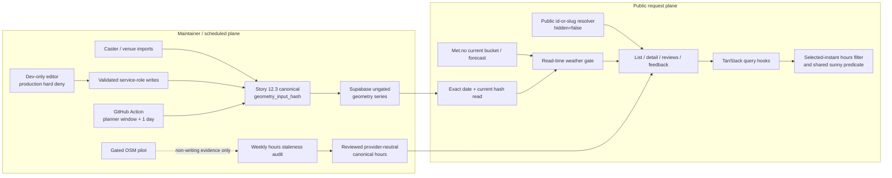

# Architecture Decision Document

_This document builds collaboratively through step-by-step discovery. Sections are appended as we work through each architectural decision together._

> **MVP scope correction (2026-05-19):** time planner, future date picker, future sun simulation, and favourites are free MVP functionality. Season Pass, Swish payments, premium activation, premium recovery, and payment failure flows are dormant Future Monetization architecture preserved in `future-monetization-season-pass.md`.
>
> **Visual source refresh (2026-05-21):** MVP implementation and visual gates use the refreshed Claude Design MVP Unlocked pages only. Post-MVP Unlocked/Locked pages remain future-only architecture references and must not reintroduce premium/payment runtime dependencies into MVP planner/date/favourites.
>
> **Admin removal correction (2026-05-30):** SunnySeat has no admin page, admin venue CRUD/configuration API, admin authentication surface, venue candidate review queue, or admin-operated building upload surface. Venue and geometry changes are manual database insert/update work. Server-only Supabase service-role usage remains backend infrastructure, not admin functionality. Epic 12's localhost/dev-only editor is a narrowly scoped maintenance exception governed by `E12-AD-11`; it does not restore a production admin surface.
>
> **Shadow data trust correction (2026-06-02, clarified 2026-06-05):** `building_geodata/byggnad_kn1480.gpkg` is a 2D footprint source only. MVP building shadows must use the combined central open-data path: 2D Lantmäteriet footprints + Göteborg Baskarta XYZ object inventory + Göteborg Höjdmodell 2022 DTM-derived ground elevation. Runtime currently uses the first validated building subset from Baskarta `byggnad_l`; broader Z-aware Baskarta object layers must be preflighted, classified, and validated before runtime activation. Runtime must read filtered active shadow-caster records only. Future paid DSM/LOD2/LOD3 sources override per object/source priority and do not replace the provenance model.
>
> **Epic 12 architecture delta (2026-07-12):** the dated delta below is the controlling architecture for real-venue launch readiness. It supersedes the fixture-era cache/compute availability assumptions and the historical "no API contract changes" conclusion without deleting them. Earlier decisions remain historical evidence unless the delta explicitly supersedes them.
>
> **Epic 12 product-policy closure (2026-07-13):** explicitly closed venues stay out of map/ranked discovery, exact by-name search returns them labelled `Stängt vid vald tid`, and saved favourites remain visible as greyed, accessible, inspectable rows. This closes the final product gate in `E12-AD-07`.

## Project Context Analysis

### Requirements Overview

**Functional Requirements (50 FRs across 9 categories):**

> **Historical count note:** this original inventory predates PRD v3.2. Epic 12 LR1–LR6 and NFR38–NFR39 are governed by the dated delta rather than being folded back into these historical counts.

| Category | FRs | Architectural Implication |
|----------|-----|--------------------------|
| Venue Discovery (FR1–FR6) | Map with sun-state pins, list ranking, search, geolocation | Map as persistent root, spatial API integration, geolocation permission flow |
| Sun Exposure Intelligence (FR7–FR13) | Sun timeline, time scrubbing, free future date simulation, auto-refresh | Free time/date planner component, 5-min polling, progressive data loading |
| Venue Engagement (FR14–FR20) | Venue detail, routing, feedback, reviews, outdoor seating confirmation | Bottom sheet / overlay panel, native share API, form flows |
| Future Monetization (FR21–FR26) | Upsell, Swish payment (mobile + desktop), paid-status persistence, error handling | Dormant post-MVP payment state machine, session-based paid status, two distinct payment UX flows |
| Partner & B2B (FR27–FR30) | Golden Pin, SOL NU badge, deep-links, analytics | Enhanced map markers, partner API integration, analytics dashboard |
| User Personalization (FR31–FR35) | Favourites, recent history, push notifications, sharing | Client-side persistence, Web Push API, native share |
| Manual Venue Operations (FR36–FR38) | Existing-venue consumer verification plus direct database maintenance | No app runtime surface; no candidate approval queue |
| Retired Administration (FR39–FR45) | Admin CRUD, geometry editor, building upload, auth, and dashboard retired | Excluded from product architecture |
| Platform & Onboarding (FR46–FR50) | Onboarding, about page, 404, PWA, offline shell | Service worker, app manifest, static pages |

**Non-Functional Requirements (37 NFRs across 6 categories):**

| Category | Key NFRs | Architectural Impact |
|----------|----------|---------------------|
| Performance (9) | LCP ≤4.5s, INP ≤200ms, CLS ≤0.1, 600KB JS budget, 60fps map, <200ms API p95 (Plan B re-baselined 2026-05-06 — see PRD NFR2/NFR8 + line 339 below) | Async map loading, code-splitting, lazy-loading strategy, system font stack, precomputed data |
| Security & Privacy (8) | Zero PII, hashed IPs, public API rate limiting, HTTPS, GDPR, future Swish compliance | Anonymous MVP session model, no cookies requiring consent, secure future payment flow |
| Scalability (4) | ≤10K MAU at ≤$100/mo, sunny-day 5x spikes, precomputed data, external tile CDN | Serverless auto-scaling, CDN caching, precomputation pipeline |
| Accessibility (6) | WCAG 2.1 AA, keyboard nav, screen reader, colour contrast, reduced motion, shape not colour | Component-level ARIA, focus management, motion preferences, icon differentiation |
| Integration (5) | Met.no, future Swish, MapLibre, Web Push, OSM | External service adapters, error boundaries, graceful degradation |
| Reliability (5) | 99.5% uptime, weather staleness handling, precomputation fallback, future payment timeout, SW cache | Staleness indicators, fallback data, timeout UX, cache invalidation |

**Scale & Complexity:**

- Primary domain: Full-stack web application (front-end architecture focus)
- Complexity level: Medium-High
- Estimated front-end architectural components: ~25 (8 signature custom, ~9 shadcn commodity, ~8 composed/layout)
- Two distinct viewport interaction models (mobile bottom-sheet vs desktop side-panel)
- Real-time data with 5-minute refresh cycle
- Future payment integration with two UX flows (mobile deep-link, desktop QR), inactive for MVP

### Technical Constraints & Dependencies

**Brownfield constraints (existing backend):**
- Next.js 16+ API routes already deployed on Vercel — front-end builds on top
- Supabase (PostgreSQL + PostGIS) with established schema, RPCs, and migrations
- Existing API contracts (venue search, sun exposure, feedback, dormant/future payments, partners, health, cron)
- TypeScript strict mode, Zod v4 validation, and server-only Supabase service-role infrastructure already implemented
- 22 passing sun/shadow engine tests — regression protection in place
- Building/shadow data contract must be corrected before Epic 3 feature work continues. The old GeoPackage-only assumption is retired; the runtime contract must be backed by filtered, provenance-rich `shadow_casters` records.

**Hard performance constraints:**
- 600KB gzipped JS total budget (Plan B re-baselined 2026-05-06; was 400KB). Breakdown per Story 1.6 close-out measurement: MapLibre dynamic chunk ≤320KB, non-MapLibre route JS ≤280KB, total ≤600KB. See PRD NFR8 for the durable breakdown and rationale.
- System font stack vs. design-specified custom fonts (Plus Jakarta Sans + Manrope) — decision required
- MapLibre GL JS is the largest single dependency and non-negotiable
- Testing conditions: simulated 4G (9 Mbps, 170ms RTT), 4x CPU slowdown

**Platform constraints:**
- ≤$100/month operational budget (Vercel + Supabase)
- No user accounts — MVP planner/date/favourites use anonymous client state
- Swish Merchant API for future payments (requires merchant account approval; inactive for MVP)
- Met.no API requires User-Agent attribution
- MapTiler for vector tiles (API key required)

**Design system constraints:**
- Comprehensive token system defined in DESIGN.md (colours, typography, spacing, shadows, radii, motion, z-index)
- Font conflict: Figma uses Plus Jakarta Sans + Manrope; tech stack specifies system fonts only
- 8px base grid with 4px half-steps
- Warm amber shadow system (brand-tinted) vs neutral shadows (structural chrome)
- 8-level z-index model for map/sheet/glass/button layering
- Breakpoints: 375px (mobile min), 768px (tablet), 1024px (desktop trigger), 1440px (wide)

### Cross-Cutting Concerns Identified

1. **Performance budget governance** — Every dependency, component, and code path must be evaluated against the 600KB total ceiling (Plan B re-baselined 2026-05-06; see PRD NFR8 for the per-chunk breakdown). CI enforcement via Lighthouse + bundle analysis as merge gates.

2. **Dual viewport architecture** — Mobile and desktop are not just responsive variants but different interaction paradigms (bottom sheet with drag physics vs. side panel with overlay). Components must support both without code duplication.

3. **Map lifecycle management** — MapLibre canvas is persistent (never unmounted). All UI layers (sheets, panels, modals) overlay the map. State synchronization between map viewport, selected venue, and UI panels is a core architectural challenge.

4. **Data freshness & progressive loading** — Sun data and weather data are separate concerns with different freshness windows. The UI must communicate staleness, support auto-refresh, and load progressively (sun first, weather second).

5. **Future monetization state management** — Dormant Season Pass architecture without accounts is preserved for later. MVP planner/date/favourites must not depend on premium state, premium JWTs, or payment routes.
6. **Dormant code relocation** — Rasmus's MVP preference is to keep live runtime files free of unused premium/payment scaffolding. If a future-facing provider, hook, route, type, or component is not needed by active MVP behaviour, move the useful contract into `future-monetization-season-pass.md`, `messages/*/future-premium.json`, or an inactive `future-premium` archive, and remove imports/wiring from app runtime paths. Do not keep dormant `PremiumProvider`, Swish, payment, or paywall code mounted in the provider tree or reachable from planner/date/favourites flows.

6. **Accessibility across complex interactions** — WCAG AA on a map-heavy SPA with drag gestures, dynamic overlays, and real-time updates. Focus management across sheet state changes, ARIA live regions for sun state updates, keyboard alternatives for all touch interactions.

7. **Internationalization** — Swedish-first with English support. All UI strings externalized. Venue names always Swedish. Date/time formatting in 24-hour Swedish convention.

8. **Font strategy decision** — Design fidelity (custom fonts) vs performance (system fonts). This cross-cuts every component and affects CLS, LCP, and the visual identity of the product.

## Starter Template Evaluation

### Primary Technology Domain

Full-stack web application (front-end focus) — Next.js App Router on existing Vercel/Supabase backend. This is a brownfield front-end bootstrap: the `lib/` backend engine code (solar, weather, supabase, middleware, types, utils, validation, buildings) is intact, but `app/`, `package.json`, and all front-end infrastructure were removed during the pre-Epic 8 cleanup.

### Starter Options Considered

| Option | Verdict | Rationale |
|--------|---------|-----------|
| `create-next-app` (Next.js 16.2.2) | **Selected** | Official scaffold, creates exactly the shell needed. Matches existing config files. |
| next-forge v6 | Rejected | SaaS monorepo template — Prisma, Clerk, Resend, Turborepo. Architectural mismatch on every axis. |
| T3 Stack | Rejected | tRPC (we have REST APIs), Prisma (we have Supabase), NextAuth (we have no accounts). |
| Manual rebuild | Rejected | No advantage over create-next-app when we need the standard scaffold anyway. |

### Selected Starter: create-next-app (Next.js 16.2.2)

**Rationale:** The official Next.js scaffold creates the exact shell SunnySeat needs — App Router, TypeScript strict, Tailwind CSS v4, ESLint — with zero unnecessary opinions. The existing config files (tsconfig.json, next.config.ts, vercel.json, eslint.config.mjs, .prettierrc.cjs) will be reconciled with the scaffold output. The existing `lib/` directory integrates directly.

**Initialization Sequence:**

```bash
# 1. Scaffold Next.js shell (in-place or temp, then merge)
npx create-next-app@latest nextjs-app --typescript --tailwind --eslint --app --turbopack --import-alias "@/*"

# 2. Initialize shadcn/ui for commodity components
npx shadcn@latest init

# 3. Install project-specific dependencies
npm install maplibre-gl @tanstack/react-query motion @use-gesture/react date-fns-tz

# 4. Install dev dependencies
npm install -D @axe-core/react eslint-plugin-jsx-a11y @next/bundle-analyzer vitest @testing-library/react playwright
```

**Architectural Decisions Provided by Starter:**

**Language & Runtime:**
- TypeScript 5.x strict mode (extends existing tsconfig.json)
- React 19 with Server Components (default)
- React Compiler enabled (existing next.config.ts already has `reactCompiler: true`)
- Node.js 24 LTS on Vercel

**Styling Solution:**
- Tailwind CSS v4 — CSS-first configuration via `@import tailwindcss`
- No `tailwind.config.js` needed — design tokens defined in CSS via `@theme`
- Automatic content detection (no `content` array configuration)
- ~70% smaller CSS output vs v3

**Build Tooling:**
- Turbopack for development (fast HMR)
- Next.js built-in bundler for production
- Automatic code splitting per route
- Tree shaking for all dependencies

**Code Organization:**
- `app/` — Next.js App Router (pages, layouts, API routes)
- `lib/` — Existing backend engine code (solar, weather, supabase, etc.) + new front-end services
- `components/ui/` — shadcn/ui commodity components
- `components/composed/` — Lightly customized compositions
- `components/custom/` — Signature components (VenueCard, MiniTimeline, BottomCardTray, MapMarker, etc.)

**Development Experience:**
- Turbopack dev server with fast refresh
- ESLint with Next.js rules
- Prettier for formatting
- TypeScript path aliases (@/*)

**Additional Setup (post-scaffold):**
- shadcn/ui CLI v4 for commodity component infrastructure
- MapLibre GL JS (declared `^5.23.0`, lockfile-resolved `5.24.0`) for interactive maps
- TanStack Query (declared `^5.99.0`, lockfile-resolved `5.101.2`) for server state management
- Motion (12.38.0) — successor to framer-motion, using `motion/react` imports
- @use-gesture/react for unified touch/mouse gesture handling
- axe-core + eslint-plugin-jsx-a11y for accessibility enforcement
- @next/bundle-analyzer for performance budget monitoring

**Note:** The `motion` package replaces the legacy `framer-motion` package referenced in the existing tech stack document. New imports use `motion/react` instead of `framer-motion`.

**Note:** Project initialization using this sequence should be the first implementation story.

## Core Architectural Decisions

### Decision Priority Analysis

**Critical Decisions (Block Implementation):**
- Font strategy: Custom fonts via next/font
- State management architecture: TanStack Query + React Context
- Component architecture: Three-layer (shadcn/ui + composed + custom)
- Map lifecycle: Persistent canvas, never unmounted
- Free planner/date/favourites state: selected date/time and favourite venue IDs without premium gating

**Important Decisions (Shape Architecture):**
- i18n approach: next-intl
- Search combobox: cmdk
- PWA strategy: Serwist
- Client persistence: localStorage for favourites/recent

**Deferred Decisions (Post-Launch):**
- Error tracking beyond Vercel Analytics (Sentry if needed)
- Push notification infrastructure (Web Push API — Epic 9 scope)
- Partner analytics dashboard (Epic 9 scope)
- Future monetization: Season Pass, Swish payment, paid-status JWT, and recovery by transaction ID
- Manual database operations for venue additions and geometry corrections

### Data Architecture

**Database:** Supabase (PostgreSQL 15 + PostGIS) — existing platform, with a required shadow-caster schema correction before Epic 3 feature work continues.
- Spatial queries via PostGIS RPCs (get_venues_near_point, get_buildings_near_point compatibility, etc.)
- GIST indexes on all geometry columns
- Connection pooling via Supabase Supavisor
- Migrations via SQL files in infrastructure/supabase/migrations/

**Data Validation:** Zod v4 — existing on all API inputs.

#### Shadow Caster Data Architecture

**MVP launch scope:** EPSG:3007 bbox `x=140000..150000, y=6390000..6410000`, covering Inom Vallgraven, Nordstan, Lilla Bommen, Avenyn, Vasastan, Haga, Linné, and surrounding central/south-central areas. Whole Gothenburg is later expansion.

**Authoritative MVP open-data path:**
- `building_geodata/byggnad_kn1480.gpkg`: 2D footprints and object metadata only.
- Göteborg Baskarta XYZ object inventory: open source object geometry with Z-bearing point, line, and polygon layers. The current validated runtime building subset is SHP `byggnad_l`, especially `Takkonturer`, `Fasad`, and `Skärmtak`.
- Göteborg Höjdmodell 2022: DTM/ground model in RH2000.
- Derived height method: `max roof/facade/shelter Z - DTM ground Z at representative point`.
- Runtime geometry: WGS84 polygon emitted for the existing TypeScript shadow engine.
- Required preflight before broader use: layer inventory, geometry type, record count, type distribution, Z presence/range, missing-Z count, anomaly warnings, and fail-fast detection for flattened exports.

**Runtime table contract:** create or migrate toward `shadow_casters` with at least:

```text
id
geometry
height_m
ground_z_rh2000
roof_z_rh2000
height_method
height_source
source_dataset
source_external_id
source_footprint_fid
source_object_type
source_purpose
source_geometry_type
source_geom_3007
source_layer
source_subclass
engine_geometry_method
quality_score
shadow_caster_tier
filter_decision
filter_reasons
source_flags
matched_line_count
z_spread_m
bbox_3007
centroid_3007
caster_class
source_priority
active
import_batch_id
imported_at
updated_at
```

**Caster classes:**
- `building`: derived from footprints + Baskarta roof/facade/shelter Z.
- `structure`: bridges, large shelters, walls, major built objects.
- `vegetation`: trees/hedges; initially disabled or low-confidence until better data exists.
- `manual_override`: hand-entered corrections for known high-impact cases.

**Runtime filtering:** `get_buildings_near_point` remains as a compatibility RPC name until the TypeScript engine contract is renamed, but it must return only active runtime casters:
- `active = true`
- `filter_decision = 'include'`
- `height_m >= 3`
- MVP default `caster_class = 'building'`, plus manually approved `structure` records when present
- Review/quarantine records are stored inactive or omitted from runtime. Excluded records are diagnostics only.

**Source precedence:** runtime chooses the best record per logical object by priority. Higher-priority sources override lower-priority records for runtime selection, but they do not erase provenance-bearing fallback/source-comparison records:
1. Manual verified override
2. Paid LOD2/LOD3 or surveyed roof geometry
3. Paid classified DSM/LAS-derived object height
4. Current open-data derived height: 2D Lantmäteriet footprints + Göteborg Baskarta XYZ object inventory + Göteborg Höjdmodell 2022 DTM-derived ground elevation
5. OSM/heuristic fallback

Every source tier, including manual overrides, paid sources, open-derived records, and OSM/heuristic fallbacks, must preserve source dataset, external ID or manual override ID, object metadata, source priority, import-batch traceability, and rollback path. Open-derived records remain fallback coverage and source-comparison data even when higher-priority sources arrive.

**Confidence gates:** high building-shadow confidence is cluster-scoped, not citywide. Each launch cluster needs at least 10 venue or street-facing spot checks across morning/low-angle, midday/high-sun, and afternoon/evening directional shadow conditions, with at least 70 total central checks and about 85-90% obvious building-shadow agreement before "high confidence" is allowed for that cluster.

**Client-Side Persistence:**
- **Favourites & recent venues:** localStorage. Simple key-value. No PII.
- **Planner state:** selected date and time are client-derived UI state. Future date planning is free MVP functionality and must not require premium status.
- **Future paid status:** Signed JWT in localStorage after payment confirmation, if Season Pass is reactivated post-MVP. Not used by MVP planner/date/favourites.
- **Language preference:** sessionStorage (per tech stack doc).
- **Feedback tracking:** sessionStorage (prevent duplicate submissions).

**Caching Strategy:**
- CDN (Vercel Edge): `/api/venues/search` at 30s, `/api/sun-exposure/venue/[id]` at 5min
- Client (TanStack Query): 5-minute stale time for venue/sun data, background refetch while tab active
- Server: Met.no weather data with 5-minute in-memory revalidation cache
- Precomputed: Sun exposure data refreshed daily via Vercel Cron

> **Historical pre-Epic-12 baseline:** this list and the Story 9.3 implementation record below describe the fixture-era/warm-instance optimization. `E12-AD-02` through `E12-AD-04` supersede its availability boundary: ungated daily geometry is persisted in Supabase and populated by a long-running GitHub Action; weather remains a read-time gate. Process caches remain optional accelerators only.

**Story 9.3 — server sun-compute caching + edge-cacheable venue reads (the live perf fix):**

The real sun engine (`SUNNYSEAT_SUN_ENGINE=real`) used to fire **two** `get_buildings_near_point`
RPCs per venue per request (one for the current shadow, one for the full-day timeline) with **no
server cache**, so every `/api/venues` and `/api/venues/[slug]` load re-ran the whole engine. Story
9.3 fixes this in three layers (no behaviour/output change — byte-identical sun outputs, gated by a
deep-equality snapshot):

- **Building-fetch dedupe (AC1):** the shadow casters are fetched **once** per venue per request and
  shared by both the single-shot shadow and the timeline (≈14→7 RPCs for the 7-venue list).
- **Buildings cache (AC2):** `get_buildings_near_point` is wrapped in a server TTL cache keyed on the
  **rounded centroid (4 dp ≈ 11 m) + radius**, **24 h** revalidate (building geometry is effectively
  static). Co-located venues collapse to one RPC; only successful (non-null) results are cached.
- **Sun-compute cache (AC2):** the computed outcome is cached per **(venue id, 15-min time bucket,
  Stockholm day)**, **15 min** revalidate — applied inside the shared engine seam so **both** the list
  and the detail ("Mer info") route inherit it. Degraded (building-RPC-failed) computes are NOT cached.
  Both caches live in `lib/services/sun-engine-cache.ts` as process-scoped TTL maps (survive across
  warm-instance invocations; lost on cold start — fine at the historical fixture scale, 7 venues / ≤10K MAU). **This fixture-era sufficiency conclusion is superseded by `E12-AD-02`.**
- **Edge-cacheability — AC3 decision = Option A (relocate rate-limiting):** the venue list route's GET
  handler used to read `x-forwarded-for` / `x-real-ip` for the per-IP token-bucket limiter, which made
  the route effectively dynamic and killed the already-present `Cache-Control: public, s-maxage=30`
  header. The limiter was **moved into the Edge proxy** (`proxy.ts` → `lib/utils/venue-rate-limit-middleware.ts`,
  matched on `/api/venues` + `/api/venues/[slug]`), so the GET handler is now a pure, header-independent
  function and the `s-maxage=30` response is genuinely edge-cacheable. DoS protection (429) and
  malformed-XFF rejection (400) are preserved in the proxy; the IP validator is pure-JS (no `node:net`)
  to stay Edge-runtime-safe. Option B (a Vercel-Cron precompute pipeline) was judged disproportionate
  for this story and NOT adopted. **That Story 9.3 scope decision is preserved historically; Epic 12 adopts persisted precomputation in `E12-AD-02` through `E12-AD-04` for the 42-venue real-data envelope.**

  **Agreed staleness window (AC3):** client TanStack 5-min stale time · **CDN `s-maxage=30` (30 s)** ·
  **sun-compute server cache 15 min** (worst-case a cached bucket is ≤15 min stale before the next
  wall-clock bucket forces a recompute) · **buildings server cache 24 h** (a stale building set does
  not move the sun; it only misses a newly-imported caster — a rare offline data event). The weather
  honesty signal (`isForecast` / >2h "approximate" / `weatherUpdatedAt` valid-time) is preserved
  unchanged — the cached outcome carries the same honest freshness the weather slice gave it.

### Authentication & Security

**Public routes:** No auth. Zero PII. Anonymous by design.

**Admin auth:** Retired by the 2026-05-30 product decision. There are no `/api/admin/*` routes or admin JWTs in active runtime scope.

**Future paid-status security (post-MVP, dormant):**
- Server-signed JWT issued on payment confirmation
- JWT contains: Swish transaction ID, activation timestamp, season expiry
- Client stores JWT in localStorage for fast UI gating
- Server verifies JWT signature on future paid-only API requests (cannot be forged client-side)
- Paid-status recovery: User provides Swish transaction ID → server verifies against `purchases` table → re-issues signed JWT

**Future paid-status recovery flow (preserved for post-MVP):**
- User clears browser data or switches device
- User opens "Recover Season Pass" flow in app
- User retrieves Swish transaction ID from their Swish app's transaction history
- User enters transaction ID in SunnySeat recovery form
- Server looks up transaction ID in `purchases` table, verifies it's valid and current season
- Server issues new signed paid-status JWT
- Zero PII required — Swish transaction ID is a reference the user already has

**Rate limiting:** Token bucket per IP on public APIs, currently 100 req/min unless a route-specific stricter limit is documented. 429 with Retry-After header.

**API security:** HTTPS only (Vercel), CORS configured, no mixed content. Future Swish webhook handler must be idempotent.

### API & Communication Patterns

**API design:** REST — existing Next.js API routes. The original "no changes to existing contracts" conclusion is historical and is superseded by controlled Epic 12 evolution in `E12-AD-12`.

**URL state management:** Deep-linkable URLs reflecting app state:
- `/?venue=kafe-magasinet&t=14:30` — selected venue + time
- `/?lat=57.70&lng=11.97&z=14` — map viewport
- URL parsed on load to restore state (no SSR needed)
- `history.replaceState` for state updates (no page reloads)

**Data freshness headers:** API responses include `X-Weather-Updated-At` and `X-Sun-Data-Source` so the front-end can display staleness indicators.

**Progressive data loading:** Sun status loads first (fast, precomputed), weather qualifier arrives second (may have slight delay). UI renders progressively — never blocks on weather.

### Frontend Architecture

**Font strategy:** Custom fonts via `next/font`.
- **Plus Jakarta Sans** — display text (headings, logo, badges, slider timestamps)
- **Manrope** — UI text (labels, body, tabs, CTAs, helper text)
- Both loaded via `next/font/google` with `display: 'swap'`, preloaded, self-hosted from same origin
- `size-adjust` applied automatically by Next.js to minimize CLS
- CSS custom properties exposed for Tailwind v4 `@theme` integration
- Rationale: The warm, distinctive typography is integral to SunnySeat's "it feels sunny" emotional design identity. next/font handles performance concerns (no external requests, inlined, preloaded).

**Design tokens:**
Design tokens (colours, typography, spacing) are sourced from `/docs/design/DESIGN.md`, generated from the Figma designs. Tokens must not be redefined independently in code — always reference the design system file. The full token-to-Tailwind mapping is specified in [Tailwind v4 Design Token Mapping](#tailwind-v4-design-token-mapping) below.

**UX design specification:**
Component layout, interaction patterns, viewport behaviour, and screen flows follow the UX design specification (`_bmad-output/planning-artifacts/ux-design-specification.md`). Agents building front-end components MUST consult the UX spec for interaction details, responsive breakpoints, animation behaviour, and screen-level composition before implementing.

**Component architecture (three layers):**
1. `components/ui/` — shadcn/ui commodity (Button, Dialog, Badge, Tooltip, Toast, Select, Skeleton, Sheet, Input)
2. `components/composed/` — Lightly customized (SearchBar = shadcn Input + cmdk combobox)
3. `components/custom/` — Signature (VenueCard, MiniTimeline, BottomCardTray, MapMarker, SkyConditionBadge, SunWindowsTable, LocationPermissionPrompt, FeedbackPrompt)

**State management:**
- **TanStack Query 5.101.2** (current lockfile resolution) — all server state (venues, sun exposure, weather). 5-min stale time. Background refetch, with Epic 12's visibility-bearing bound in `E12-AD-05`.
- **React Context** — cross-cutting client state:
  - `MapContext` — viewport (center, zoom), selected venue ID, map instance ref
  - `TimeContext` — selected time, selected date, slider position
  - `Favourites` — localStorage-backed favourite venue IDs (hook/service, no PII)
  - `PremiumContext` — dormant/future only; not part of MVP planner/date/favourites flows
  - `LanguageContext` — SV/EN preference
- **useState/useReducer** — component-local state
- **No global state library** (Redux, Zustand) — not needed at this scope

**Search:** cmdk for accessible venue search combobox. ~3KB gzipped. `role="combobox"` with full keyboard navigation.

**Internationalization:** next-intl.
- Swedish-first, English supported
- App Router-native (Server Components + Client Components)
- Locale files structured by feature area (map, venue, planner, favourites, feedback, future-premium, etc.)
- Resolution chain: URL param (`?lang=en`) → sessionStorage → `navigator.language` → default SV
- Venue names always Swedish regardless of language setting
- 24-hour time format always (Swedish convention)

**Dual viewport architecture:**
- Mobile (< 1024px): Bottom sheet (peek/expanded/full) with drag physics via Motion + @use-gesture. 40px bottom nav bar. Floating glass map controls.
- Desktop (≥ 1024px): Fixed top navbar (84px). 190px venue side panel (left). 390px venue detail overlay (right). No bottom nav. Time slider in header bar.
- Shared component logic, viewport-specific layout wrappers. `useMediaQuery` hook drives layout selection.

**PWA:** Serwist (successor to next-pwa).
- App shell caching for offline display
- Service worker registration via next.config.ts plugin
- Web app manifest for installability
- "No connection" message when offline
- Cache invalidation on new deployment
- No offline data caching (real-time sun predictions require connectivity)

### Infrastructure & Deployment

**Hosting:** Vercel — existing. Auto-deploy on push to main, preview deployments for PRs.

**CI/CD merge gates (GitHub Actions):**
- All tests pass (Vitest + Playwright)
- axe-core: zero critical/serious accessibility violations
- Lighthouse Performance ≥ 55 (re-baselined 2026-05-06 in Story 1.6 Task 6 from the original ≥ 90 target; 3-run local median measured 59–61 with `cpuSlowdownMultiplier: 4`. See PRD NFR2 for rationale: LCP/TBT pinned by MapLibre map-canvas + tile fetch on mobile + 4× CPU throttling.)
- Lighthouse Accessibility ≥ 95
- Total JS bundle ≤ 600KB gzipped (re-baselined 2026-05-05 in Story 1.6 — see PRD NFR8 for the full breakdown of initial vs MapLibre dynamic chunk vs total)
- eslint-plugin-jsx-a11y: zero errors

**Monitoring:** Vercel Analytics — Core Web Vitals, function duration, cold starts. Sufficient for launch. Sentry can be added later if error visibility becomes a problem.

**Error tracking:** Vercel Analytics only for launch. Decision to add Sentry deferred — will reassess after first month of production traffic.

**Environment configuration:**
- Production: Vercel environment variables (SUPABASE_URL, keys, CRON_SECRET, MAPTILER_KEY; SWISH credentials only when Future Monetization is reactivated)
- Preview: Separate Vercel env vars per PR
- Development: `.env.local` (git-ignored)

### Decision Impact Analysis

**Implementation Sequence:**
1. Project scaffold (create-next-app + shadcn init + dependencies)
2. Font setup (next/font + Tailwind v4 @theme tokens)
3. Design system tokens (DESIGN.md → Tailwind CSS @theme)
4. Map integration (MapLibre + MapContext)
5. Core layout (dual viewport, bottom sheet / side panel)
6. API integration (TanStack Query + existing endpoints)
7. i18n setup (next-intl + locale files)
8. Free planner/favourites flows (selected date/time + localStorage favourites)
9. PWA (Serwist)
10. CI/CD gates (Lighthouse, axe-core, bundle analysis)

**Cross-Component Dependencies:**
- MapContext ↔ TimeContext ↔ VenueList: selected venue syncs between map pins, list, and detail
- TimeContext ↔ date picker/future simulation: selected date/time updates map pins, list, QuickInfo, and detail as free MVP behaviour
- Favourites ↔ venue surfaces: favourite state syncs across QuickInfo, list cards, detail, and `/favoriter`
- LanguageContext → all UI text: every component reads locale strings
- Font loading → all components: typography tokens must be available before first render
- Bottom sheet state ↔ map viewport: sheet expansion/collapse adjusts visible map area

## Implementation Patterns & Consistency Rules

### Pattern Categories Defined

**Critical Conflict Points Identified:** 8 areas where AI agents could make divergent choices, each addressed below.

### Naming Patterns

**Database Naming (existing + shadow-caster correction):**
- Tables: snake_case plural (venues, shadow_casters, buildings compatibility view/table, sun_windows, weather_slices, feedback)
- Columns: snake_case (venue_id, cloud_cover, created_at, is_partner)
- Foreign keys: referenced_table_id (venue_id, not fk_venue)
- Indexes: idx_table_column (idx_venues_geometry)
- RPCs: snake_case verb_noun (get_venues_near_point, get_buildings_near_point compatibility)

**API Naming (existing — no changes):**
- Routes: kebab-case directories + route.ts (app/api/sun-exposure/venue/[id]/route.ts)
- Endpoints: plural nouns (/api/venues, /api/payments), not singular
- Query params: camelCase (radiusKm, venueId)
- Custom headers: X-Prefixed (X-Weather-Updated-At, X-Sun-Data-Source)
- Response fields: camelCase (sunStatus, currentExposurePercent, isPartner)

**Code Naming (existing — no changes):**
- Components: PascalCase (VenueCard.tsx, MiniTimeline.tsx)
- Hooks: camelCase with `use` prefix (useSunExposure.ts, useMapViewport.ts)
- Utilities: camelCase (formatSunWindow.ts, classifySunStatus.ts)
- Types/Interfaces: PascalCase (SunExposureResult, VenueCardProps)
- Constants: UPPER_SNAKE_CASE (MAX_SEARCH_RADIUS_KM, WEATHER_STALE_THRESHOLD_MS)
- Design tokens in CSS: kebab-case (color-amber-primary, shadow-card, radius-pill)
- API route directories: kebab-case (sun-exposure, not sunExposure)

### Structure Patterns

**Server vs Client Component Boundary:**
- `app/layout.tsx` — Server Component. Imports `Providers` client wrapper.
- `app/page.tsx` — Server Component. Can fetch initial data.
- `app/providers.tsx` — `'use client'`. Wraps all Context providers + QueryClientProvider.
- `components/custom/*` — `'use client'`. All use hooks, gestures, or browser APIs.
- `components/ui/*` — `'use client'`. shadcn defaults.
- `components/composed/*` — `'use client'`. Compositions of UI + custom logic.
- `lib/services/*` — No directive. Pure functions, importable by Server and Client Components.
- `lib/types/*` — No directive. Shared type definitions.
- **Rule:** Push `'use client'` as low as possible. Never mark a layout or page as client unless it directly uses hooks.

**Context Provider Nesting Order:**
```
QueryClientProvider
  └─ LanguageProvider
       └─ GeolocationProvider
            └─ MapProvider
                 └─ TimeProvider
                      └─ {children}
```
Rationale: Query is the outermost data layer. Language affects all text rendering. Geolocation affects map defaults. Map and Time are the most specific shared UI states. PremiumProvider is reserved for Future Monetization and must not gate MVP planner/date/favourites. If PremiumProvider is not actively used by a reactivated Future Monetization story, it should not be mounted in the MVP provider tree.

**Hook Organization:**
- `hooks/queries/` — Hooks wrapping TanStack Query (useVenueSearch.ts, useSunExposure.ts)
- `hooks/` — Hooks wrapping Context or browser APIs (useMapContext.ts, useFavourites.ts, useMediaQuery.ts; usePremiumStatus only if Future Monetization is reactivated)
- One hook per file. Named `use[Feature].ts`.
- Query hooks return TanStack Query result objects directly (isLoading, data, error, etc.)

**Test Organization:**
- `test/` directory at project root (existing convention)
- Unit tests: `test/unit/` — mirrors lib/ structure
- Component tests: `test/components/` — one test file per component
- E2E tests: `test/e2e/` — Playwright journey tests
- Test file naming: `[module-name].test.ts` or `[ComponentName].test.tsx`

### Format Patterns

**API Response Formats (existing — no changes):**
- Success (collection): `{ venues: [...], meta: { count, radiusKm, weatherUpdatedAt } }`
- Success (single): Direct object `{ id, name, sunStatus, ... }`
- Error: `{ error: string | object }` — string for simple errors, Zod flatten for validation
- Status codes: 400 (validation), 401 (unauthorized), 404 (not found), 429 (rate limited with Retry-After), 500 (internal, no details exposed)

**Date/Time Formats:**
- Internal (DB, lib/): UTC always
- API responses: Both UTC ISO string and pre-formatted Europe/Stockholm string per sun window
- UI display: 24-hour format (Swedish convention), formatted via date-fns-tz
- API response timestamps: ISO 8601 (2026-04-07T14:30:00Z)

**JSON Conventions:**
- Field names: camelCase
- Booleans: true/false (never 1/0)
- Nulls: Explicit null (never undefined in JSON responses)
- Empty arrays: [] (never null)

### Communication Patterns

**TanStack Query Key Conventions:**
```typescript
// lib/query-keys.ts — single source of truth for all cache keys
export const queryKeys = {
  venues: {
    all: ['venues'] as const,
    search: (params: { lat: number; lng: number; radiusKm: number }) =>
      ['venues', 'search', params] as const,
    detail: (slug: string) => ['venues', 'detail', slug] as const,
  },
  sunExposure: {
    venue: (venueId: string) => ['sun-exposure', 'venue', venueId] as const,
    venueFuture: (venueId: string, date: string, time: string) =>
      ['sun-exposure', 'venue', venueId, { date, time }] as const,
  },
  weather: {
    current: ['weather', 'current'] as const,
  },
  partners: {
    sunnyNow: ['partners', 'sunny-now'] as const,
  },
} as const;
```
All query hooks MUST use keys from this file. Never construct keys inline.

**State Update Patterns:**
- Context updates via dispatch functions (not direct state mutation)
- Map viewport updates: MapContext dispatch → MapLibre `flyTo`/`easeTo`
- Selected venue: MapContext dispatch → triggers TanStack Query fetch for detail
- Time slider: TimeContext dispatch → triggers venue re-query if time changes significantly

### Process Patterns

**Loading State Patterns:**
- Initial load: shadcn `Skeleton` components matching the target layout
- Background refetch: No visible loading indicator (TanStack Query `isFetching` — data still shown)
- Map pins: Render from cached/precomputed data immediately, update silently when fresh data arrives
- Venue detail: Skeleton for image + text blocks, then populate
- Never show a full-page spinner. Always progressive/skeleton loading.

**Error Handling Patterns:**
- API validation errors (400): Show inline field errors from Zod flatten
- Network errors: TanStack Query retry (3 attempts, exponential backoff), then inline error + retry button
- Future payment errors: Dedicated error screen per Figma design (payment-failed component) if Season Pass is reactivated
- Map tile errors: Fallback to `color-surface-sand` background, no error shown to user
- Weather staleness: Show data with "Uppdaterad: [time]" label, cap confidence display
- React error boundary: One around map + UI layer. Fallback: "Something went wrong" + reload button.

**MapLibre Integration Pattern:**
- `MapContainer` component creates MapLibre instance once, stores in MapContext via ref
- Map events (click, moveend, zoomend) → MapContext dispatch
- Base venue pins: MapLibre symbol layer with SVG sprite (GPU-rendered, handles 50+ markers)
- Selected venue popup: MapLibre `Marker` API with React overlay (DOM-based, allows rich content)
- Pin click → MapContext updates selectedVenueId → triggers detail fetch + bottom sheet/panel open
- Map instance NEVER re-created. Viewport changes via `map.flyTo()` / `map.easeTo()`.

### Tailwind v4 Design Token Mapping

All DESIGN.md tokens map into Tailwind v4 `@theme` in `app/globals.css`. Agents MUST use Tailwind classes — never raw hex values, pixel sizes, or inline styles.

```css
@import "tailwindcss";

@theme {
  /* Surfaces */
  --color-surface-cream: #fdfaf4;
  --color-surface-root: #fbf8fc;
  --color-surface-sand: #f5f0e6;
  --color-surface-muted: #f5f3f6;

  /* Amber brand palette */
  --color-amber-pin: #f1b100;
  --color-amber-primary: #ffbf00;
  --color-amber-text: #fbbc00;
  --color-amber-dark: #735c00;
  --color-amber-cta-text: #554300;

  /* Text */
  --color-text-primary: #1b1b1e;
  --color-text-body: #4d4635;

  /* Shadows, radii, spacing — all from DESIGN.md */
  --shadow-card: 0px 12px 32px 0px rgba(115, 92, 0, 0.08);
  --radius-pill: 9999px;
  --radius-card: 16px;
  /* ... complete token set from DESIGN.md */
}
```

Usage: `bg-surface-cream`, `text-amber-dark`, `shadow-card`, `rounded-pill`. If a value isn't in `@theme`, it doesn't belong in the code.

### i18n Key Conventions

```
messages/
  sv/common.json     — nav, buttons, shared labels
  sv/map.json        — map UI, pins, controls
  sv/venue.json      — venue detail, list, quick-info
  sv/future-premium.json    — future upsell, paywall, recovery, Swish
  sv/feedback.json   — feedback prompt, reviews
  sv/about.json      — about page, data sources
  en/                — same structure, same keys
```

Key format: flat within each file — `"sunTimeline"`, `"showRoute"`, `"feedbackQuestion"`. Feature scoping comes from the file, not the key. Agents MUST use `useTranslations('venue')` (next-intl) scoped to the file, not `t('venue.sunTimeline')`.

### Enforcement Guidelines

**All AI Agents MUST:**
1. Use design tokens from `@theme` — never raw hex, px, or shadow values. All tokens are sourced from `/docs/design/DESIGN.md`; never invent new colour names, spacing values, or shadows independently
2. Use query keys from `lib/query-keys.ts` — never construct inline
3. Mark Client Components with `'use client'` — never mark Server Components
4. Use `@/` import alias for all internal imports
5. Follow the import order: React/Next → third-party → lib → components → types
6. Provide `aria-label` on all non-text interactive elements
7. Respect `prefers-reduced-motion` for all animations
8. Use i18n keys for all user-facing strings — never hardcode Swedish or English text
9. Return TanStack Query result objects from query hooks — never transform before returning
10. Handle loading states with Skeleton components — never full-page spinners

## Project Structure & Boundaries

### Complete Project Directory Tree

```
nextjs-app/
├── app/
│   ├── layout.tsx                    # Root Server Component — fonts, metadata, <Providers> import
│   ├── page.tsx                      # Root Server Component — renders <MapView>
│   ├── providers.tsx                 # 'use client' — QueryClient + all Context providers
│   ├── globals.css                   # Tailwind v4 @import + @theme tokens from DESIGN.md
│   ├── manifest.ts                   # PWA manifest (next/manifest)
│   ├── not-found.tsx                 # Custom 404 — friendly redirect to map
│   ├── [locale]/                     # next-intl locale segment
│   │   ├── layout.tsx                # NextIntlClientProvider wrapper
│   │   └── page.tsx                  # Locale-aware root page
│   ├── about/
│   │   └── page.tsx                  # About page — how it works, data sources, accuracy
│   └── api/                          # ── EXISTING API ROUTES (Epics 1–7) ──
│       ├── health/route.ts
│       ├── venues/
│       │   ├── route.ts              # GET /api/venues — list/search
│       │   ├── [id]/route.ts         # GET /api/venues/[id]
│       │   └── [id]/feedback/route.ts
│       ├── sun-exposure/
│       │   ├── venue/[id]/route.ts   # GET — current sun state
│       │   └── venue/[id]/future/route.ts  # GET — future date (free MVP)
│       ├── weather/
│       │   └── current/route.ts
│       ├── payments/                 # Future Monetization only — inactive for MVP
│       │   ├── create/route.ts       # POST — Swish payment initiation
│       │   ├── status/[id]/route.ts  # GET — poll payment status
│       │   ├── webhook/route.ts      # POST — Swish callback
│       │   └── recover/route.ts      # POST — paid-status recovery via txn ID
│       ├── reviews/
│       │   └── route.ts              # GET/POST — venue reviews
│       ├── partners/
│       │   └── sunny-now/route.ts    # GET — partner venues currently sunny
│
├── components/
│   ├── ui/                           # ── LAYER 1: shadcn/ui primitives ──
│   │   ├── button.tsx
│   │   ├── card.tsx
│   │   ├── dialog.tsx
│   │   ├── skeleton.tsx
│   │   ├── slider.tsx
│   │   ├── badge.tsx
│   │   ├── input.tsx
│   │   ├── sheet.tsx                 # shadcn Sheet — base for bottom sheet
│   │   ├── separator.tsx
│   │   ├── toggle.tsx
│   │   └── tooltip.tsx
│   │
│   ├── composed/                     # ── LAYER 2: multi-primitive compositions ──
│   │   ├── VenueCard.tsx             # Card + Badge + sun status icon
│   │   ├── VenueQuickInfo.tsx        # Compact venue info for map popup
│   │   ├── SunTimeline.tsx           # Timeline bar + confidence indicator
│   │   ├── TimeSlider.tsx            # Slider + time label + date context
│   │   ├── DatePicker.tsx            # Free MVP date picker (cmdk-based)
│   │   ├── SearchCombobox.tsx        # cmdk search for venues/areas
│   │   ├── FeedbackPrompt.tsx        # "Was this sunny?" Card + buttons
│   │   ├── ReviewCard.tsx            # Single review display
│   │   ├── ReviewForm.tsx            # Review submission form
│   │   ├── PaymentStatus.tsx         # Future Monetization: Swish payment polling + status display
│   │   ├── SwishQRCode.tsx           # Future Monetization: QR code for desktop Swish payment
│   │   ├── PremiumBadge.tsx          # Future Monetization: Säsongskortet active badge
│   │   └── PartnerBadge.tsx          # SOL NU / Golden Pin badge
│   │
│   └── custom/                       # ── LAYER 3: feature-specific components ──
│       ├── map/
│       │   ├── MapContainer.tsx      # MapLibre instance lifecycle + MapContext
│       │   ├── MapControls.tsx       # Zoom, locate-me, compass floating buttons
│       │   ├── VenuePinLayer.tsx     # MapLibre symbol layer — all venue pins
│       │   ├── SelectedVenuePopup.tsx # MapLibre Marker + React overlay
│       │   └── MapLoadingFallback.tsx # Skeleton while map initializes
│       ├── venue/
│       │   ├── VenueDetail.tsx       # Full venue detail view
│       │   ├── VenueList.tsx         # Scrollable venue list
│       │   ├── VenueListItem.tsx     # Single row in venue list
│       │   └── RouteButton.tsx       # Navigate-to-venue CTA
│       ├── sheets/
│       │   ├── MobileBottomSheet.tsx # Drag-physics bottom sheet (@use-gesture)
│       │   ├── DesktopSidePanel.tsx  # 190px list + 390px detail overlay
│       │   └── SheetTransition.tsx   # Motion-powered sheet enter/exit
│       ├── favourites/
│       │   ├── FavouriteButton.tsx   # Free favourite toggle surfaces
│       │   └── FavouritesList.tsx    # /favoriter saved venue list
│       ├── future-premium/           # Future Monetization only — inactive for MVP
│       │   ├── PremiumPaywall.tsx    # Upsell modal with Swish CTA
│       │   ├── PremiumRecovery.tsx   # Swish transaction ID recovery flow
│       │   └── SwishPaymentFlow.tsx  # Payment orchestrator (mobile deep-link / desktop QR)
│       ├── onboarding/
│       │   ├── OnboardingScreen.tsx  # First-visit branded splash
│       │   └── LocationPermission.tsx # Geolocation request + fallback
│       ├── feedback/
│       │   ├── FeedbackFlow.tsx      # Sun accuracy + outdoor seating confirmation
│       │   └── PushOptIn.tsx         # Push notification opt-in prompt
│       ├── social/
│       │   └── ShareButton.tsx       # Native Share API wrapper
│       └── layout/
│           ├── MobileNavBar.tsx      # Bottom nav bar (mobile)
│           ├── DesktopNavBar.tsx     # Top nav bar (desktop)
│           └── ResponsiveLayout.tsx  # Breakpoint-aware layout switcher
│
├── hooks/
│   ├── queries/                      # ── TanStack Query wrappers ──
│   │   ├── useVenueSearch.ts         # Venue list/search query
│   │   ├── useVenueDetail.ts         # Single venue detail query
│   │   ├── useSunExposure.ts         # Current sun state query
│   │   ├── useSunExposureFuture.ts   # Future date sun state (free MVP)
│   │   ├── useWeatherCurrent.ts      # Current weather query
│   │   ├── useVenueReviews.ts        # Venue reviews query
│   │   └── usePartnersSunnyNow.ts    # Partner sunny-now query
│   ├── mutations/                    # ── TanStack Query mutations ──
│   │   ├── useSubmitFeedback.ts      # POST feedback mutation
│   │   ├── useSubmitReview.ts        # POST review mutation
│   │   ├── useCreatePayment.ts       # Future Monetization: POST payment creation mutation
│   │   └── useRecoverPremium.ts      # Future Monetization: POST paid-status recovery mutation
│   ├── useMapContext.ts              # MapContext consumer hook
│   ├── useTimeContext.ts             # TimeContext consumer hook
│   ├── usePremiumStatus.ts           # Future Monetization only
│   ├── useMediaQuery.ts              # Responsive breakpoint hook
│   ├── useGeolocation.ts             # Browser geolocation API hook
│   ├── useDragSheet.ts              # @use-gesture drag physics for bottom sheet
│   ├── useSwishPayment.ts           # Future Monetization: Swish payment polling + status
│   └── useFavourites.ts             # localStorage favourites management
│
├── lib/
│   ├── query-keys.ts                 # Centralized TanStack Query key factory
│   ├── utils.ts                      # shadcn cn() utility (existing)
│   ├── contexts/
│   │   ├── MapContext.tsx             # Map instance + viewport + selected venue
│   │   ├── TimeContext.tsx            # Current time slider position + date
│   │   ├── PremiumContext.tsx         # Future Monetization only — not active MVP gating
│   │   └── LanguageContext.tsx        # next-intl locale context
│   ├── services/                     # ── Pure functions (no React, no 'use client') ──
│   │   ├── premium-token.ts          # Future Monetization: JWT encode/decode for paid status
│   │   ├── swish-client.ts           # Future Monetization: Swish deep-link URL + QR payload generation
│   │   ├── share.ts                  # Native Share API wrapper
│   │   ├── push-subscription.ts      # Web Push subscription management
│   │   └── favourites-storage.ts     # localStorage read/write for favourites
│   ├── solar/                        # ── EXISTING (Epics 1–4) — not modified ──
│   │   ├── index.ts
│   │   ├── solar-calculation-service.ts
│   │   ├── solar-math.ts
│   │   ├── shadow-calculation-service.ts
│   │   ├── shadow-geometry.ts
│   │   ├── sun-exposure-service.ts
│   │   ├── confidence-calculator.ts
│   │   ├── timezone-utils.ts
│   │   ├── constants.ts
│   │   └── types.ts
│   ├── weather/                      # ── EXISTING (Epic 5) — not modified ──
│   │   └── met-no-service.ts
│   ├── supabase/                     # ── EXISTING — not modified ──
│   │   ├── client.ts
│   │   ├── server.ts
│   │   ├── health.ts
│   │   └── types.ts
│   ├── middleware/                    # ── server request helpers ──
│   │   └── request-logger.ts
│   ├── buildings/                    # ── backend shadow-caster import/contract helpers when needed ──
│   ├── types/                        # ── EXISTING + NEW front-end types ──
│   │   ├── index.ts                  # Re-exports
│   │   ├── api.ts                    # API response types (existing)
│   │   ├── venue.ts                  # Venue domain types (existing)
│   │   ├── payment.ts               # Future Monetization payment types (existing/dormant)
│   │   ├── location.ts              # Location types (existing)
│   │   ├── design-tokens.ts         # Design token types (existing)
│   │   ├── map.ts                    # NEW — MapLibre viewport, pin, popup types
│   │   ├── premium.ts               # Future Monetization — paid status, JWT payload types
│   │   └── review.ts                # NEW — Review submission/display types
│   ├── utils/                        # ── EXISTING + NEW ──
│   │   ├── api-errors.ts            # API error helpers (existing)
│   │   ├── validation.ts            # Zod schemas (existing)
│   │   └── venue-mapping.ts         # Venue data transforms (existing)
│   └── validation/                   # ── EXISTING — not modified ──
│       └── venue.ts
│
├── messages/                         # ── i18n translation files ──
│   ├── sv/
│   │   ├── common.json              # Nav, buttons, shared labels
│   │   ├── map.json                 # Map UI, pins, controls
│   │   ├── venue.json               # Venue detail, list, quick-info
│   │   ├── future-premium.json      # Future Monetization: upsell, paywall, recovery, Swish
│   │   ├── favourites.json          # Favourites UI
│   │   ├── feedback.json            # Feedback prompt, reviews
│   │   └── about.json               # About page, data sources
│   └── en/                           # Same structure, same keys
│       ├── common.json
│       ├── map.json
│       ├── venue.json
│       ├── future-premium.json
│       ├── favourites.json
│       ├── feedback.json
│       └── about.json
│
├── public/
│   ├── icons/                        # PWA icons (192px, 512px)
│   ├── sprites/                      # MapLibre pin sprites (SVG → PNG atlas)
│   │   ├── pin-sunny.png
│   │   ├── pin-shaded.png
│   │   ├── pin-partner-sunny.png
│   │   └── pin-partner-shaded.png
│   └── og-image.png                  # Open Graph social sharing image
│
├── test/                             # ── Test directory (existing convention) ──
│   ├── unit/                         # Mirrors lib/ structure
│   │   ├── services/
│   │   ├── solar/                    # Existing solar tests
│   │   └── contexts/
│   ├── components/                   # One test file per component
│   │   ├── VenueCard.test.tsx
│   │   ├── SunTimeline.test.tsx
│   │   ├── MobileBottomSheet.test.tsx
│   │   └── ...
│   ├── e2e/                          # Playwright journey tests
│   │   ├── sun-discovery.spec.ts     # Lina's journey — map → venue → feedback
│   │   ├── planner.spec.ts           # Sara's journey — free date/time planner
│   │   ├── returning-user.spec.ts    # Erik's journey — favourites → review
│   │   └── partner-visibility.spec.ts # Marcus's journey — Golden Pin + analytics
│   └── setup/
│       └── test-utils.tsx            # Render with providers, mock query client
│
├── docs/design/                      # ── UX reference (existing) ──
│   ├── DESIGN.md                     # Design token system
│   └── references/
│       ├── screens/                  # 21 screen images
│       └── components/               # 40 component images
│
├── next.config.ts                    # Next.js config (existing, extend for i18n + bundle analyzer)
├── next-env.d.ts
├── tsconfig.json                     # TypeScript config (existing)
├── tailwind.css                      # Tailwind v4 — no config file, CSS-first
├── postcss.config.mjs
├── vitest.config.ts                  # Vitest configuration
├── playwright.config.ts              # Playwright E2E configuration
├── i18n.ts                           # next-intl configuration
├── middleware.ts                     # Next.js middleware (locale routing)
├── serwist.config.ts                 # PWA service worker configuration
├── .env.local                        # Local env vars (not committed)
├── .env.example                      # Env var template
└── package.json                      # Dependencies (to be scaffolded)
```

### Architectural Boundaries

**API Boundary — Existing Backend Surface:**
All front-end data flows through the existing Next.js API routes (`app/api/`). The front-end NEVER imports from `lib/solar/`, `lib/weather/`, `lib/supabase/`, or `lib/middleware/` directly. These modules are server-only and accessed exclusively via API route handlers. The boundary is enforced by the client/server component split — `'use client'` components cannot import server-only modules.

**Component Boundary — Three-Layer Architecture:**
- `components/ui/` — shadcn primitives. No business logic. No API calls. No context consumption.
- `components/composed/` — Combine multiple ui/ primitives with layout and display logic. May consume context for display purposes. No direct API calls — receive data via props from custom/ parents or TanStack Query.
- `components/custom/` — Feature-specific. Consume hooks, contexts, and TanStack Query data. Orchestrate composed/ and ui/ components. These are the "smart" components.

Direction of dependency: `custom/ → composed/ → ui/`. Never upward. Never skip a layer for complex compositions.

**Service Boundary — Pure Functions vs React:**
`lib/services/` contains pure functions with zero React imports. They handle token management, URL construction, localStorage operations, and API payload formatting. They are importable by both Server Components and Client Components. Hooks in `hooks/` wrap these services with React lifecycle (effects, state, context).

**Data Boundary — TanStack Query as Single Source:**
All server state lives in the TanStack Query cache. No duplicating API data into Context or component state. Contexts hold only client-derived state: map viewport, time slider/date position, local favourites, and locale. If data came from an API, it belongs in a query hook. Future paid status can use a separate dormant context if Season Pass is reactivated.

### Requirements-to-Structure Mapping

**Epic 8 — Front-End Implementation:**

| Feature | Components | Hooks | Services |
|---------|-----------|-------|----------|
| Map + Pins (FR1, FR4–6) | `custom/map/*` | `useMapContext`, `useGeolocation`, `queries/useVenueSearch` | — |
| Venue List (FR2) | `custom/venue/VenueList`, `VenueListItem`, `composed/VenueCard` | `queries/useVenueSearch` | — |
| Venue Search (FR3) | `composed/SearchCombobox` | `queries/useVenueSearch` | — |
| Sun Exposure + Planner (FR7–13) | `composed/SunTimeline`, `composed/TimeSlider`, `composed/DatePicker` | `queries/useSunExposure`, `queries/useSunExposureFuture`, `useTimeContext` | — |
| Venue Detail (FR14) | `custom/venue/VenueDetail`, `composed/VenueQuickInfo` | `queries/useVenueDetail` | — |
| Routing (FR15–16) | `custom/venue/RouteButton` | — | — |
| Feedback (FR17–18) | `custom/feedback/FeedbackFlow`, `composed/FeedbackPrompt` | `mutations/useSubmitFeedback` | — |
| Reviews (FR19–20) | `composed/ReviewCard`, `composed/ReviewForm` | `queries/useVenueReviews`, `mutations/useSubmitReview` | — |
| Onboarding (FR46) | `custom/onboarding/*` | `useGeolocation` | — |
| About (FR47) | `app/about/page.tsx` | — | — |
| 404 (FR48) | `app/not-found.tsx` | — | — |
| PWA (FR49–50) | `serwist.config.ts`, `app/manifest.ts` | — | — |
| Favourites (FR31) | `custom/favourites/*`, favourite affordances in venue surfaces | `useFavourites` | `services/favourites-storage` |
| Push (FR33–34) | `custom/feedback/PushOptIn` | — | `services/push-subscription` |
| Share (FR35) | `custom/social/ShareButton` | — | `services/share` |
| Responsive layout | `custom/layout/*`, `custom/sheets/*` | `useMediaQuery`, `useDragSheet` | — |

**Future Monetization + Growth:**

| Feature | Components | Hooks | Services |
|---------|-----------|-------|----------|
| Paywall (FR21) | `custom/future-premium/PremiumPaywall` | `usePremiumStatus` | — |
| Swish Payment (FR22–24, 26) | `custom/future-premium/SwishPaymentFlow`, `composed/SwishQRCode`, `composed/PaymentStatus` | `mutations/useCreatePayment`, `useSwishPayment` | `services/swish-client` |
| Premium Recovery (FR25) | `custom/future-premium/PremiumRecovery` | `mutations/useRecoverPremium` | `services/premium-token` |
| Partner Pins (FR27–29) | `custom/map/VenuePinLayer` (partner variant), `composed/PartnerBadge` | `queries/usePartnersSunnyNow` | — |
| Partner Analytics (FR30) | Deferred — API exists, dashboard in Phase 2 | — | — |
| Manual Venue Operations (FR36–38) | Direct database insert/update workflow; no app runtime surface | — | — |

### Integration Points

**Internal Communication Patterns:**

```
┌────────────────────────────────────────────────────┐
│  Browser                                           │
│                                                    │
│  ┌─────────────┐    ┌──────────────┐               │
│  │ MapContext   │◄──►│ custom/map/* │               │
│  │ (viewport,  │    │              │               │
│  │  selected)  │    └──────┬───────┘               │
│  └─────────────┘           │ pin click             │
│         ▲                  ▼                       │
│         │           ┌──────────────┐               │
│  ┌──────┴──────┐    │ TanStack     │               │
│  │ TimeContext  │    │ Query Cache  │◄── 5min stale │
│  │ (slider pos,│    │              │               │
│  │  date)      │    └──────┬───────┘               │
│  └─────────────┘           │ fetch                 │
│         ▲                  ▼                       │
│  ┌──────┴──────┐    ┌──────────────┐               │
│  │ Favourites  │    │ hooks/       │               │
│  │ localStorage│    │ queries/     │               │
│  │ (venue IDs) │    │ mutations/   │               │
│  └─────────────┘    └──────┬───────┘               │
│                            ▼                       │
│                    ┌──────────────┐                 │
│                    │ fetch()      │                 │
│                    └──────┬───────┘                 │
│                           │                        │
└───────────────────────────┼────────────────────────┘
                            │ HTTPS
                            ▼
┌───────────────────────────────────────────────────┐
│  Next.js API Routes (app/api/)                    │
│  ┌─────────┐  ┌──────────┐  ┌─────────────┐      │
│  │ venues  │  │ sun-exp  │  │ payments*   │      │
│  └────┬────┘  └────┬─────┘  └──────┬──────┘      │
│       │            │               │              │
│       ▼            ▼               ▼              │
│  ┌─────────────────────────────────────────┐      │
│  │ lib/solar  lib/weather  lib/supabase    │      │
│  └────────────────┬────────────────────────┘      │
│                   │                               │
└───────────────────┼───────────────────────────────┘
                    │
        ┌───────────┼───────────┐
        ▼           ▼           ▼
   ┌─────────┐ ┌─────────┐ ┌─────────┐
   │Supabase │ │ Met.no  │ │ Swish*  │
   │PostGIS  │ │ Weather │ │ Merchant│
   └─────────┘ └─────────┘ └─────────┘
```

**External Service Integration:**

| Service | Integration Point | Error Handling |
|---------|-------------------|----------------|
| Supabase/PostGIS | `lib/supabase/server.ts` → API routes | Existing — connection pooling, retry |
| Met.no Weather | `lib/weather/met-no-service.ts` → API routes | Existing — graceful degradation, staleness cap |
| Swish Merchant | Future Monetization only: `app/api/payments/*` ← `hooks/useSwishPayment` | 5-min polling timeout, error screen, retry |
| MapLibre Tiles | `custom/map/MapContainer.tsx` → external CDN | Fallback `color-surface-sand` background |
| Web Push | `services/push-subscription.ts` → browser API | Permission revocation handled gracefully |
| Geolocation | `hooks/useGeolocation.ts` → browser API | Fallback to Gothenburg centrum (57.7089, 11.9746) |

**Data Flow — Venue Discovery (Primary Journey):**

1. `useGeolocation` → user coordinates (or Gothenburg centrum fallback)
2. `useVenueSearch({ lat, lng, radiusKm })` → TanStack Query → `GET /api/venues?lat=...&lng=...&radiusKm=...`
3. API route → Supabase PostGIS `get_venues_near_point` RPC → venue list with sun states
4. TanStack Query cache populated → `VenuePinLayer` reads cache → MapLibre symbol layer renders pins
5. Pin click → `MapContext.dispatch({ type: 'SELECT_VENUE', slug })` → URL updates
6. `useVenueDetail(slug)` → TanStack Query → `GET /api/venues/[id]` → full detail
7. `VenueDetail` renders in `MobileBottomSheet` or `DesktopSidePanel` (via `useMediaQuery`)
8. Background: `useSunExposure` refetches every 5 minutes (TanStack `refetchInterval`)

**Data Flow — Shadow Caster Lookup (Backend):**

1. Import pipeline derives current building candidate heights from 2D footprints + the validated Baskarta `byggnad_l` subset + DTM ground elevation; broader Baskarta XYZ layers require preflight/classification before use.
2. Validation/filtering splits candidates into include, review, and exclude.
3. Import stores include records as runtime-active `shadow_casters`; review records are inactive; excluded records remain diagnostics.
4. `calculateVenueShadow` calls `get_buildings_near_point` compatibility RPC for nearby runtime-active casters.
5. Shadow geometry uses `height_m`, caster geometry, and solar position to project shadows.
6. An optional per-venue seating-surface elevation (`venues.seating_elevation_m`, server-only) gates which casters shadow the venue: a caster only contributes a shadow by its height *above* the seating surface, so a building at or below an elevated venue (rooftop bar, raised/hilltop terrace) stops shadowing it. Null/0 elevation = ground-level (default, byte-identical to the pre-8.6 path). Height-above-own-ground is Epic 8 Story 8.6; terrain/DTM ground-delta for hilltop venues is Story 8.7.
7. Confidence logic applies building quality, source priority, cluster validation status, data coverage, low sun elevation, weather, and known unmodelled obstruction caps.

## Epic 12 Architecture Delta — 2026-07-12

**Status:** Adopted build substrate for Epic 12. This delta implements the approved 2026-07-12 change proposal against PRD v3.2, the revised UX specification, the completed Google Places policy research, Epic 12, `project-context.md`, and the live brownfield seams. Story numbers below identify implementation ownership; they do not permit a story to redefine a shared contract locally.

**Supersession rule:** the original architecture remains the historical pre-Epic-12 baseline. Where it says process-local caches are sufficient at seven venues, precomputation is disproportionate, sun data is refreshed by Vercel Cron, API contracts do not change, or the project has zero implementation gaps, this dated delta controls. The three-layer component boundary, server-only backend boundary, design tokens, Swedish-first copy, accessibility, and Epic 10/11 weather and request-count invariants remain binding.

### Epic 12 Decision Spine

#### E12-AD-01 — Canonical hours stay single-interval and provider-neutral [ADOPTED]

**Binds:** Stories 12.1 and 12.14, venue authoring, the selected-instant formatter/filter, and any future hours provider adapter.

**Prevents:** split schedules being flattened, Google-derived content entering MapLibre-associated public data, and missing evidence being represented as closed.

**Rule:** `venues.opening_hours` remains the canonical `WeeklyOpeningHours` launch shape: numeric ISO weekday keys, at most one `{open, close}` interval per weekday, missing/null weekday = explicitly closed, whole field absent = unknown, and `close < open` = a prior-day session extending past midnight. Any source with a split weekday routes the **whole venue** to `manual_review`; no day is partially written and the prior independently verified schedule remains. The launch shape has no unambiguous 24/7 sentinel (`00:00`→`00:00` is not guessed as full-day), so 24/7, seasonal, and holiday-specific schedules also route whole-venue to manual review until a separately controlled contract extension lands. Story 12.1 owns the provider-neutral adapter and weekly staleness/review workflow. Accepted adapter outcomes are `accepted(schedule, provenance)`, `manual_review(reason, provenance)`, or `failed(errorClass)`, with schedule and provenance written atomically and idempotently only for `accepted`.

Google Places `regularOpeningHours` is not a permitted canonical source under the current ordinary 2026 EEA terms established by the completed research. SunnySeat may persist Google **Place IDs only**. It must not persist, log, queue, fixture, expose, or use raw/normalized Google hours, Google-returned URLs, provider URLs, or API-key-bearing URLs. `places_api_url` is not part of the forward contract and is removed after any existing reader is retired; endpoints are derived transiently from `place_id` only for an expressly permitted IDs-only operation. An optional annual Place-ID validity check is isolated from hours and routes obsolete IDs to review without silent relinking.

Before weekly automation is enabled, Story 12.1 owns a one-time live-data provenance audit. Every existing schedule receives independently verified provenance or is removed/replaced; any Google-derived or unprovable schedule is not relabelled and becomes whole-field unknown (`opening_hours = null`) until independently verified, so it remains visible rather than being falsely closed. The same story removes `places_api_url`, corrects the authoring guide's Google-sync claims, and records an auditable per-venue remediation outcome.

Weekly automation reports missing provenance, due, unknown, conflicting, split, failed, and stale venues; it never fetches Google hours and never silently overwrites public hours. Story 12.1 implements it as a scheduled GitHub Action running a repository script with read-only venue access plus service-role writes only to the hours-review run/outcome tables; it does not depend on the currently documentary `/api/cron/*` routes and exposes no public trigger. Durable per-venue outcomes carry a checked reason/error class and are retained for 180 days; the GitHub summary links to the run rather than containing provider payloads. Reviewed hours changes enter separately through the guarded maintenance write seam. Venue confirmation, independently reviewed venue material, and expressly licensed providers are eligible sources. OSM remains a **non-writing, gated pilot** until the 42-venue coverage/agreement study and ODbL attribution, derivative/collective-database, and share-alike decisions are approved. The pilot cannot write canonical hours, and scheduled bulk work cannot use public Nominatim.

#### E12-AD-02 — Persist deterministic ungated geometry; gate weather at read time [ADOPTED]

**Binds:** Story 12.3 list/detail compute, Met.no integration, planner coverage, and the cache implementation.

**Prevents:** cold-instance freezes, four shadow recomputations per hour, stale weather-gated series, and substitution of another date's geometry.

**Rule:** deterministic daily shadow geometry is stored independently of weather. The persisted unit is `(venue_id, stockholm_date, geometry_input_hash)` and carries the complete planner-step exposure series. `series` is a Zod-validated ordered array of `{ minutes, sunExposurePercent }`: exactly one unique ascending entry for every shared planner step from `PLANNER_MIN_MINUTES` through `PLANNER_MAX_MINUTES` inclusive (currently 61 entries), with integer `minutes` and finite exposure in `0..100`. It contains no weather, sky, confidence, public verdict, or localized label. The planner range/step contract participates in `geometry_input_hash`, so a range change cannot read an old shape. List and detail reads resolve the venue's current `geometry_input_hash`, read that date's exact artifact, and apply the request's current weather bucket on demand. No weather-gated series is persisted. Process-local building/sun maps may accelerate a warm request but are never the availability boundary.

For today, the gate uses the current forecast bucket and near-now nowcast rain under the existing Epic 10 rules. Story 12.3 moves list-scale provider fan-out off the user request path: a scheduled weather script refreshes service-only `weather_bucket_snapshots` every five minutes for the deduplicated engine coordinates (existing four-decimal coordinate buckets), with provider concurrency four, a two-second per-call timeout, at most two transient retries with jitter, required Met.no User-Agent, and one normalized snapshot per provider valid-time bucket. Future forecast snapshots refresh with the geometry cadence and retain the whole planner horizon. List/detail requests read the shared snapshot store and apply gating locally; they issue no 42-venue provider burst. A missing/expired snapshot degrades that venue to explicit weather `unknown` within the request budget and triggers telemetry/background recovery rather than delaying the response beyond the approximately five-second p95 target.

For future dates, the retained Met.no timeseries must cover the requested planner instant. If it is outside the real forecast horizon, weather is `unknown`; the implementation must not choose the nearest far-off slice or fabricate clear sky. The existing geometry-only/unknown-weather presentation contract applies. Weather snapshot coverage is measured separately from geometry coverage and cannot make a geometry run appear complete.

#### E12-AD-03 — Story 12.3 owns one geometry-input hash [ADOPTED]

**Binds:** Stories 12.2, 12.3, and 12.5; seating/elevation edits; shadow-caster imports; feedback aggregation; and persisted geometry reads.

**Prevents:** different stories inventing incompatible cache versions, corrected geometry being masked by old series, and pre-fix feedback contaminating post-fix accuracy.

**Rule:** Story 12.3 owns a single canonical field named `geometry_input_hash`, formatted `g1:<lowercase SHA-256>`. `g1` is the serialization/algorithm contract version and is part of the one value, not a second competing cache version. Bytes are UTF-8 RFC 8785 JSON Canonicalization Scheme. Seating polygons are forced to EPSG:4326/2D; exterior/interior rings use right-hand orientation, remove the duplicated closing point for ordering then restore it, rotate to the lexicographically smallest coordinate sequence, sort holes by full serialized ring, normalize `-0` to `0`, and reject non-finite numbers. Numeric inputs are JSON numbers at stored schema precision with no additional rounding; absent optional values serialize as explicit `null`. Caster geometries use uppercase hex `ST_AsEWKB(ST_Normalize(ST_Force2D(geometry)), 'XDR')` with SRID 4326. Caster records sort by `(id, canonical EWKB, full canonical record)`, so database row order cannot affect the digest. Import generation is the canonical lowercase UUID string (or explicit `null` for legacy data). The hashed canonical payload contains:

- the sun/shadow algorithm and planner-step contract version;
- the canonicalized seating polygon;
- `seating_elevation_m` and `ground_elevation_m`;
- the resolved, sorted runtime caster set actually used for the venue: caster IDs, canonical geometry/EWKB, `height_m`, `ground_z_rh2000`, `roof_z_rh2000`, active/filter/class/priority fields that affect selection, and the import generation/batch signal;
- every other input later shown to change shadow projection, added only by incrementing the hash prefix contract (`g2`, etc.).

The shared server-only hash module and canonical serialization are Story 12.3 deliverables. Story 12.2 stores the hash on each feedback row and aggregates agreement only against the venue's current hash. Story 12.5 and every seating/elevation/caster import or manual correction call the same publication seam. Normal operation is two-phase: validate and stage proposed inputs; hash and precompute the full planner-window artifacts against that staged snapshot; then atomically publish the input change, exact artifacts, and `venue_geometry_inputs` ready hash in one database transaction. Public reads see the complete old generation until the complete new generation commits. A direct/out-of-band input change that bypasses staging must mark the affected current hash dirty in the same transaction and intentionally yields the fail-closed 503 until recomputed. Import tooling may conservatively stage/recompute all venues when affected venues cannot be proven. No consumer constructs or approximates the hash independently.

#### E12-AD-04 — Coverage is scheduled, complete, and fail-closed [ADOPTED]

**Binds:** Story 12.3 infrastructure, operational monitoring, and list/detail error behavior.

**Prevents:** Vercel timeout failures, midnight holes, invisible partial coverage, and request-path fallback to CPU-bound geometry.

**Rule:** a long-running GitHub Action invokes a repository script that writes directly through the explicitly accepted Supabase service-role trust boundary; the geometry batch does not run inside a Vercel request. It precomputes **all venues, including hidden venues**, for Stockholm today through `today + PLANNER_MAX_FUTURE_DAYS + 1`. The extra day is the midnight-continuity buffer. The planner constant is imported from one shared server-safe module rather than copied. The Action runs at least daily, can be dispatched after geometry invalidation, is idempotent, and fails unless coverage is 100% for every expected venue/date/current-hash tuple.

Non-overlap uses both GitHub workflow `concurrency` and a database lease, not a connection-scoped advisory lock: one `claim_geometry_precompute_run` transaction atomically expires a missed-heartbeat run, rejects an active lease, and creates the sole `running` row; the worker heartbeats, and completion/failure closes the lease. The service-role key's broad RLS-bypassing power is an explicit exception to least privilege required by the service-only table contract. It lives only in a protected GitHub `production` Environment with required review and main-branch restriction, never in PR/fork jobs or logs; rotation is every 90 days and immediately on suspected exposure. `SUN_GEOMETRY_PRECOMPUTE_ENABLED=false`, `SUN_WEATHER_REFRESH_ENABLED=false`, and `SUN_HOURS_AUDIT_ENABLED=false` are independent emergency stops. The scheduled-workflow story replaces the current nonexistent `/api/cron/*` calls with these direct scripts and removes any scheduled OSM ingestion; OSM remains manual/non-writing pilot only.

Each run records expected, written, reused, missing, stale-hash, failed, started/finished, duration, and per-venue/date failure details. Alerts surface any incomplete current planner window before the artifact becomes selectable. A request with no exact current-hash artifact **does not** compute the 61-step shadow path and does not substitute another date/hash: list/detail returns a typed `503 SUN_GEOMETRY_COVERAGE_MISSING`, emits structured telemetry with venue/date/hash, and relies on the existing retry/degradation UI. This makes a coverage hole an observable operational failure rather than a plausible but false sun verdict.

#### E12-AD-05 — One public venue resolver owns identity and visibility [ADOPTED]

**Binds:** Stories 12.5, 12.7, 12.10, and 12.14; list, favourites-by-id, detail, reviews GET/POST, feedback POST, and detail prefetch.

**Prevents:** live IDs resolving differently from slugs, hidden venues leaking through secondary routes, and route-local visibility drift.

**Rule:** Story 12.7 owns one asynchronous server-only resolver/guard. In Supabase/live mode it accepts an ID **or** slug against the live venue store; fixture fallback exists only in fixture mode. Its public mode returns only `hidden = false`, and unknown/hidden identifiers return the same public 404. Every public list/detail/review/feedback/prefetch path calls this guard or a shared store query built from it; none repeats an ad-hoc fixture or hidden check. Public route handlers never accept `includeHidden`.

The only include-hidden read is an explicitly typed editor mode behind the Story 12.5 dev guard. A hide/show mutation invalidates `queryKeys.venues.all` in the editor and invalidates any available server cache tags for list/detail/review responses. No cross-layer visibility revision protocol is introduced. CDN responses retain a documented hard upper bound of 30 seconds; visibility-bearing active venue queries revalidate within that bound and inactive queries revalidate before reuse. Thus another browser can display a just-hidden venue for at most 30 seconds, while the editing browser updates immediately. Time-scrub/date-change request accounting excludes no user-triggered request: visibility refresh is timer-driven and a scrub itself remains zero-fetch.

#### E12-AD-06 — Display coordinate is public; engine/weather coordinate is server-only [ADOPTED]

**Binds:** Story 12.5, venue store mapping, discovery/radius/distance, markers, route handoff, shadow geometry, forecast, and nowcast.

**Prevents:** a visual pin correction silently changing cloud/rain gating or public routing continuing to target an obsolete point.

**Rule:** `venues.display_lat`/`display_lng` are the editable public coordinate pair. A database check requires both null or both non-null, and mapping coalesces the pair as a unit; it can never combine one display value with one legacy value. Public DTO `location`, radius inclusion, distance sort/copy, map markers, route summaries, native-map URLs, and routing handoff all use the display pair, with the complete legacy `lat`/`lng` pair as a temporary read fallback during migration only. The live engine/weather coordinate is never sent in public DTOs and is derived server-side from the validated seating-area centroid for both shadow lookup and Met.no forecast/nowcast. Story 12.3 owns one shared `seatingCentroidWgs84` function extracted from the brownfield engine behavior: arithmetic mean of the non-duplicated outer-ring WGS84 vertices, no rounding for engine/weather; four-decimal rounding is only a cache-key concern. Shadow lookup, forecast, nowcast, and hash generation all call it. Live rows without a valid seating polygon fail venue-input validation and cannot receive a persisted geometry artifact; fixture mode may retain its fixture fallback. The scheduled expected set is every non-deleted live venue, hidden or visible: an invalid hidden row is a preflight failure, not silently excluded, and must be fixed or explicitly deleted before the coverage job succeeds. After backfill, legacy `lat`/`lng` is server-only fallback data and a display-coordinate edit cannot alter the `geometry_input_hash` or prediction.

#### E12-AD-07 — One selected-instant availability predicate [ADOPTED]

**Binds:** Story 12.14, opening-hours copy, pins, ranked lists, favourites, counts, selection continuity, and search.

**Prevents:** current-clock copy beside future predictions, unknown hours being hidden, and past-midnight sessions being evaluated against the wrong weekday.

**Rule:** one pure, client-safe `isVenueOpenAt(openingHours, selectedInstant, 'Europe/Stockholm')` returns `open | closed | unknown`. The selected instant is the planner's date plus time, or live now. Whole-field absence returns unknown/visible; missing/null selected weekday returns closed; intervals use `open <= time < close`; and the helper checks the prior weekday's `close < open` spillover. Every surface evaluates this same result before tags, ordering, availability counts, map/ranked-list membership, exact-name search presentation, favourites presentation, and selection preview. Map pins, ranked discovery rows, and their availability counts exclude `closed`. Exact by-name matches remain in search labelled `Stängt vid vald tid`; saved closed venues remain in favourites with an accessible greyed treatment and enabled detail navigation. Area/partial/fuzzy discovery continues to exclude closed venues. Hours labels use the same result and instant. Live mode may render `Öppet till HH:MM`; in planned mode the constrained map/list/QuickInfo hours line is suppressed, while detail renders `Öppet vid vald tid · till HH:MM`. This per-surface copy treatment is approved design discretion resolved by the architecture, not an additional product gate. If a time change closes the selected venue, its pin/ranked-list/preview selection is removed; an already-open detail surface preserves user context but replaces open claims with `Stängt vid vald tid` and announces the change politely. Opening a closed favourite or exact-name result enters that same inspectable detail state without restoring a pin.

The nearby/city candidate cap is separated from `MAX_IDS` and `MAX_IDS_QUERY_LENGTH`. Story 12.14 returns the complete bounded city candidate set needed for local hours filtering while favourites-by-id abuse limits remain independently capped. Same-date scrub re-evaluates locally and issues zero requests; a date change keeps exactly one list/favourites day-series request.

**Product policy — resolved 2026-07-13:** Rasmus/Product chose labelled retention for deliberate retrieval. Story 12.14 implements and verifies the exact-name search and closed-favourite behavior above. The retained Story 12.14 wording that applies the closed filter to `/favoriter` rows, together with its “Open questions for planning” paragraph, is controlled superseded prose: its two maintainer calls are now resolved and both conflicting passages must be named in the story brief's **Superseded Epic Text** section alongside the adopted `E12-AD-07` behavior.

#### E12-AD-08 — One public sunny predicate and label policy [ADOPTED]

**Binds:** Stories 12.2, 12.6, and 12.8; pin/ARIA presentation, cards, server and client ranking, feedback agreement, About copy, sun windows, and peak labels.

**Prevents:** `Partial` status creating an amber 40% pin, client/server ordering disagreement, and a grey venue announcing an unqualified sunny window.

**Rule:** one shared domain predicate defines public sunny as `sunExposurePercent > 50 && weatherGateState !== 'gated'`, where `weatherGateState` is the explicit tri-state `gated | not_gated | unknown`. Server ranking and feedback mapping import it from a server-safe pure module; client list/pin/card/ARIA use the same module or a parity-tested generated mirror. `unknown` may expose geometric potential under the standing Epic 10/PRD contract, but must retain an explicit unknown-weather signal and uncertainty copy and must never be presented as clear weather. Raw `VenueSunStatus` remains diagnostic and does not decide the public colour by itself. Amber retains percentage; grey is percentage-free and remains distinguishable by cloud icon/text.

Unqualified `Sol HH:MM–HH:MM` and peak labels are extracted only from steps satisfying the same predicate. The window is the longest contiguous qualifying sample run; displayed start/end are the first and last qualifying sample minutes (not the next step boundary), and equal-length ties choose the earliest run. Peak is the maximum qualifying exposure sample, with the earliest minute winning a tie. Geometry below/equal to 50%, or a weather-gated step, may appear only as explicitly localized `viss sol`/potential copy; it cannot populate an unqualified sunny window or peak. Weather-unknown treatment remains governed by Epic 10's non-fabrication contract and must be encoded explicitly in predicate tests.

For `Mest sol`, server and client use the same total comparison tuple: public-sunny first, then `sunExposurePercent` descending, then distance ascending, then stable venue ID ascending. Weather-gated venues do not enter the sunny band, while their geometric percentage still gives deterministic secondary order inside the grey band. Other explicit user-selected sort modes may replace this tuple but cannot redefine public sunny.

#### E12-AD-09 — Detail prefetch preserves the Epic 11 request gates [ADOPTED]

**Binds:** Story 12.10, `useVenueDetail`, candidate ordering, list/favourites caches, and interaction scheduling.

**Prevents:** time scrubs producing background detail traffic, mismatched TanStack keys causing a second fetch, and a 50–100 request idle burst.

**Rule:** use the UX-recommended initial-settle-only option. After initial location and list/favourites settle, prefetch at most **six** candidates with at most **two** requests in flight, ordered by current visible list/favourites order. Use the exact mounted key produced by `queryKeys.venues.detailAt(slug, { date, time, lat, lng })` after the same normalization/bucketing helper as `useVenueDetail`; the prefetcher does not construct parameters independently. It yields/cancels on direct interaction and backs off on failure.

Prefetch does not restart on a same-date scrub or date change. It uses only already-returned list and favourite candidates, does not expand discovery to 10 km, and does not alter the list/favourites request-count gates. A cache miss opens the identity shell immediately with token skeletons, usable close/back, `aria-busy`, one polite Swedish loading announcement, and inline retry.

#### E12-AD-10 — Supabase Storage exposes optimized renditions, not originals [ADOPTED]

**Binds:** Story 12.12, Story 12.5 thumbnail editing, list card, desktop QuickInfo, and detail hero.

**Prevents:** raw camera downloads, broken hotlinks/icons, and cards/heroes selecting the wrong rendition.

**Rule:** a public-read Supabase Storage bucket `venue-media` stores versioned, immutable rendition objects; uploads are maintainer/service-role only and no browser upload surface exists. Object keys are `{slug}/{mediaVersion}/card.webp` and `{slug}/{mediaVersion}/hero.webp`. The upload script is create-only and fails if the key exists; replacing bytes requires a new `mediaVersion`, and a separate reviewed cleanup may delete only unreferenced old versions. Card is sRGB WebP, maximum `640x400`, maximum `120 KiB`; hero is sRGB WebP, maximum `1600x900`, maximum `350 KiB`; metadata is stripped and raw originals are not consumer-addressable.

The DTO/database thumbnail contract is `{ alt, initials, cardUrl?, heroUrl?, url? }`. List and desktop QuickInfo select `cardUrl ?? url`; detail selects `heroUrl ?? url`; the shipped mobile anchored QuickInfo keeps its placeholder. `url` is legacy read fallback only and remains during rollout. New `cardUrl`/`heroUrl` values must match the configured Supabase project origin, public `venue-media` bucket, and exact `{slug}/{mediaVersion}/{card|hero}.webp` key; the guarded editor rejects other origins/keys and verifies object content-type/byte limit before saving. Existing external legacy `url` values may be read only until backfilled and cannot be created or edited. Missing/decode/error switches once to initials (card/desktop QuickInfo) or the branded hero placeholder (detail), removes the failed image from the accessibility tree, and never retries infinitely. A changed image uses a new `mediaVersion`/URL, so immutable public caching cannot serve old bytes. Storage object policies allow public `SELECT` only under the `venue-media` bucket and deny anon/authenticated `INSERT`, `UPDATE`, and `DELETE`; service-role/manual tooling owns writes.

#### E12-AD-11 — The maintainer editor is impossible in production [ADOPTED]

**Binds:** Story 12.5 UI/read/write routes and service-role privileges.

**Prevents:** a Vercel environment-flag mistake enabling an admin surface or a browser gaining direct Supabase write access.

**Rule:** every editor read/write handler starts with an unconditional `NODE_ENV === 'production'` deny before parsing flags or input. Development then requires `SUNNYSEAT_ADMIN=dev` **and** a loopback host/origin (`localhost`, `127.0.0.1`, or `[::1]`); forwarded-host ambiguity fails closed. The UI is included only through the existing development-only split/DCE pattern and never renders in a production build. Tests exercise a production-config request with the dev flag set and require denial.

All writes remain behind Next.js route handlers, strict Zod validation, and the server-only Supabase service-role client. The migration grants service role the minimum `UPDATE` columns required for venue maintenance and denies anon/authenticated access; it does not add production admin auth or public policies. Polygon validation reuses the authoring contract (GeoJSON Polygon/closed ring/at least four positions/Gothenburg bounds). Hide/show, display coordinates, tags, description, media URLs, seating geometry, and elevations call their shared visibility/media/hash invalidation seams.

#### E12-AD-12 — Contracts evolve through one controlled migration seam [ADOPTED]

**Binds:** all Epic 12 database, generated Supabase type, Zod, TypeScript DTO, route, hook, and fixture changes.

**Prevents:** stories claiming no contract change, generated types drifting from SQL, and mixed-version deploys breaking consumers.

**Rule:** changes are made through versioned, idempotent SQL migrations plus regenerated `lib/supabase/types.ts`, server store row types, Zod schemas, `lib/types/api.ts`, and the centralized query-key factory. The deploy order is additive: create nullable/defaulted columns/tables and policies; deploy dual-read server mapping and additive DTO fields; backfill/compute; deploy consumers; then remove deprecated reads/columns such as `places_api_url` and eventually thumbnail `url`. Public handlers expose only DTO fields, never engine coordinates, provider provenance notes, service data, or geometry hashes except the hash submitted back as prediction evidence in the typed feedback flow.

Contract tests cover old rows throughout the rollout. The canonical deployable migration authority is the repository-root `supabase/migrations/` directory, applied in filename/timestamp order by Supabase CLI from a protected deployment workflow or an explicitly recorded maintainer run. Story 12.1 begins with a reconciliation migration that idempotently adopts any live-only `place_id`/`places_api_url` drift before applying the forward Place-ID-only contract. Local `_bmad-output` SQL artifacts are evidence, never production migration authority. Every schema change commits its migration, regenerated `nextjs-app/lib/supabase/types.ts`, and preview-schema verification together before the production apply; post-apply schema diff must be empty.

#### E12-AD-13 — Operational gates cover console, providers, and policy [ADOPTED]

**Binds:** Stories 12.1, 12.3, 12.4, CI, scheduled jobs, and production verification.

**Prevents:** app-origin warnings becoming normal, tests depending on external availability, and policy-ineligible Places calls returning later.

**Rule:** Playwright listens to `console` and `pageerror` for supported cold map and detail flows and fails on every app-origin error or warning. A third-party warning exception must name the exact message/source and carry evidence; there is no blanket MapLibre allow-list. Hydration mismatches are fixed at their shared time source, not suppressed.

Unit/contract/E2E tests make no live Met.no, Google Places, or other provider calls. Weather and provider adapters use deterministic fixtures/mocks; scheduled-job tests use local/test Supabase or a transactionally isolated substitute. A static policy regression guard fails if scheduled or request-path code asks Google for `regularOpeningHours`, persists Google-returned URLs/content, or exposes a provider credential. User request paths make zero Google calls. Scheduled jobs minimize operations in code but use the explicitly accepted/protected service-role trust boundary described in `E12-AD-04`; all use the named database lease or read-only execution as applicable, bounded concurrency/retries, structured outcomes, credential rotation, and an independent per-job emergency disable.

### Persisted Data Contracts

The SQL names below are the planned Epic 12 contract. Implementations may refine physical indexes or enum/check syntax without changing semantics.

| Relation / field | Planned contract | Access and owner |
|---|---|---|
| `venues.hidden` | `boolean not null default false` | Public reads require false; Story 12.5 writes through guarded service route |
| `venues.display_lat`, `venues.display_lng` | nullable migration fields, then required for live launch rows; WGS84 checks plus both-null-or-both-non-null pair check | Public discovery/routing coordinate; Story 12.5 |
| `venues.place_id` | nullable indexed text, deliberately non-unique because distinct seating areas may share one establishment ID | Server-side identity/reference only; Story 12.1 |
| `venues.hours_source_type` | checked provider-neutral value: `venue_confirmed`, `venue_website`, `osm`, `licensed_provider`, `manual` | Server/maintainer provenance; Story 12.1 |
| `venues.hours_source_reference` | nullable reviewed evidence reference; never a Google-returned URL or secret URL | Server/maintainer only; Story 12.1 |
| `venues.hours_review_status` | `verified`, `due`, `manual_review`, or `unknown` | Server/maintainer; Story 12.1 |
| `venues.hours_reviewed_at`, `hours_next_review_at`, `hours_notes` | nullable timestamptz/timestamptz/text | Server/maintainer; Story 12.1 |
| `hours_review_runs` | run ID/status, started/finished, due/unknown/conflict/split/failed/stale counts; 180-day retention | RLS on, no anon/auth grants; scheduled service-role write, Story 12.1 |
| `hours_review_outcomes` | run ID + venue ID PK, checked outcome/reason/error class, prior review status and resulting review status; no provider payload | RLS on, no anon/auth grants; scheduled service-role write, Story 12.1 |
| `venues.thumbnail` | `{alt, initials, cardUrl?, heroUrl?, url?}` JSONB during migration | Sanitized public media contract; Stories 12.12/12.5 |
| `feedback.sun_exposure_percent` | integer check `0..100` | Prediction evidence; Story 12.2 |
| `feedback.public_sun_verdict` | checked `amber` or `grey` | Derived from shared predicate at prediction time; Story 12.2 |
| `feedback.weather_gated` | boolean, true only for `weatherGateState = gated` | Prediction evidence; Story 12.2 |
| `feedback.weather_unknown` | boolean, true only for `weatherGateState = unknown`; SQL CHECK and request-Zod refinement both require `not (weather_gated and weather_unknown)` | Prevents unknown from being reconstructed as known-clear; Story 12.2 |
| `feedback.geometry_input_hash` | text matching `^g[0-9]+:[0-9a-f]{64}$` | Exact Story 12.3 hash; Story 12.2 consumes |
| `venue_geometry_inputs` | `venue_id` PK/FK, published `geometry_input_hash`, nullable `pending_geometry_input_hash`, `status` = ready / building / dirty, pending run, derived/dirty timestamps and reason | RLS on, no anon/auth grants; service-role only; Story 12.3 |
| `venue_sun_geometry_series` | `venue_id`, `stockholm_date`, `geometry_input_hash`, `step_minutes`, `series jsonb`, `computed_at`, `run_id`; PK `(venue_id, stockholm_date, geometry_input_hash)`; `series` is the exact ordered ungated `{minutes,sunExposurePercent}` shape in `E12-AD-02` | RLS on, no anon/auth grants; service-role only; Story 12.3 |
| `geometry_precompute_runs` | run ID/status/window/hash-contract, one logical lock key, lease heartbeat/expiry, expected/written/reused/missing/stale/failed counts, timestamps and bounded failure report | RLS on, no anon/auth grants; service-role only; Story 12.3 |
| `weather_bucket_snapshots` | coordinate bucket + provider/forecast bucket PK, exact valid times, normalized forecast/nowcast payload, fetched/expires timestamps and source status | RLS on, no anon/auth grants; service-role scheduled write/server read; Story 12.3 |

For all service-only relations above: enable RLS, revoke all privileges from `anon` and `authenticated`, expose no public policy, grant only the required service-role operations, and index their exact read paths. Local/test enforcement uses SQL `SET ROLE anon|authenticated` denial tests because Compose has PostgreSQL/PostGIS but no PostgREST; a separately owned preview Supabase smoke test verifies denial through REST before production. The service role is held only by server/scheduled code. Old-hash series may be retained briefly for diagnosis but can never satisfy a current read and are pruned only after replacement coverage exists.

### Cache Keys and Invalidation

| Layer | Canonical key / lifetime | Invalidation |
|---|---|---|
| Persisted ungated series | `(venue_id, stockholm_date, geometry_input_hash)`; durable | Shared hash dirty/recompute seam on seating, elevation, caster geometry/ID/Z/selection, algorithm-version, and import changes |
| Read-time weather gate | service-only `weather_bucket_snapshots` at exact engine-coordinate/provider valid-time bucket; five-minute current TTL and planner-horizon forecast | Scheduled refresh; missing/expired degrades to unknown; never stored into the geometry row |
| Process accelerator | current hash/date for geometry; current weather bucket for gated result | Hash/date/bucket mismatch is a miss; safe to lose on cold start |
| Edge list/detail | full normalized URL with associated public visibility cache tags; `s-maxage <= 30` | Hide/show tag invalidation when available, otherwise hard 30-second bound; deploy invalidation remains standard |
| TanStack list/favourites | existing date-only factories with normalized coords/radius/IDs; **never selected time** | Date/location/data mutation; hide/show invalidates `queryKeys.venues.all`; active visibility revalidation bounded to 30 seconds |
| TanStack detail/prefetch | exact `queryKeys.venues.detailAt(slug,{date,time,lat,lng})` using shared normalization | Initial-settle prefetch only; direct mutation invalidation; ordinary five-minute sun freshness remains |

The full-city nearby-list cap and favourites-by-ID cap are separate constants and tests. Raising the candidate envelope cannot raise ID count or query-length limits.

### Public DTO and API Delta

- `VenueDataDto.location` is the display coordinate. Engine/weather coordinates, seating geometry, elevations, hash dirty state, provider notes, and persisted geometry rows remain server-only.
- `VenueDataDto.openingHours` preserves absent-field unknown versus missing/null weekday closed; the current required detail override becomes optional so detail can represent whole-field unknown honestly. No provider display strings or provider calls enter rendering.
- `VenueDaySeriesEntry` and the selected-instant top-level DTO add explicit `weatherGateState: 'gated' | 'not_gated' | 'unknown'` produced by the server gate. The persisted ungated series contains exposure geometry only; the public sunny predicate never reverse-engineers gating from `VenueSunStatus` strings or treats unknown as known-clear.
- `VenueDataDto.thumbnail` adds optional `cardUrl` and `heroUrl`, retains optional `url` as the controlled legacy fallback, and preserves required `alt`/`initials`.
- Public list/detail DTOs retire the per-venue `confidence` number after Story 12.13 consumers are removed. Confidence remains in server/internal diagnostic types, coverage logic, uncertainty derivation, logs, and guarded maintainer tooling; public uncertainty/weather copy remains but cannot expose the number visually or to assistive technology.
- The feedback request/row adds `sunExposurePercent`, `publicSunVerdict`, `weatherGated`, `weatherUnknown`, and `geometryInputHash`; the server recomputes/validates the verdict and associates the resolved live venue rather than trusting arbitrary client identity.
- Geometry coverage failure uses typed error code `SUN_GEOMETRY_COVERAGE_MISSING` and `503`; hidden/unknown venue uses the shared indistinguishable public 404.
- The list candidate response returns the complete supported city envelope before client-side selected-instant availability/tag filtering. Favourites-by-ID remains separately bounded.
- Reviews GET/POST and feedback POST accept the shared live id-or-slug identity contract and never resolve against fixtures in live mode.
- Existing Zod validation, API routes, hooks, and central `queryKeys` remain the boundary; client components do not import server store, Supabase, solar, weather, geometry, or provider modules.

### Epic 12 Infrastructure and Integration Flow



Google Places hours and returned URLs have no edge into either plane. Place IDs may exist as server-side reference metadata only. Supabase Storage `venue-media` is public-read for immutable renditions and service-role/manual-write; the editor accepts rendition URLs but does not upload files.

### Dated Validation and Readiness — 2026-07-12

**Current assessment:** READY FOR EPIC 12 STORY CREATION; IMPLEMENTATION AND PUBLIC-LAUNCH SIGN-OFF REMAIN STORY- AND EVIDENCE-GATED. The fixture-era availability assumptions are not launch-ready until Stories 12.3/12.7 and the shared contracts above land. All ten proposal decisions are now adopted, including the exact-name closed-search and closed-favourite behavior; no known product-policy gate remains.

The Epic 12 story prose in `epics.md` is intentionally retained history under the approved proposal and still describes superseded implementation options or questions (notably Google-hours ingestion in 12.1, process-cache/detail assumptions in 12.10, and the now-resolved `/favoriter` filtering plus closed-search/favourite questions in 12.14). New Story 12.1, 12.10, and 12.14 files must contain a mandatory **Superseded Epic Text** section quoting the affected old intent by heading and naming the controlling `E12-AD` rules; the story-file audit fails if that section or the applicable dated proposal/research/product-decision citations are absent. Direct implementation from those superseded paragraphs is prohibited. This is an input-history reconciliation, not an additional product gate.

**Reality-checked seams:** the current code has process-scoped caches and a weather-bucketed day-series key, date-only list/favourites TanStack keys, parameterized `detailAt` keys, 30-second list/detail cache headers, fixture-bound reviews/feedback resolution, one-interval hours with no minute-precise open predicate, one thumbnail URL, no Storage policy, no hidden/display/provenance/geometry tables in generated types, and engine weather calls reading the current public location. The delta explicitly assigns every correction rather than treating planned fields as shipped.

**Contradiction audit:**

- Fixture-era process-cache sufficiency and Story 9.3's non-adoption of precompute are superseded by `E12-AD-02` through `E12-AD-04`.
- "No changes to existing contracts" is superseded by `E12-AD-12` and the planned schema/DTO table.
- Google weekly hours ingestion is rejected and replaced by `E12-AD-01`; Place IDs only remain.
- The old ≥30%/raw-`Partial` sunny presentation is superseded by `E12-AD-08`; internal statuses remain.
- Current public `location` serving both discovery and weather is superseded by `E12-AD-06`.
- Current fixture-only route identity is superseded by `E12-AD-05`.
- The pre-Epic-12 unconditional readiness text below is retained and labelled historical, not used as the current launch verdict.

**Required gates before Epic 12 can be called launch-ready:** committed migration/type/schema-diff verification; SQL-role denial plus preview REST-denial smoke; one-time hours provenance remediation with zero Google-derived/unprovenanced schedules retained; geometry hash and seating-centroid golden vectors; pending-generation/atomic-promotion race tests; 100% planner-window-plus-buffer coverage including invalid-hidden-row preflight; service-role secret/environment/rotation audit and database-lease concurrency test; weather snapshot call-budget/concurrency/timeout/expiry/unknown-degradation tests; day+3 forecast-horizon/unknown test; current-bucket gating parity; midnight rollover; scrub=0/date-change=1 request counts; initial prefetch budget six/concurrency two; public hidden-venue route matrix, mutation/read race, and 30-second bound; closed/unknown/past-midnight/unsupported-24-7 hours tests; exact-name labelled-return plus retained greyed/inspectable-favourite tests; weekly hours-audit outcome/idempotency/failure-retains-prior-schedule/retention tests; server/client sunny comparator and predicate parity including unknown weather, window endpoints, and peak ties; Storage public-read/write-denial plus rendition origin/key/content-type/byte/create-only enforcement; card/hero/fallback media tests; production editor deny; Story 12.1/12.10/12.14 supersession-section audit; zero app-origin console error/warning E2E; and static proof of no live/production Google hours path. Tests must not call live Met.no or Google Places.

## Architecture Validation Results — Historical Pre-Epic-12 Assessment (2026-04-08, retained)

### Coherence Validation ✅

**Decision Compatibility:**
All technology choices verified compatible: Next.js 16.2.2 + React 19 + Tailwind v4 CSS-first + shadcn/ui v4 + TanStack Query 5.x + Motion 12.x + MapLibre GL JS 5.x + cmdk + next-intl + Serwist. No version conflicts, no contradictory patterns. The brownfield integration preserves existing lib/ modules behind the API route boundary.

**Pattern Consistency:**
Naming conventions are internally consistent across all areas (components, hooks, API routes, CSS tokens, i18n keys). The three-layer component architecture aligns with shadcn/ui v4 conventions. TanStack Query key factory is the single source of truth for cache keys. Context provider nesting is logically ordered and documented.

**Structure Alignment:**
Project directory tree directly supports all architectural decisions. Server/client boundary is clean and enforceable via `'use client'` directives. Existing lib/ modules are preserved without modification. New front-end additions are clearly separated.

### Requirements Coverage Validation ✅

**Epic Coverage:**
- MVP Front-End: All applicable FRs (FR1–20, FR31–35, FR46–50) plus free planner FR10–11 mapped to specific components, hooks, and services
- Future Monetization + Growth: FR21–30 mapped or preserved as dormant post-MVP architecture. FR36 and FR38 plus FR39–45 are retired by the 2026-05-30 admin-removal decision; FR37 remains consumer feedback for existing venues.
- Cross-epic dependencies handled: free planner state drives future sun queries, partner pins are a variant of the same VenuePinLayer, favourites/push build on the venue discovery foundation, and premium status is dormant Future Monetization only

**Non-Functional Requirements Coverage:**
All 37 NFRs addressed architecturally:
- Performance (NFR1–9): 600KB JS budget (Plan B re-baselined 2026-05-06 — see PRD NFR8), MapLibre async load, skeleton loading, 5-min TanStack refetch, 60fps map target
- Security (NFR10–17): Zero PII, hashed IPs, public API rate limiting, future paid-status tokens / Swish txn ID recovery, HTTPS-only
- Scalability (NFR18–21): Vercel auto-scaling, Supabase pooling, precomputed data, CDN tiles
- Accessibility (NFR22–27): WCAG 2.1 AA, axe-core CI, prefers-reduced-motion, ARIA, shape-differentiated pins
- Integration (NFR28–32): All external services mapped with error handling
- Reliability (NFR33–37): Error boundaries, staleness indicators, polling timeouts, SW cache

### Implementation Readiness Validation ✅

**Decision Completeness:**
All critical decisions documented with specific library versions, import paths, and code examples. Initialization command sequence provides a copy-paste scaffold. Seven architectural decisions (fonts, state management, search, auth, free planner/favourites, PWA, monitoring) resolved with rationale.

**Structure Completeness:**
Every file and directory defined in the project tree. Every functional requirement maps to specific files via the requirements-to-structure mapping tables. No orphan requirements.

**Pattern Completeness:**
Naming, structure, communication, process, format, and enforcement patterns documented with examples. The 10-point enforcement checklist provides concrete compliance verification for AI agents.

### Gap Analysis Results

**Historical Critical Gaps (as assessed 2026-04-08):** None. All implementation-blocking decisions were considered made at that time.

**Important Gaps (non-blocking, resolve during story planning):**
1. Environment variables for front-end not enumerated in architecture (derivable from API routes)
2. MapLibre tile provider/style URL not specified (deployment-time configuration)
3. Future Swish test/production environment toggle mechanism not explicit (env var convention)

**Nice-to-Have:**
- Per-route bundle size breakdown beyond the 600KB total budget (Plan B re-baselined 2026-05-06 — see PRD NFR8)
- Explicit code-splitting boundaries (Next.js App Router handles automatically)

### Architecture Completeness Checklist

**✅ Requirements Analysis**
- [x] Project context thoroughly analyzed (brownfield, 50 FRs, 37 NFRs, 4 user journeys)
- [x] Scale and complexity assessed (medium complexity, ≤10K MAU, $100/month budget)
- [x] Technical constraints identified (existing backend, stripped front-end, no package.json)
- [x] Cross-cutting concerns mapped (i18n, accessibility, PWA, free planner/favourites, future premium gating)

**✅ Architectural Decisions**
- [x] Critical decisions documented with versions (7 decisions with rationale)
- [x] Technology stack fully specified (13 libraries with exact versions)
- [x] Integration patterns defined (API boundary, context hierarchy, TanStack cache)
- [x] Performance considerations addressed (600KB budget per Plan B re-baseline, async MapLibre, skeleton loading)

**✅ Implementation Patterns**
- [x] Naming conventions established (6 naming domains: components, hooks, utils, types, constants, tokens)
- [x] Structure patterns defined (server/client boundary, context nesting, hook organization)
- [x] Communication patterns specified (query keys, state updates, data flow)
- [x] Process patterns documented (loading, error handling, MapLibre integration, i18n)

**✅ Project Structure**
- [x] Complete directory structure defined (every file and directory)
- [x] Component boundaries established (three-layer: ui → composed → custom)
- [x] Integration points mapped (internal data flow diagram, external service table)
- [x] Requirements to structure mapping complete (Epic 8 + Epic 9 tables)

### Architecture Readiness Assessment

**Historical Overall Status (2026-04-08):** READY FOR IMPLEMENTATION

**Confidence Level:** High — based on complete requirements coverage, zero critical gaps, coherent technology stack, and comprehensive pattern documentation.

**Key Strengths:**
- Clean brownfield integration — existing backend preserved behind API boundary, fresh front-end scaffold
- Design-first approach — every component traceable to Figma screens and DESIGN.md tokens
- Explicit agent guidance — 10-point enforcement checklist, code examples, naming rules
- Practical technology choices — proven libraries, no cutting-edge risk, clear migration paths

**Areas for Future Enhancement:**
- Sentry integration when error patterns emerge post-launch
- Bundle size monitoring per route as feature count grows
- Component Storybook if team scales beyond solo developer
- E2E test expansion beyond the four core user journeys

### Implementation Handoff

**AI Agent Guidelines:**
- Follow all architectural decisions exactly as documented
- Use implementation patterns consistently across all components
- Respect project structure and boundaries (especially the three-layer component rule and API boundary)
- Refer to this document for all architectural questions
- Use the 10-point enforcement checklist as a self-review before completing any component

**First Implementation Priority:**
Run the scaffold initialization sequence from the "Starter Template Evaluation" section, then begin with Epic 8 story planning — the map + venue discovery core (FR1–6) is the foundation all other features build upon.
