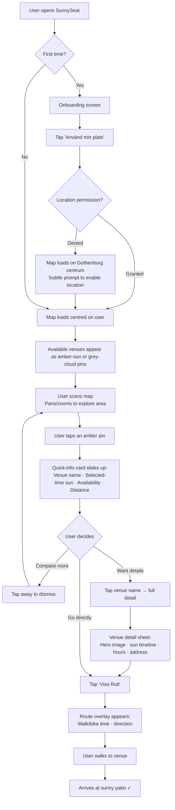
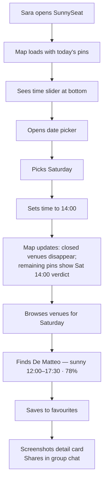

---
stepsCompleted:
  - 1
  - 3
  - 4
  - 7
  - 10
  - 11
  - 12
stepsToExecute:
  - 3
  - 4
  - 7
  - 10
  - 11
  - 12
inputDocuments:
  - '_bmad-output/planning-artifacts/brief/project-brief.md'
  - '_bmad-output/planning-artifacts/prd.md'
  - '_bmad-output/planning-artifacts/sprint-change-proposal-2026-07-12.md'
  - '_bmad-output/planning-artifacts/research/technical-google-places-api-policy-epic-12-research-2026-07-12.md'
  - 'project-context.md'
  - '_bmad-output/planning-artifacts/architecture.md'
  - '_bmad-output/planning-artifacts/epics.md'
  - 'nextjs-app/docs/design/DESIGN.md'
  - '_bmad-output/planning-artifacts/design/references/screens/mobile/ (13 screen images)'
  - '_bmad-output/planning-artifacts/design/references/screens/desktop/ (8 screen images)'
  - '_bmad-output/planning-artifacts/design/references/components/ (41 component images)'
documentCounts:
  briefs: 1
  prd: 1
  projectContext: 1
  architecture: 1
  designSystem: 1
  screenReferences: 21
  componentReferences: 41
  epics: 1
  research: 1
  changeProposals: 1
workflowType: 'ux-design'
project: 'sunnyseat'
author: 'Rasmus'
date: '2026-04-08'
updated: '2026-07-13'
---

# UX Design Specification — SunnySeat

**Author:** Rasmus
**Date:** 2026-04-08
**MVP scope correction:** 2026-05-19 — planner, date picker, future sun simulation, and favourites are free MVP functionality. Season Pass, Swish, paywalls, payment states, and premium recovery are preserved as Future Monetization references only.
**Visual source refresh:** 2026-05-21 — MVP visual validation uses the refreshed Claude Design MVP Unlocked pages only: `SunnySeat MVP Mobile Unlocked.html` and `SunnySeat MVP Desktop Unlocked.html`. Post-MVP Unlocked/Locked pages are future-only.
**Epic 12 launch-readiness correction:** 2026-07-12 — selected-instant availability plus a two-presentation amber/grey verdict supersedes the prior confidence-first/no-teaching model. Sun percentage means share of seating in direct sun, never probability; internal confidence is not exposed visually or to assistive technology.
**Epic 12 closed-venue policy closure:** 2026-07-13 — map and ranked discovery hide explicitly closed venues, while exact by-name search returns a labelled result and favourites retain saved closed venues as greyed, accessible, inspectable rows.

---

<!-- Steps to execute: 3 (Core Experience), 4 (Emotional Response), 7 (Defining Experience), 10 (User Journey Flows), 11 (Component Strategy), 12 (UX Patterns) -->

## Core User Experience

### Defining Experience

SunnySeat's core experience is opening a map and instantly seeing which available venue patios are sunny at the selected Stockholm instant: now by default, or the planner's chosen date and time. The map is not a feature of the product — it is the product. Every other interaction (venue details, free planner, favourites, feedback) layers on top of this persistent map canvas. The defining user action is the visual scan: open the app, see amber pins where more than half of the seating is in direct sun and weather does not gate it, pick an available venue, go.

### Platform Strategy

- **Mobile-first PWA:** Designed at 390px, responsive to desktop at 1024px+. Mobile is the primary context — users are outside, deciding where to go now.
- **Touch-primary:** Core interactions (map pan/zoom, pin tap, sheet drag) are touch-optimized. Desktop uses mouse equivalents with the same interaction model.
- **Geolocation-dependent:** Location permission is the critical onboarding gate. The map centers on the user's position; distance to venues is a primary decision factor.
- **Always-online:** Real-time sun predictions require connectivity. No offline data caching — the app shell loads offline with a connection-required message.
- **Persistent map canvas:** MapLibre GL JS renders the map as the root-level element, never unmounted during navigation. All UI layers (bottom sheets, panels, modals) overlay the map.

### Effortless Interactions

- **Visual scan answers the question:** Exactly two pin presentations answer the selected instant: amber sun + seating-share percentage for `>50% sunlit && !weatherGated`; grey cloud with no percentage otherwise. Icon and accessible name carry the distinction without colour alone.
- **Distance is immediate:** Users can see how far venues are from their position without tapping. The map's spatial layout is the primary comparison tool.
- **One-tap depth:** Tapping a pin reveals venue name, selected-instant sun information, distance, and availability in a quick-info card. One more tap opens full detail. Internal confidence is absent from visible and screen-reader content.
- **No forced engagement on grey days:** When no venues are sunny, the map shows grey pins honestly. No upsell prompts, no "check back later" nudges — a quiet, boring experience is the correct experience when the sun isn't out.

### Critical Success Moments

1. **The amber moment:** User grants location, the map loads, and amber pins appear on sunny venues within seconds. This is the single most important moment in the entire product. If this feels instant and clear, the user is hooked.
2. **The redirect:** User's first choice is full or unavailable. They glance at the map and see another amber pin 200m away. The transition from disappointment to discovery happens on the map itself — no search, no filter, just a visual scan.
3. **The confirmation:** User arrives at the venue. The patio is sunny, exactly as the app predicted. Trust is established. They tap "Ja" on the feedback prompt.

### Experience Principles

1. **The Map Is the Product** — The map isn't a feature, it's the entire experience. Everything else layers on top of the persistent map canvas.
2. **Guided Clarity** — Sun state is visible at a glance through amber-sun vs grey-cloud pins, then reinforced by a short About legend and a skippable first-run coach-mark guide.
3. **Honest Data** — SunnySeat reflects reality without editorial spin. Grey day means grey pins. The percentage is the share of seating in direct sun, not a probability or a confidence score; weather and uncertainty remain explicit without a confidence number.
4. **Zero-Tap Discovery** — Which venues are sunny and how far away they are is visible without tapping anything.
5. **Layered Depth** — Simple at the surface (map + pins), rich underneath (venue detail, sun timeline, weather and uncertainty context). Users who just want a sunny seat never have to go deeper.

## Desired Emotional Response

### Primary Emotional Goals

- **Excitement about possibility:** When the map loads with amber pins, users should feel a spark of "there are sunny places near me right now." The amber colour palette and pin density create visual abundance that fuels this feeling.
- **Effortless certainty:** The dominant ongoing emotion is ease — users should feel like finding a sunny venue requires zero effort. The smoothness of the experience is the product's emotional signature.
- **Trust through accuracy:** When the prediction matches reality, trust compounds. Each accurate visit builds emotional loyalty that no feature can replicate.

### Emotional Journey Mapping

| Stage | Target Emotion | Design Driver |
|-------|---------------|---------------|
| Onboarding | Curiosity + anticipation | Warm brand palette, clear value promise |
| Map loads (amber pins) | Excitement + possibility | Amber pins on the map — visual abundance of sunny options |
| Scanning the map | Clarity + ease | Distance visible spatially, sun state at a glance, no interaction needed |
| Tapping a venue | Satisfaction + certainty | Selected-instant availability, exposure share, sun timeline, clear information hierarchy |
| Route / walking | Momentum + purpose | Decision made, direction clear, ETA visible |
| Arriving sunny | Delight + trust | Prediction confirmed. Credibility earned. |
| Grey day (no sun) | Neutral acceptance | Grey pins only. No editorial, no nudges. Quiet honesty. |

### Micro-Emotions

- **Clarity over confusion:** The map should never feel overwhelming. Pin icons, labels, spatial layout, and information hierarchy eliminate guesswork.
- **Trust over skepticism:** A consistent amber/grey verdict, transparent weather/uncertainty copy, and user feedback build trust incrementally. Never present the seating-share percentage as certainty or probability.
- **Ease over accomplishment:** Users shouldn't feel clever for using SunnySeat — they should feel like finding sun was obvious. The tool disappears behind the result.

### Design Implications

- **Warm palette sells the feeling before the data:** The amber/sand/cream colour system (from DESIGN.md) isn't decorative — it's emotional infrastructure. The interface should feel sunny even before the user reads a single data point.
- **Smoothness > features:** Every interaction that adds friction undermines the core emotional payoff. Animation timing (150ms–300ms from design tokens), sheet transitions, and map responsiveness must feel fluid.
- **No emotional manipulation on grey days:** When there's no sun, the app is quiet. No push to check back, no "sunny tomorrow!" prompts. The absence of forced optimism builds more trust than any engagement tactic.
- **The share moment is about ease, not novelty:** When Lina screenshots the venue detail for her group chat, she's sharing how easy the decision was, not how impressive the technology is. The detail card must be scannable and screenshot-friendly.

### Emotional Design Principles

1. **Excitement lives in the amber pins** — The map scan moment is where emotional energy peaks. Protect it.
2. **Smoothness is the feeling** — Word-of-mouth will be "it was so easy," not "it was so cool." Design for effortless, not impressive.
3. **Trust compounds silently** — Each accurate prediction deepens loyalty. Never spend trust on overpromising.
4. **Grey days need no design** — Neutral acceptance is the correct emotional state when the sun isn't out. Handle it by reflecting reality, nothing more.
5. **Warmth is structural** — The amber colour system, sun-tinted shadows, and sand map background are emotional infrastructure, not decoration.

## 2. Core User Experience

### 2.1 Defining Experience

**"Open the map, browse sunny venues, pick one."**

SunnySeat's defining experience is a 1–2 minute map browse where users scan amber and grey pins, tap a few to compare, and decide where to go. The interaction mirrors how people already use map apps — pan, zoom, tap pins — with one critical difference: the pins reflect the selected instant. Amber means more than 50% of seating is sunlit and weather does not gate the result. Grey means not sunny at that instant, whether because of shade, low exposure, or weather obstruction. Venues explicitly closed at that instant are absent from the map/ranked browse; venues with unknown hours remain discoverable. Deliberate retrieval is different: exact by-name search and saved favourites retain access to a closed venue with an explicit closed label.

This is SunnySeat's Shazam moment: a familiar interaction pattern (map with pins) that delivers an answer no other tool can provide (which patio is in direct sun right now). The innovation is invisible — users don't learn a new interaction, they just get a new kind of answer from a pattern they already trust.

### 2.2 User Mental Model

Users approach SunnySeat with a **"where should I go?" map app** mental model, not a weather app or data dashboard. They expect:

- A map centred on their location
- Pins representing places they can go at the selected instant when hours are known; unknown-hours venues remain visible rather than being falsely treated as closed
- Tapping a pin reveals more info
- Spatial reasoning (proximity, clustering) as the primary comparison method
- The ability to pan and explore beyond their immediate area

**Key mental model implications:**
- The map must feel like a map, not an infographic. No chart overlays, no data density.
- Pin interaction must match established map-app conventions (tap to reveal, tap away to dismiss).
- Distance is felt spatially through the map, not read from a number. The number confirms what the spatial layout already suggests.

### 2.3 Success Criteria

| Criterion | Target | Signal |
|-----------|--------|--------|
| Time to first amber pin visible | <5 seconds after location grant | Performance timing |
| Session duration (browse) | 1–2 minutes | Analytics |
| Venues inspected per session | 2–3 quick-info cards viewed | Tap analytics |
| Decision made | User taps "Visa Rutt" or opens detail without hesitation | Funnel conversion |
| Return behaviour | User opens SunnySeat next sunny day without prompting | D7 retention |

**"It worked" signals:**
- User knew which venues were sunny through the paired sun/cloud icon, amber/grey treatment, and concise labels without relying on colour alone
- User compared 2–3 options by tapping pins, not by scrolling a list
- User made a decision in under 2 minutes
- User arrived at a sunny patio

### 2.4 Novel UX Patterns

**What's established (leverage, don't reinvent):**
- Map with location-based pins (Google Maps, Airbnb, Uber)
- Bottom sheet for detail (Apple Maps, Google Maps)
- Pin tap → quick-info card → detail view (universal map pattern)
- Time slider for temporal exploration (transit apps, weather radar)

**What's novel (the SunnySeat innovation):**
- **Selected-instant sun-state pins:** Pin presentation reflects the chosen time (amber sun + seating-share percentage when sunny; grey cloud without a percentage otherwise). This is time-sensitive data visualisation disguised as familiar map UI.
- **The "recovery redirect" pattern:** Deliberately optimising for the user's *second* choice — the moment their first pick falls through and the map instantly shows nearby sunny alternatives. Most map apps optimise for the first choice; SunnySeat optimises for the pivot.
- **Exposure share without probability theatre:** The amber percentage says how much of the seating area is in direct sun at the selected instant. Internal model confidence remains diagnostic-only; public weather and uncertainty copy carry honest caveats.

**Teaching the novel patterns:**
Use light, optional teaching. A first-run, skippable coach-mark guide introduces the two pin meanings and the mounted planner/list controls; Settings can reopen it. The About page repeats the two-pin legend and states that “70%” means roughly 70% of the seating surface is sunny at the selected time, not a 70% chance of sun. The core map remains usable without completing either explanation.

### 2.5 Experience Mechanics

**1. Initiation**
- **Trigger:** User wants a sunny outdoor seat. Opens SunnySeat (PWA or browser).
- **First-time:** Onboarding screen → "Använd min plats" → location permission.
- **Returning:** App opens directly to map, centred on last/current location.
- **Fallback:** If location denied, map centres on Gothenburg centrum with a gentle prompt to enable location.

**2. Interaction (the 1–2 minute browse)**
- Map loads with amber and grey pins for venues eligible at the selected instant. User pans and zooms to explore.
- Tapping a pin opens a quick-info card: venue name, selected-instant sun information, availability/hours, and distance. Amber surfaces may show the seating-share percentage; grey surfaces never do.
- User taps away to dismiss, taps another pin to compare. This scan-compare-scan loop is the core interaction.
- Time slider (bottom of screen) lets users scrub forward to see how sun states change later today.
- Venue list (row-quantized mobile sheet / side panel) provides an alternative linear view ranked by sun relevance.

**3. Feedback**
- Pin colour is instant, continuous feedback — the map always shows current state.
- Quick-info card confirms spatial intuition with data (distance number matches what the map showed).
- Sun timeline in venue detail gives temporal context (for example, "sunny until 18:30").
- Weather obstruction and meaningful uncertainty remain readable; no visible or screen-reader confidence number appears.

**4. Completion**
- User taps "Visa Rutt" — routing appears with walk/bike time. Decision is final.
- Or user taps venue name to open full detail, reads more, then decides.
- Or user simply notes the venue name and location, closes the app, and walks there.
- After visiting: feedback prompt ("Var det soligt?") closes the trust loop.

## User Journey Flows

### Journey 1: "Sun Right Now" — Lina (Core Discovery Loop)

**Goal:** Find a sunny venue nearby, get there.
**Entry:** First-time or returning user opens SunnySeat wanting a sunny seat now.
**Expected duration:** ~1–2 minutes.



**Key design decisions:**
- Onboarding remains a single permission screen. The separate post-onboarding coach-mark guide is skippable, shows once, and can be reopened from Settings.
- Quick-info card is the primary comparison tool — users tap 2–3 pins before deciding
- "Visa Rutt" is accessible from both quick-info card and venue detail — two paths to the same action
- The scan → tap → dismiss → scan loop is the core interaction pattern; it must feel instant (card appear/dismiss <200ms)
- Map, ranked lists, search, and favourites use the same selected-instant availability predicate, then apply their approved surface policy: explicitly closed venues are hidden from map/ranked discovery, retained as labelled exact by-name results, and retained as greyed, inspectable favourite rows. Unknown-hours venues remain visible without an open/closed claim.

---

### Journey 2: "The Redirect" — Erik (Engagement + Depth)

**Goal:** First choice is full. Find an alternative, explore venue detail, leave feedback and a review.
**Entry:** Returning user who already knows SunnySeat.
**Expected duration:** ~3–5 minutes (includes detail reading, feedback, review).

```mermaid
flowchart TD
    A[Erik opens SunnySeat\nat his usual spot] --> B[Map loads centred on location]
    B --> C[Sees amber pin on Bar Himmel\n+ 2 other amber pins nearby]
    C --> D[Arrives at Bar Himmel — full, no seats]

    D --> E[Glances at map:\n2 amber pins within 200m]
    E --> F[Taps nearest amber pin]
    F --> G[Quick-info card:\nRestaurang Bellora · Sol 15:00–19:15 · Öppet · 180m]

    G --> H[Taps venue name for full detail]
    H --> I[Venue detail sheet opens:\nHero image · description · sun timeline\nOpening hours · address · distance]
    I --> J[Reads venue description and hours]
    J --> K[Scrolls to sun timeline —\nsolid amber through 19:15]

    K --> L["Taps 'Visa Rutt'"]
    L --> M[Route: 2 min walk]
    M --> N[Walks to Restaurang Bellora]
    N --> O[Arrives — tables available, patio sunny ✓]

    O --> P{Feedback prompt appears:\n'Var det soligt när du kom?'}
    P --> Q["Taps 'Ja'"]
    Q --> R{Outdoor seating confirmation:\n'Har stället uteservering?'}
    R --> S["Taps 'Ja'"]

    S --> T[User browses venue detail again after visit]
    T --> U["Taps 'Lämna ett omdöme'"]
    U --> V[Review form opens:\nText input · optional rating]
    V --> W[Writes review:\n'Bra uteservering, perfekt eftermiddagssol']
    W --> X["Taps 'Skicka'"]
    X --> Y[Confirmation: review submitted ✓]
```



**Key design decisions:**
- The redirect happens on the map itself — Erik doesn't search or filter, he scans nearby amber pins. The "recovery from disappointment" is spatial, not textual.
- Venue detail is designed for browsing — hero image, readable description, sun timeline, and practical info (hours, address) in a scannable layout.
- Feedback prompt appears contextually after the user has been near the venue — not as a modal, but as a gentle inline prompt.
- Outdoor seating confirmation is a secondary question, piggy-backing on the feedback moment.
- Review flow is a separate intentional action ("Lämna ett omdöme" CTA button) — not forced, not prompted.

---

### Journey 3: "Planning Saturday Fika" — Sara (Free MVP Planner)

**Goal:** Plan ahead for a future date without payment or account friction.
**Entry:** User wants to explore future sun predictions.
**Expected duration:** ~30–60 seconds.



**Key design decisions:**
- **Planner and date picker are free MVP functionality** — no gate, no lock badge, no partial teaser, no payment screen.
- **Date/time changes update all venue surfaces** — map pins, QuickInfo, list cards, and venue detail remain synchronized.
- **Availability follows the same selected instant** — explicit closed weekdays/times disappear from map/ranked discovery and reappear when the planner moves into an open interval; saved favourites and exact by-name matches remain accessible with a closed label. Unknown hours remain visible.
- **Favourites are free** — saving a venue never opens a paywall or lock prompt.
- **Future Monetization is inactive** — paywall/payment references are preserved for later but not part of the MVP flow.
- **The screenshot moment** is a natural sharing point — the venue detail card must be visually complete and scannable as an image.

---

### Partner Features in Consumer Experience

Partner venues (B2B) appear within the normal consumer map experience with visual enhancements. No separate consumer-facing flow exists; partner onboarding and pin configuration are handled through direct database insert/update queries.

**How partners appear to consumers:**

| Feature | Consumer-Visible Behaviour |
|---------|---------------------------|
| **Golden Pin** | Partner venues display a larger, more prominent amber pin with a warm glow effect. Visually elevated above standard pins without breaking the map's readability. |
| **SOL NU Badge** | When a partner venue's patio is in direct sun, a "SOL NU" badge appears on their venue card in the list view. Standard venues show sun state but without the badge emphasis. |
| **Partner Deep-Links** | External links (from partner websites, social media) can deep-link directly to a partner's venue detail page in SunnySeat. URL format: `sunnyseat.se/?venue=[slug]`. |
| **No consumer-facing distinction label** | Partner status is not explicitly labelled — the visual enhancements (Golden Pin, SOL NU badge) speak for themselves. No "Sponsored" or "Partner" tag. |

---

### Journey Patterns

**Common patterns extracted across all journeys:**

**Navigation Patterns:**
- **Map-first entry:** Every journey starts and returns to the map. The map is home.
- **Layered reveal:** Map → quick-info card → venue detail. Each layer adds depth without losing context (the map remains visible behind sheets).
- **Dismiss to return:** Tapping away from a card/sheet returns to the previous layer. No explicit "back" button needed for the first layer (quick-info).

**Decision Patterns:**
- **Scan-compare-scan:** Users tap multiple pins before deciding. The quick-info card is designed for rapid comparison, not deep reading.
- **Spatial comparison over list comparison:** Users compare venues by their position on the map (proximity, clustering) before comparing data.
- **Availability first, exposure second:** Explicitly closed venues are removed before comparison. Among visible venues, amber/grey verdict, sun-window duration, seating-share percentage on amber surfaces, and distance guide the decision. Internal confidence never acts as a public tiebreaker.

**Feedback Patterns:**
- **Contextual prompts:** Feedback ("Var det soligt?") appears after likely venue visit, not randomly.
- **Two-tap feedback:** Yes/no binary first, optional detail second. Never more than two taps for the core feedback.
- **Intentional reviews:** Review submission is a separate, user-initiated action — never prompted or forced.

**Conversion Patterns:**
- **Free planning loop:** Planner/date/favourites stay in the core loop so users can build habit before monetization.
- **Future device-aware payment:** If Season Pass is reintroduced, Swish should adapt to mobile (deep-link) vs desktop (QR code) automatically.

### Flow Optimisation Principles

1. **Minimise taps to value:** Lina goes from app open to "I know where I'm going" in 3–5 taps. Every additional tap must earn its existence.
2. **The map is the undo button:** Dismissing any overlay returns to the map. Users can never get lost because the map is always there.
3. **Errors don't break flow:** Payment failure → retry on the same screen. Location denied → default map position. No dead ends.
4. **Feedback is earned, not extracted:** Prompts appear at contextually appropriate moments (after a venue visit), not at engagement-maximising moments (mid-browse).
5. **Screenshots are a feature:** Venue detail cards and sun timelines should look good as screenshots — users share these in group chats as decision artifacts.

## Component Strategy

### Design System Foundation

SunnySeat uses a custom design system extracted from Figma (documented in DESIGN.md) with no third-party component library. All tokens are mapped to a custom Tailwind CSS theme configuration as the single source of truth.

**Token Mapping Strategy:**
- All DESIGN.md colour tokens → `tailwind.config.ts` custom colours (e.g., `colors.amber.pin`, `colors.surface.cream`)
- Typography tokens → custom font size utilities with font family, weight, and line-height bundled (e.g., `text-display-xl` = 28px / ExtraBold / Plus Jakarta Sans / 36px)
- Spacing tokens → extended spacing scale (e.g., `space-3` = 6px, `space-5` = 10px)
- Shadow tokens → custom box-shadow utilities (e.g., `shadow-card`, `shadow-route-button`)
- Border radius tokens → custom radius scale (e.g., `rounded-pill`, `rounded-sheet-full`)
- Transition tokens → custom transition utilities (e.g., `duration-fast` = 150ms)
- Gradient tokens → CSS custom properties referenced in Tailwind classes

**Font Loading:** Plus Jakarta Sans and Manrope loaded via `next/font`. No system font fallbacks in rendered UI.

### Component Architecture

**Approach:** In-app component library in a `components/` directory within the Next.js app. No Storybook overhead — components are built, tested, and iterated in context. Extractable to a standalone library if needed later.

> **Note:** The domain folders below (map/, venue/, time/, etc.) live inside `components/custom/` per the project's three-layer architecture: `components/ui/` (shadcn/ui primitives) → `components/composed/` (multi-primitive compositions) → `components/custom/` (feature components by domain). The `shared/` group maps to `components/composed/`. See CLAUDE.md and the architecture document for the full layer model.

**File Structure:**
```
components/custom/
├── map/
│   ├── MapCanvas.tsx              # MapLibre GL JS wrapper (persistent, never unmounted)
│   ├── VenuePin.tsx               # Sunny/shaded/selected/partner pin states
│   ├── MapControls.tsx            # Zoom +/-, location button (floating glass)
│   └── MapOverlay.tsx             # Gradient overlay, decorative map elements
├── venue/
│   ├── VenueQuickInfo.tsx         # Quick-info card (tap pin → slide-up)
│   ├── VenueDetail.tsx            # Full venue detail (bottom sheet / side panel)
│   ├── VenueList.tsx              # Venue list (row-count mobile sheet / side panel)
│   ├── VenueCard.tsx              # Single venue in list (thumbnail + sun info)
│   ├── SunTimeline.tsx            # Horizontal sun exposure timeline bar
│   └── SunBadge.tsx               # Amber badge overlay on venue image
├── time/
│   ├── TimeSlider.tsx             # Free time scrubber
│   ├── DatePicker.tsx             # Free future date picker
│   └── TimeSliderPanel.tsx        # Glass panel containing slider + date
├── favourites/
│   ├── FavouriteButton.tsx        # Free heart toggle
│   └── FavouritesList.tsx         # Saved venue list
├── feedback/
│   ├── FeedbackPrompt.tsx         # "Var det soligt?" inline prompt
│   ├── OutdoorSeatingConfirm.tsx  # "Har stället uteservering?" follow-up
│   ├── ReviewForm.tsx             # Text review submission form
│   └── ReviewCard.tsx             # Displayed review from another user
├── future-premium/                # Future Monetization only — inactive for MVP
│   ├── UpsellCard.tsx
│   ├── PaywallScreen.tsx
│   ├── SwishPayment.tsx
│   ├── PaymentProcessing.tsx
│   └── PaymentFailed.tsx
├── navigation/
│   ├── BottomNavBar.tsx           # Mobile bottom navigation (40px)
│   ├── DesktopNavBar.tsx          # Desktop top navbar with logo + search
│   └── SearchBar.tsx              # Venue search input
├── guidance/
│   └── CoachMarkGuide.tsx         # Skippable responsive first-run guide; Settings re-entry
├── routing/
│   └── RouteOverlay.tsx           # Walk/bike route with ETA
├── shared/
│   ├── GlassButton.tsx            # Frosted-glass floating button (48px/40px)
│   ├── AmberCTAButton.tsx         # Gradient amber CTA (multiple sizes)
│   ├── RouteButton.tsx            # Gold-to-dark gradient "Visa Rutt"
│   ├── BottomSheet.tsx            # Reusable bottom sheet (row-quantized list / detail container)
│   ├── DragHandle.tsx             # Sheet drag handle pill
│   └── InfoCard.tsx               # Rounded info section card (e.g., "Soltider idag")
└── pages/
    ├── OnboardingScreen.tsx       # First-visit onboarding
    ├── AboutPage.tsx              # How it works, data sources
    └── NotFoundPage.tsx           # 404 with redirect to map
```

### Animation Strategy

**Framer Motion — for gesture-driven and complex state transitions:**
- Bottom sheet height-following drag and whole-row settle (`N=0..maxRows`)
- Quick-info card slide-up / slide-down
- Upsell card and paywall screen enter/exit
- Venue-detail sheet enter/exit
- `AnimatePresence` for mount/unmount transitions
- Spring easing: `cubic-bezier(0.22, 1, 0.36, 1)` for drag-release settle

**CSS Transitions (Tailwind utilities) — for micro-interactions:**
- Button hover/press states (`transition-colors duration-200 ease-in-out`)
- Pin colour transitions (`transition-colors duration-150`)
- Tab switches (`duration-fast`)
- Opacity fades (`transition-opacity duration-200`)
- Badge/icon state changes

**`prefers-reduced-motion`:** All Framer Motion animations wrapped in a motion-safe check. CSS transitions simplified to instant state changes. Sheet transitions reduced to opacity fade only.

### Custom Component Specifications

#### VenuePin

**Purpose:** Represents a venue on the map. The primary visual element of the entire product.
**Presentations:** Exactly two data presentations exist. The shared predicate is the single authority for visual content and accessible naming.

| Presentation | Predicate | Tokens | Content | Accessible-name rule |
|--------------|-----------|--------|---------|----------------------|
| Sunny | `sunExposurePercent > 50 && !weatherGated` | Existing amber pin, border, and shadow tokens | Sun icon + seating-share percentage | Names venue, “soligt vid vald tid,” and seating-share percentage |
| Not sunny | All other results, including low-`Partial`, `Shaded`, `NoSun`, and `CloudObscured` | Existing grey pin, border, and shadow tokens | Cloud icon; no number | Names venue and “inte soligt vid vald tid”; never includes a percentage |

Selection, hover/focus, clustering, and any partner emphasis may add an interaction ring, focus indicator, or existing partner decoration, but must not create a third sun-state presentation or change the predicate/content. A selected grey pin stays the same grey cloud without a number; a selected amber pin stays the same amber sun with its seating-share percentage. `CloudObscured` remains available to cards/detail for honest weather copy even though its pin shares the grey presentation.

**Interaction:** Tap opens VenueQuickInfo. Tap on the selected pin deselects it. Data-state changes do not flash on refresh; reduced motion changes presentation instantly.

#### BottomSheet

**Purpose:** Reusable container for the row-quantized mobile venue list and full venue-detail/future overlay surfaces. The list sheet no longer uses named fixed snaps.

**Mobile venue-list height contract:** `handle + persistent chrome + N complete rows`, where `N=0..maxRows`. At `N=0`, only the handle is exposed and list chrome is not rendered. From `N>=1`, the controls/chips occupy their own measured chrome term and never consume part of a promised row. `rowHeight` comes from the actual rendered row variant; resting states never clip a row. `maxRows` is the greatest complete-row count that clears top safe-area/search chrome. At max, the list scrolls internally.

**Behaviour:** The bottom edge remains anchored above navigation/safe area while height follows the finger 1:1; no translated gap may expose the map beneath the sheet. Dragging the handle or a row while list `scrollTop===0` moves the sheet. Otherwise the list scrolls. Release settles on a whole-row boundary in the release/fling direction. ArrowUp/ArrowDown changes exactly one row and announces the new visible-row count. Reduced motion preserves the same state changes without a spring.

Venue detail remains a full content sheet/desktop panel and uses its existing dismiss transition; the `N` model applies to the mobile venue list, not to detail content.

#### VenueQuickInfo

**Purpose:** Compact venue summary that appears when tapping a map pin. The primary comparison tool.
**Content:** Venue name, selected-instant sun window/verdict, distance, and selected-instant availability/hours when known. Amber surfaces may show seating-share percentage; grey surfaces use a percentage-free verdict. No visible or screen-reader confidence content.
**Behaviour:** Slides up from bottom on pin tap (<200ms). Tapping venue name/“Mer info” navigates to full VenueDetail. Tapping "Visa Rutt" opens RouteOverlay. Tapping map (outside card) dismisses. Only one QuickInfo is visible at a time — tapping a new pin replaces the current one.
**Responsive:** Mobile: full-width card above bottom nav. Desktop: positioned near the selected pin or in the side panel area.

#### TimeSliderPanel

**Purpose:** Glass panel containing the free time scrubber and free date picker.
**Background:** `color-glass-slider` (rgba(255,255,255,0.9)) with `blur-heavy` (12px) backdrop.
**Behaviour:** Time slider scrubs through today's hours and selected future dates. Date picker opens a calendar for future dates. Interacting with either element never triggers a premium gate in MVP.
**Responsive:** Mobile: floating panel within page padding with the slimmer Epic 12 vertical inset (existing token utilities only), while retaining badge clearance and the minimum touch target. Desktop: integrated into the top header bar and unchanged.

#### SunTimeline

**Purpose:** Horizontal bar showing when a venue has sun exposure throughout the day.
**Visual:** Gradient bar (`gradient-timeline-bar`) on a track background. Height: `size-timeline-h` (12px). Time markers at key points (sunrise, current time, sunset).
**Content:** Solid amber segments for sun windows. Gap/transparent for shaded periods. Current time indicated with `text-time` styling.
**Verdict alignment:** Unqualified “Sol HH:MM–HH:MM” and peak labels use the same `>50% sunlit && !weatherGated` predicate as pins/cards. Lower exposure may remain visible only as explicitly qualified “viss sol”/potential treatment, and weather-gated clear-sky geometry may remain only as clearly labelled potential; neither may make a grey venue sound unqualifiedly sunny.

#### CoachMarkGuide

**Purpose:** Optional post-onboarding teaching for the two-pin legend and the controls mounted in the current responsive layout.
**Sequence:** The first step explains both pin presentations in the coach card while anchored to the persistent map surface, so it does not depend on a sunny venue existing. Middle steps target the currently mounted time slider/date planner, tag chips, venue list/sheet, and favourites entry. Feedback may be mentioned in copy but is not targeted unless the guide first opens a venue detail deterministically.
**Behaviour:** Shows once on first map entry after onboarding; an always-visible “Hoppa över”/close exits from every step and persists the seen flag. Settings exposes “Visa guide igen.” Each step verifies its target exists before focus moves; an unavailable target is skipped rather than highlighted at stale coordinates. Mobile and desktop use independent anchor mappings.
**Accessibility:** Focus remains inside the current coach card, initial focus lands on its heading, Escape exits, next/back/skip are named controls with a minimum 44×44 px touch target, and the target receives an accessible description. On close, focus returns to the invoking control or a stable map heading. `prefers-reduced-motion` removes animated travel between targets.

#### VenuePhoto

**Purpose:** Deterministic venue imagery with an honest, branded fallback.
**Surface selection (recommended default):** Prefer explicit `cardUrl` and `heroUrl` fields, retaining the legacy `url` only as a backward-compatible fallback. List cards and desktop QuickInfo request the card rendition; venue detail requests the hero rendition. The mobile anchored QuickInfo keeps its shipped placeholder treatment. Raw originals are never requested by a consumer surface.
**Fallback:** Missing URL or load/decode failure switches once to initials on card/desktop QuickInfo and to the branded hero placeholder in detail. The failed image is removed from the accessibility tree; fallback text uses the venue's accessible name. No broken-image icon, infinite retry, layout shift, or external-hotlink assumption.

#### VenueDetailPreload

**Recommended default:** Preserve the standing same-date scrub=zero-request and date-change=one-list-request gates. Prefetch only after the initial list/location settle, using at most six candidates with no more than two concurrent requests, prioritized by current visible order and including visible favourites. Use the already-returned city/list/favourites candidates; do not expand the API radius to 10 km in this UX story. Do not restart detail prefetch on time scrubs or date changes. Prefetch is silent and yields to direct interaction.
**Cache hit:** “Mer info” opens with populated content immediately using the exact detail query key.
**Cache miss/non-prefetched venue:** Open the sheet/panel immediately with venue identity and stable token-based skeletons for hero/timeline/details; keep the close/back action usable, set the content region `aria-busy=true`, and announce “Laddar platsinformation” once through a polite live region. Replace skeletons in place without a second entrance animation. On failure, preserve the shell and expose the existing inline retry pattern rather than closing the detail surface.

### Implementation Roadmap

**Phase 1 — Core Map Experience (Critical path):**
- MapCanvas + VenuePin (exactly two sun-state presentations plus non-semantic selection emphasis)
- VenueQuickInfo
- BottomSheet (row-quantized mobile VenueList)
- BottomNavBar (mobile) + DesktopNavBar
- GlassButton (map controls)
- OnboardingScreen (location permission)

**Phase 2 — Venue Depth:**
- VenueDetail (full bottom sheet / desktop overlay)
- SunTimeline + SunBadge
- RouteButton + RouteOverlay
- VenueCard (list item)
- InfoCard (reusable section container)
- SearchBar

**Phase 3 — Engagement:**
- FeedbackPrompt + OutdoorSeatingConfirm
- ReviewForm + ReviewCard
- AmberCTAButton (shared across feedback, review, and future premium if reactivated)

**Phase 4 — Free Planner + Favourites:**
- TimeSliderPanel + TimeSlider + DatePicker
- FavouriteButton + FavouritesList

**Future Monetization — preserved, inactive for MVP:**
- UpsellCard
- PaywallScreen
- SwishPayment (mobile deep-link + desktop QR)
- PaymentProcessing + PaymentFailed

**Phase 5 — Polish:**
- AboutPage + NotFoundPage
- Partner Golden Pin variant
- MapOverlay (gradient, decorative elements)
- Animation refinement + reduced motion support

This roadmap follows the user journey priority: the map experience must work before anything layers on top of it.

### Selected-Instant Availability & Hours

**One time source:** Every availability decision and every hours label uses the same selected instant in `Europe/Stockholm`: live now by default, otherwise the planner's selected date plus time. A time scrub re-evaluates locally from the already-loaded canonical `opening_hours`; it does not fetch. A date change retains the established single list request for the new sun day-series.

**Eligibility contract:** Evaluate one shared open-at-selected-instant predicate before tag filtering, availability counts, ordering, pins, map-adjacent ranked lists, exact by-name results, and favourites presentation. Map pins, ranked discovery rows, and their counts exclude `closed`. Exact by-name identity matches and saved favourites do not use `closed` as a membership filter: they retain the venue and expose its state honestly. Unknown hours are never equated with closed.

| Hours data at selected instant | Availability result | Public presentation |
|-------------------------------|---------------------|---------------------|
| Entire `opening_hours` field absent/undefined | Unknown | Venue remains visible. Suppress “Öppet/Stängt” claims and concrete close-time copy. |
| Selected weekday missing or `null` | Explicitly closed that weekday | Hide from map/ranked discovery and availability counts. Retain an exact by-name match labelled `Stängt vid vald tid`; retain a saved favourite as a greyed, labelled, inspectable row. |
| Current weekday interval contains selected time | Open | Venue remains visible; derive close time from this same selected instant. |
| Prior weekday has `close < open` and selected after-midnight time is before that close | Open in prior day's session | Venue remains visible; close-time copy uses the spillover close (for example, `02:00`). |
| Valid interval exists but selected time is before open or at/after close | Closed at that instant | Hide from map/ranked discovery and availability counts; retain the labelled exact-name/favourite access paths. The venue may reappear in map/ranked discovery on a later scrub. |

**Hours copy:** Live mode may use “Öppet till HH:MM.” Planned mode uses selected-time-qualified copy such as “Öppet vid vald tid · till HH:MM”; if that qualification cannot be rendered on a constrained surface, suppress the hours line rather than showing current-day/current-clock copy beside a planned result. Unknown hours suppress the line. Never persist or render source-provided display strings; copy is derived and localized at render time from provider-neutral canonical hours.

**Selection continuity:** If a time change makes the currently selected venue explicitly closed, remove its pin/ranked-list membership and selected preview. If detail is already open, keep the user's context but replace any open claim with “Stängt vid vald tid.” A closed favourite or exact by-name result opens the same inspectable detail state without restoring a map pin. A polite live-region update announces that the venue is closed at the selected time. Unknown-hours detail never claims open or closed.

**Resolved product decision (2026-07-13):** An exact by-name match that is closed at the selected instant remains in search, is labelled `Stängt vid vald tid`, and can open venue details. Area, partial/fuzzy discovery, map pins, and ranked list membership continue to exclude explicitly closed venues. A saved closed venue remains in `FavouritesList` with a token-based grey overlay/treatment that preserves WCAG contrast, a visible and programmatic `Stängt vid vald tid` label, and an enabled row/detail action. The grey treatment must never be the only state signal and must not make the row look disabled.

### Public Confidence Removal Contract

- Internal confidence computation, coverage diagnostics, uncertainty reasons, logs, and maintainer tooling remain intact.
- Public UI and assistive text never expose a confidence percentage: remove it from list cards, QuickInfo, venue detail, card accessible names, sr-only lines, and the route overlay.
- The route overlay retains its prediction-uncertainty honesty row when meaningful, renamed and rendered as uncertainty-only; remove empty separators/slots when no uncertainty copy exists.
- The bold sun-exposure value is separate from confidence. It remains only where the public presentation is amber and always means share of seating in direct sun at the selected instant.
- Grey pins, grey cards, grey accessible names, and weather-gated presentations remain percentage-free. Weather/uncertainty copy may explain shade, clouds, rain, stale/missing weather, or model limitations without numeric confidence.
- About may say confidence is tracked internally to prioritize improvements, but it must not teach or display a per-venue “Säkerhet” number.

## UX Consistency Patterns

### Button Hierarchy

Three tiers of button importance, each with a distinct visual treatment from the design system:

| Tier | Component | Visual | Usage |
|------|-----------|--------|-------|
| **Primary action** | RouteButton | `gradient-route-button` (gold-to-dark), `shadow-route-button`, pill shape | The ONE action per screen that moves the user forward: "Visa Rutt", main navigation CTAs. Only one primary button visible at a time. |
| **Secondary action** | AmberCTAButton | `gradient-cta-amber` (gold-to-amber), `shadow-cta`, pill shape | Important but not the primary: "Lämna ett omdöme", "Ge oss feedback", "Skicka". Future Monetization may reuse it for "Betala med Swish" / "Visa Säsongskortet". Multiple can coexist on a screen. |
| **Tertiary / utility** | GlassButton | `color-glass-standard` (frosted white 80%), `blur-standard`, `shadow-button-float`, pill shape | Map controls (zoom +/−, location), share, favourite, close. Always circular or pill. Visually recede behind primary/secondary actions. |

**Button rules:**
- Never place two primary buttons on the same screen. If two actions compete, one becomes secondary.
- Disabled buttons use 40% opacity of their normal fill. No grey-out — maintain the colour identity at reduced intensity.
- All buttons use `radius-pill` (9999px). No squared or rounded-rectangle buttons anywhere in the product.
- Touch targets: minimum 44×44px on mobile (even if the visual button is smaller, the hit area expands).

### Sheet & Overlay Behaviour

Sheets are the primary container for all non-map content. Consistent behaviour across all sheet types:

**Stacking Rules:**
- Only one sheet visible at a time. Opening a new sheet replaces the current one (with appropriate transition).
- Exception: VenueQuickInfo can coexist with the mobile list sheet when rows are visible — the quick-info card sits above the list container.
- Future Monetization flows (UpsellCard, PaywallScreen) replace the current sheet entirely only if reactivated post-MVP.

**Dismiss Patterns:**
- **List sheet drag down** decreases `N` by whole-row boundaries until the handle-only `N=0` state. It does not translate off its bottom anchor.
- **Tap outside** (on the map) dismisses VenueQuickInfo cards.
- **Swipe/drag on a list row** also resizes the sheet when the internal list is at its top; it is not handle-only.
- **Venue-detail drag/back** retains its full-sheet dismiss behavior; the list's row ladder and the detail's dismissal are separate contracts.
- **Back gesture / button** dismisses the top-most overlay and returns to the previous state.
- Dismissing always returns to the map. The map is the universal "home" state.

**Transition Timing:**
- List drag: 1:1 height tracking; release settles to a whole-row boundary with the existing gentle spring token
- List ArrowUp/ArrowDown: one-row state change with the same settle; instant under reduced motion
- Venue detail → dismissed: 250ms, `easing-exit` (ease-in)
- QuickInfo appear: 200ms, `easing-enter` (ease-out)
- QuickInfo dismiss: 150ms, `easing-exit`

**Desktop Adaptation:**
- Mobile bottom sheets → desktop side panels (390px wide for detail, 190px for venue list)
- Desktop panels do not use drag — they open/close with click and transition
- Same content hierarchy, different container

### Loading & Empty States

**Principle:** The map is always the first thing visible. Data populates progressively.

| State | Behaviour |
|-------|-----------|
| **Initial map load** | Map canvas renders immediately with sand background and tiles. Pins fade in as venue data arrives (150ms fade per pin). No spinner, no skeleton. |
| **Slow connection (>3s)** | Small loading pill at top of map: "Laddar platser..." in `text-body-sm` / `color-text-muted`. Disappears when first pin renders. |
| **Venue detail loading** | Sheet opens immediately with venue name and placeholder layout. Sun timeline and details populate as API responds. Subtle shimmer on placeholder areas. |
| **Search — no results** | Search bar shows "Inga resultat för '[query]'" inline below the input. Map view unchanged. No full-page empty state. |
| **No venues in view area** | Map shows no pins. No message needed — the user can pan to find venues. |
| **No sunny venues (grey day)** | All pins grey. No banner, no message, no prompt. The map reflects reality. |

### Error & Degradation Patterns

**Principle:** Silently degrade. Only surface errors when the core experience (seeing pins) is completely broken.

| Scenario | User-Facing Behaviour | Technical Response |
|----------|----------------------|-------------------|
| Sun API slow / detail cache miss | Detail shell opens immediately with identity, token-based skeletons, `aria-busy`, and one polite loading announcement | Use bounded initial-settle prefetch when available; otherwise complete the live detail request |
| Weather data stale | Keep the amber/grey verdict honest from available signals and show accessible freshness/uncertainty copy where relevant; never expose confidence | Preserve internal diagnostics; do not fabricate freshness |
| Weather API down / weather unknown | Weather remains explicitly unknown; do not fabricate clear sky or reveal a confidence number | Serve geometric potential only under the established unknown-weather contract |
| Venue API failure | Inline map message: "Kunde inte ladda platser" + retry button | Retry with exponential backoff |
| Future Swish payment timeout | PaymentFailed screen with "Försök igen" button | Stop polling after 5 min per NFR36 if payment flow is reactivated |
| Location API failure | Map centres on Gothenburg centrum | Subtle "Aktivera plats" prompt |
| Network offline | App shell visible, map tiles from cache if available, "Ingen anslutning" banner at top | Service worker serves cached shell |

**Error message tone:** Matter-of-fact Swedish. No exclamation marks, no apologies, no emoji. Example: "Kunde inte ladda platser. Försök igen." Not: "Oj! Något gick fel!"

### Feedback & Confirmation Patterns

**Feedback prompt ("Var det soligt?"):**
- Appears as an inline card within the venue detail view, not as a modal or push notification.
- Triggered contextually — when the user reopens a venue they likely visited (based on proximity + time since last view).
- Binary first: "Ja" / "Nej" buttons. Single tap completes the core feedback.
- Optional follow-up: outdoor seating confirmation ("Har stället uteservering?") appears only after the sun feedback is submitted.
- Dismissible: user can ignore or swipe away. Never blocks content.

**Review submission:**
- Intentional action: user taps "Lämna ett omdöme" CTA in the venue detail view.
- Single text input field + optional star rating. No multi-page form.
- Submit button ("Skicka") uses AmberCTAButton styling.
- Success: inline confirmation replaces the form ("Tack för ditt omdöme"). No toast, no modal. Confirmation visible for 3 seconds, then fades.
- Failure: inline error below the form ("Kunde inte skicka. Försök igen.") with retry.

**Payment confirmation:**
- Future payment success: dedicated confirmation screen with checkmark and "Premium aktiverat" message. Auto-returns to map after 2 seconds or on tap if payment flow is reactivated.
- Failure: dedicated PaymentFailed screen with clear message and retry button. No auto-dismiss — user controls when to retry or go back.

### Map Interaction Conventions

**Pin interactions:**
- **Tap pin** → VenueQuickInfo slides up. The pin keeps its amber-sun or grey-cloud data presentation and gains only the existing selection/focus emphasis.
- **Tap selected pin** → Deselects. QuickInfo dismisses. Pin loses selection emphasis; data presentation is unchanged.
- **Tap map (no pin)** → Deselects current pin, dismisses QuickInfo. Returns to pure map view.
- **Tap different pin** → Previous pin deselects, new pin selects, QuickInfo swaps (no dismiss + re-appear — crossfade content, 150ms).

**Map gestures:**
- **Pan** (drag): Moves the map. Standard map behaviour.
- **Pinch zoom**: Two-finger zoom. Standard map behaviour.
- **Double-tap**: Zoom in one level. Standard map behaviour.
- **Two-finger tap**: Zoom out one level. Standard map behaviour.

**Map controls (GlassButton):**
- **Zoom +** / **Zoom −**: Top-right stack on mobile. Increment one zoom level per tap.
- **My location**: Recentres map on user's current position with smooth pan animation (500ms).
- Controls fade to 60% opacity during active map drag to reduce visual clutter. Return to full opacity on drag end.

**Re-centre behaviour:**
- On app open: map centres on user's location (or Gothenburg centrum if no permission).
- After panning away: my-location button visible. Tap recentres with animation.
- After viewing venue detail and dismissing: map does NOT recentre — preserves the user's last pan position. Spatial context is precious.

### Navigation Patterns

**Mobile:**
- BottomNavBar (40px) with tab icons: Karta (map), Favoriter (favourites), Om (about).
- Active tab: `color-tab-active` (#d97706). Inactive: `color-tab-inactive` (#a8a29e).
- Tab labels uppercase, `text-label-sm`.
- Bottom nav is always visible except when a full-screen sheet covers it (venue detail full state, paywall, onboarding).

**Desktop:**
- DesktopNavBar (84px) fixed top with logo + search bar.
- No bottom nav — navigation through header and direct map interaction.
- Venue list as persistent 190px side panel (overlaying map, not reducing canvas).
- Venue detail as 390px overlay panel.

**Universal:**
- No traditional page-to-page navigation. The app is a single-screen map with layered overlays.
- URL reflects state for deep-linking: `sunnyseat.se/?venue=[slug]&t=[time]`.
- Browser back button dismisses the current overlay (not navigate to a previous "page").
- Settings includes “Visa guide igen,” which returns to the map and launches the coach-mark guide at step one.

### Typography Consistency Rules

- **Venue names** always use `text-heading-md` (18px/Bold/Plus Jakarta Sans) in lists, `text-display-xl` (28px/ExtraBold/Plus Jakarta Sans) in detail view.
- **Sun data** (time ranges, percentages) always use `text-label-lg` (14px/Bold/Manrope) with `color-amber-dark` (#735c00).
- **Body descriptions** always use `text-body-lg` (16px/Medium/Manrope) with `color-text-body` (#4d4635).
- **CTA button labels** always use `text-label-lg` (14px/Bold/Manrope) with `color-amber-cta-text` (#554300).
- **Badge labels** (SOL NU, SOL IDAG) always uppercase, `text-label-md` (12px/Bold/Manrope).
- Numbers (seating-share percentage on amber surfaces, time, distance) always use Manrope Bold for tabular consistency. Internal confidence is never a typography case because it is not rendered.

### Accessibility Floor

- Pin accessible names use the exact shared amber predicate. Amber names may include seating-share percentage; every grey name is percentage-free, including low-`Partial` and weather-gated venues.
- Colour is never the sole state signal: amber uses a sun icon and grey uses a cloud icon; text alternatives say “soligt vid vald tid” or “inte soligt vid vald tid.”
- No visible, `aria-label`, sr-only, live-region, routing-overlay, or card-name string may expose model confidence. Prediction uncertainty and weather honesty remain available as non-numeric public copy.
- The row-count sheet exposes its current `N` and range, supports ArrowUp/ArrowDown one row at a time, keeps a visible focus indicator, and announces changes without moving focus.
- Coach marks trap focus in the current step, support Escape and skip at every step, verify the target is mounted before describing it, and restore focus on exit.
- Photo fallbacks preserve useful alternative text without announcing a failed URL or decorative placeholder twice.
- Dynamic availability changes are announced politely. Closed favourites and exact-name results expose `Stängt vid vald tid` in visible and accessible text; their detail action remains keyboard/touch operable. A venue with unknown hours is never announced as closed.
- All new/revised controls retain the project-wide 44×44px minimum touch target and respect `prefers-reduced-motion`.

## Screen Inventory

This section maps every Figma screen frame to its specific interactions, states, and animations. Cross-references point to the relevant sections above where patterns are defined in full. Implementers should use this as their entry point per screen, then follow cross-references for shared pattern details.

---

### Screen: onboarding (mobile)

**Reference:** `design/references/screens/mobile/onboarding-mobile.png`
**Route:** `/` (first visit only, gated by localStorage flag)
**Purpose:** First-time user welcome. Single goal: obtain location permission.

**Layout:**
- Full-screen warm amber gradient background (no map visible)
- "SunnySeat" logo text centred top
- Headline: "Hitta uteplatser i solen — just nu." (`text-display-xl` / white / Plus Jakarta Sans)
- Subtitle: "Platsen sparas aldrig." (`text-body-md` / white at 70% opacity)
- Primary CTA: "Använd min plats" with location pin icon (AmberCTAButton, `gradient-cta-amber`, pill shape)
- Secondary link: "Hoppa till Göteborgs centrum" (`text-body-sm` / white / underline)

**Interactions:**
- Tap "Använd min plats" → triggers browser geolocation permission dialog. On grant → navigate to map-primary centred on user location (300ms fade transition). On deny → navigate to map-primary centred on Gothenburg centrum.
- Tap "Hoppa till Göteborgs centrum" → navigate to map-primary centred on Gothenburg centrum (skips location prompt).
- No back navigation. No dismiss. This screen only appears once.

**States:**

| State | Behaviour |
|-------|-----------|
| Default | As described above |
| Location permission pending | CTA shows subtle pulse animation while browser dialog is open (opacity 0.8 → 1.0, 1s loop) |
| Location granted | Screen fades out (250ms, `easing-exit`), map-primary fades in |
| Location denied | Same transition as granted, map centres on Gothenburg centrum |

**Animations:**
- Screen entrance: fade-in from white (400ms, `easing-enter`). Headline and CTA stagger in (headline at 200ms, CTA at 400ms).
- Screen exit: full-screen fade-out (250ms, `easing-exit`)
- CTA button: standard AmberCTAButton hover/press states (see **Button Hierarchy**)
- `prefers-reduced-motion`: no stagger, instant appear, opacity-only exit

---

### Screen: onboarding (desktop)

**Reference:** `design/references/screens/desktop/onboarding-desktop.png`
**Route:** Same as mobile
**Purpose:** Identical to mobile — obtain location permission.

**Layout:**
- Same as mobile but full viewport width. Headline and CTA centred both horizontally and vertically.
- "SunnySeat" wordmark centred top (not in navbar — this is pre-app).
- CTA button width: auto (content-sized), not full-width.

**Interactions & States:** Identical to mobile onboarding.

**Animations:** Identical to mobile onboarding.

---

### Screen: map-primary (mobile)

**Reference:** `design/references/screens/mobile/map-primary.png`
**Route:** `/` (returning users) or post-onboarding
**Purpose:** The core screen. Map with sun-state venue pins. Everything layers on top of this.

**Layout (top to bottom):**
- Floating glass search bar at top (within safe area): `color-glass-standard`, `blur-standard`, `radius-pill`. Placeholder text: "Sök plats eller område i Göteborg..."
- Map canvas (MapLibre GL JS): `color-surface-sand` base, decorative road lines, `gradient-map-overlay`. Fills entire viewport behind all other elements.
- Venue pins: exactly two presentations — amber sun + seating-share percentage for `>50% sunlit && !weatherGated`, grey cloud without percentage otherwise. Explicitly closed venues are filtered out; unknown-hours venues remain. See **VenuePin**.
- Map control buttons (right edge): zoom +/− stack + my-location button. GlassButton 48×48px, `shadow-button-float`.
- Time slider panel (bottom, above nav): `color-glass-slider`, `blur-heavy`, `radius-panel`. The mobile-only vertical padding/min-height uses the slimmer existing token utilities while preserving value-badge clearance and 44x44 touch targets; desktop spacing is unchanged. Contains the time scrubber track, current time indicator, and Calendar + selected-date trigger. See **TimeSliderPanel**.
- Quick-info card (when pin selected): slides up from bottom above the time slider. See **VenueQuickInfo** component spec.
- Bottom nav bar (fixed, 40px): Karta / Favoriter / Om tabs. See **Navigation Patterns**.

**Interactions:**
- Tap amber/grey pin → pin gains selection/focus emphasis without changing its data presentation; VenueQuickInfo slides up (200ms, `easing-enter`). See **Map Interaction Conventions**.
- Tap selected pin → deselects, QuickInfo dismisses (150ms, `easing-exit`).
- Tap map (no pin) → deselects current pin, dismisses QuickInfo.
- Tap different pin → previous deselects, new selects, QuickInfo content crossfades (150ms).
- Pan/zoom map → standard MapLibre gestures. Map controls fade to 60% opacity during drag. See **Map Interaction Conventions**.
- Tap zoom +/− → increment zoom level.
- Tap my-location → smooth pan to user position (500ms).
- Tap search bar → search input focuses, keyboard opens. Results inline below input.
- Interact with time slider/date picker → planner updates selected date/time directly. No premium gate or lock state appears in MVP. See **Journey 3: Sara**.
- Tap bottom nav tabs → switch view (Karta active by default).
- First post-onboarding map entry → skippable coach-mark guide begins at the pin legend. Skip/close exits immediately; Settings can reopen it.

**States:**

| State | Behaviour |
|-------|-----------|
| Loading (initial) | Map canvas renders immediately with sand background + tiles. Pins fade in individually as venue data arrives (150ms per pin). See **Loading & Empty States**. |
| Slow connection (>3s) | Loading pill at top: "Laddar platser..." in `text-body-sm` / `color-text-muted`. Disappears on first pin render. |
| No pins in viewport | Map shows empty area. No message — user can pan to find venues. |
| All pins grey (no sun) | Grey cloud pins only, all percentage-free. No banner or prompt. See **Emotional Design Principles** #4. |
| Explicitly closed venues | No pin or ranked discovery row at the selected instant; counts update and the venue can reappear on a later scrub. Exact by-name search and saved favourites retain labelled, inspectable access without adding a pin. |
| Unknown hours | Venue remains eligible; hours copy is suppressed rather than claiming open/closed. |
| Pin selected | Pin retains its amber-sun or grey-cloud presentation with selection emphasis; QuickInfo is visible. |
| Venue API failure | Inline message on map: "Kunde inte ladda platser. Försök igen." + retry button. See **Error & Degradation Patterns**. |
| Network offline | App shell visible, "Ingen anslutning" banner at top. |

**Animations:**
- Pin appearance: fade-in (opacity 0 → 1, 150ms, `easing-enter`) as data arrives. Pins appear individually, not all at once.
- Pin selection: existing token-based emphasis appears without shape/content changing into a third state (200ms, `easing-default`).
- QuickInfo enter: translateY from 100% to 0 (200ms, `easing-enter`).
- QuickInfo dismiss: translateY from 0 to 100% (150ms, `easing-exit`).
- QuickInfo swap (tap new pin): content crossfade (opacity out 100ms, opacity in 100ms). Card stays in position.
- Map controls fade: opacity transition during drag (200ms, `easing-default`).
- Time slider thumb: follows drag position. Snap-to-tick on release with spring easing (`easing-spring`, 200ms).
- `prefers-reduced-motion`: no pin fade (instant appear), selection emphasis changes instantly, QuickInfo uses opacity only.

---

### Screen: map-primary (desktop)

**Reference:** `design/references/screens/desktop/map-primary-desktop.png`
**Route:** Same as mobile
**Purpose:** Same as mobile — core map experience with desktop layout.

**Layout differences from mobile:**
- Top navbar (84px fixed): SunnySeat logo (left), search bar (384px, centre-left), filter/location/settings icon buttons (right). `color-surface-cream` background, `shadow-card`.
- Left side panel (190px, overlays map): "TOPPVAL NÄRA DIG" header. Venue list with compact cards (thumbnail + name + distance). Scrollable. See **VenueList** in component spec.
- No bottom nav bar.
- Map controls (zoom +/−, my-location): right edge, same as mobile.
- Time slider: integrated into bottom bar spanning full width. Date picker (left), time scrubber (centre), current time display (right).
- QuickInfo: appears as a floating popover card near the selected pin (not a bottom card). Contains venue photo, name, time slider preview, "Visa Rutt" + "Mer Info" buttons.

**Interactions:** Same as mobile, plus:
- Tap venue in left side panel → selects that venue's pin on map, opens QuickInfo popover.
- Search bar: full keyboard input, results dropdown below.
- QuickInfo "Mer Info" button → opens venue-detail as right side panel (390px).

**States:** Same as mobile.

The desktop list, pins, QuickInfo, counts, selected-instant availability, photo fallback, and percentage-free grey accessible names use the same shared contracts as mobile. The coach-mark guide maps its steps to desktop-mounted controls rather than mobile coordinates.

**Animations:** Same as mobile, except:
- QuickInfo: fade-in + scale from 0.95 to 1.0 (200ms, `easing-enter`) near the pin, not slide-up.
- Side panels: slide-in from left/right edge (300ms, `easing-spring`).

---

### Screen: map-panel-venues (mobile)

**Reference:** `design/references/screens/mobile/map-panel-venues.png`
**Route:** `/` (row-quantized bottom sheet)
**Purpose:** Venue list as a bottom sheet that exposes a deterministic count of complete rows. Alternative to pin-by-pin browsing.

**Layout:**
- Bottom sheet height: handle + persistent list chrome + `N` complete venue rows, `N=0..maxRows`; bottom anchored above navigation/safe area and height-driven rather than translated by fixed snaps.
- Drag handle: 48px wide, `color-drag-handle`.
- Header: "Hitta solen nu" headline (`text-heading-xl`), subtitle with location context.
- Venue cards list: each row has the card rendition or initials fallback, venue name, selected-instant sun information, distance, and availability where known. Amber rows may show seating-share percentage; grey rows and all accessible grey labels are percentage-free. No confidence content.
- Map remains visible behind the sheet; no bare-map gap can open between sheet and navigation during drag.

**Interactions:**
- Drag handle or a row while list scroll is at top → height follows the finger and settles one complete row lower/higher. `N=0` is handle-only; resting states never show half-clipped venue rows.
- ArrowUp/ArrowDown on the sheet handle → exactly one more/fewer row, with an accessible announcement.
- Tap venue card → map centres on venue, pin selects, QuickInfo appears; the sheet retains a deterministic row count rather than mapping to an old named snap.
- At `maxRows`, scroll venue list normally inside the sheet; dragging at `scrollTop===0` transfers control back to sheet resize.

**States:**

| State | Behaviour |
|-------|-----------|
| Default | List of eligible venues sorted with shared `>50% && !weatherGated` sunny-first semantics |
| Loading | Venue cards show shimmer placeholder (thumbnail + text lines) |
| Empty (no venues in area) | "Inga platser hittades i det här området." message. No illustration. |
| Scrolled to bottom | Subtle fade-out at bottom edge indicating end of list |
| N=0 | Handle only; controls/chips/list rows are not partially exposed |
| N=maxRows | Tallest whole-row height that clears top chrome; extra rows scroll internally |

**Animations:**
- Drag follows the finger 1:1. Release uses the existing gentle spring token to settle on a row boundary.
- Venue cards may fade when first loaded but do not replay a stagger on every one-row change.
- `prefers-reduced-motion`: no spring/stagger; the same row-count state changes instantly.

---

### Screen: map-with-selected-venue (mobile)

**Reference:** `design/references/screens/mobile/map-with-selected-venue-mobile.png`
**Route:** `/` (pin selected state)
**Purpose:** Map with a venue selected, showing QuickInfo card and expanded pin.

**Layout:**
- Same as the mobile `map-primary` reference, plus:
- Selected pin: retains its amber-sun or grey-cloud data presentation and gains selection emphasis only. See **VenuePin**.
- QuickInfo card above time slider: shipped mobile placeholder treatment, venue name, selected-instant sun window/verdict, selected-instant hours when known, distance, "Visa Rutt" (RouteButton) + "Mer Info" button. Amber may show seating-share percentage; grey never does. No confidence.
- Time slider visible below QuickInfo, showing the Calendar date trigger + date label + time scrubber on mobile.

**Interactions:**
- Tap "Visa Rutt" → opens native maps app or in-app route overlay with walk/bike ETA. See **Journey 1: Lina** completion step.
- Tap "Mer Info" → transitions to venue-detail screen (bottom sheet full state, 300ms `easing-spring`).
- Tap map outside card → deselects pin, dismisses QuickInfo. See **Map Interaction Conventions**.
- Tap different pin → swap QuickInfo content (crossfade 150ms).

**States:**

| State | Behaviour |
|-------|-----------|
| Default | As described — pin selected, QuickInfo visible |
| Route loading | "Visa Rutt" button shows spinner replacing icon (duration-default) |
| Venue data loading | QuickInfo shows venue name immediately, sun data shimmer placeholder, and no speculative open/confidence claim |

**Animations:**
- QuickInfo card: see map-primary animations.
- Pin selection emphasis: 200ms, `easing-default`; no third shape/presentation.
- Mobile anchored QuickInfo retains its shipped placeholder rather than loading a venue photo.

---

### Screen: venue-detail (mobile)

**Reference:** `design/references/screens/mobile/venue-detail-mobile.png`
**Route:** `/?venue=[slug]`
**Purpose:** Full venue information — the "deep dive" before deciding to go.

**Layout (top to bottom within full bottom sheet):**
- Drag handle: 48px wide, `color-drag-handle`, `radius-pill`.
- Hero image: full-width hero rendition using the existing image/radius tokens. Missing or broken media switches to the branded placeholder with no broken-image icon. The overlay may communicate selected-instant sun exposure, but never model confidence; grey/not-sunny detail uses percentage-free status treatment.
- Venue name: `text-display-xl` (28px/ExtraBold/Plus Jakarta Sans, tracking -0.75px).
- Description: `text-body-lg` / `color-text-body`.
- "SOLTIDER IDAG" section (InfoCard, `radius-card`, `color-surface-muted`):
  - Section label: `text-heading-sm` / uppercase / tracking +1.4px
  - "Toppar kl 15:30" note in `color-amber-dark`
  - SunTimeline bar: `gradient-timeline-bar`, `size-timeline-h` (12px). Current time marker.
- Opening hours row: clock icon + copy derived from the selected Stockholm instant. Live mode may show "Öppet till HH:MM"; planned mode qualifies the selected time or suppresses the line. Unknown hours show no open/closed claim. Past-midnight sessions use the prior weekday's interval.
- Address row: pin icon + address + "ÖPPNA I KARTOR" link in `color-amber-dark` with external link icon.
- "Visa Rutt" button: full-width RouteButton (`gradient-route-button`, `shadow-route-button`). See **Button Hierarchy** primary tier.

**Interactions:**
- Drag handle/back → dismiss detail to the prior map/list context (see **Sheet & Overlay Behaviour**).
- Tap hero image → no action (no lightbox/zoom in V1).
- Tap sun badge → no action (informational only).
- Tap "ÖPPNA I KARTOR" → opens venue location in device native maps app.
- Tap "Visa Rutt" → opens route overlay / native maps routing with walk/bike ETA.
- Scroll down → reveals additional sections (feedback prompt, review CTA if applicable).
- Back gesture → dismiss sheet, return to map with pin still selected.

**States:**

| State | Behaviour |
|-------|-----------|
| Default | Full venue data loaded, sun timeline rendered |
| Loading / preload miss | Sheet opens immediately with venue name + stable placeholder shimmer for image, timeline, and detail rows; content region is `aria-busy` and announces loading once |
| Sun/weather uncertainty | Keep accessible weather/uncertainty copy; no visible or screen-reader confidence number |
| Explicitly closed after a planner change | Detail does not claim open; selected-instant availability reads "Stängt vid vald tid" while the venue is absent from pins/lists |
| Unknown hours | Hours row is suppressed; never infer “Öppet” or “Stängt” |
| Broken/missing photo | Branded hero placeholder, stable dimensions, useful venue alt/fallback text |
| Shadow imminent | Warning text "Blir skuggigt om X min" in `color-error` below opening hours |
| No shadow warning | Hours row shows normal text only |
| Partner venue | "SOL NU" badge appears next to venue name (see **Partner Features in Consumer Experience**) |

**Animations:**
- Sheet entrance: slide up from the prior map/list context (300ms, `easing-spring`).
- Hero image: fade-in on successful load (200ms); fallback swaps in place without replaying sheet entrance.
- SunTimeline bar: gradient fill animates from left to current-time position (400ms, `easing-enter`) on first render.
- Sheet dismiss: slide-down (250ms, `easing-exit`).
- `prefers-reduced-motion`: no timeline animation, sheet uses opacity only.

---

### Screen: venue-detail (desktop)

**Reference:** `design/references/screens/desktop/venue-detail-desktop.png`
**Route:** `/?venue=[slug]`
**Purpose:** Same as mobile — full venue detail in a right-side panel.

**Layout differences from mobile:**
- Right side panel (390px) overlaying map. Not a bottom sheet — static panel position.
- Hero image at top of panel with selected-instant sun treatment (never confidence) + favourite heart button (GlassButton, top-right) + share button below heart. It uses the hero rendition and branded fallback contract.
- "SOL NU" badge inline after venue name.
- Same content sections as mobile, adapted to 390px width.
- "Visa Rutt" button full-width within panel.
- "Hjälp andra hitta solen." feedback CTA section at bottom with "Vad tyckte du om Kafé Magasinet?" prompt.
- Map remains interactive behind the panel (not dimmed on desktop).
- Left venue list panel remains visible.

**Interactions:** Same as mobile, plus:
- Close button (top-right of panel) → panel slides out (300ms, `easing-exit`), returns to map-primary with venue list.
- Map behind panel remains pannable/zoomable.

**States:** Same as mobile.

**Animations:**
- Panel entrance: slide-in from right edge (300ms, `easing-spring`).
- Panel exit: slide-out to right (250ms, `easing-exit`).
- Content animations same as mobile within the panel.

---

### Screen: feedback (mobile)

**Reference:** `design/references/screens/mobile/feedback-mobile.png`
**Route:** Inline within venue-detail (not a separate page)
**Purpose:** Collect sun accuracy feedback and outdoor seating confirmation.

**Layout:**
- Venue name header: "Kafé Magasinet" + address + "Hitta hit/visa kartan" link.
- Outdoor seating question: "Har det här stället uteservering?" with "Ja" / "Nej" buttons (AmberCTAButton style).
- Sun accuracy question: "Var det soligt när du kom?" with "Ja" / "Nej" / clock icon buttons.
- Optional text area: "Om du vill ge oss feedback om..." placeholder text.
- "Skicka" CTA button (AmberCTAButton).
- "Stäng" text link below.

**Interactions:**
- Tap "Ja"/"Nej" for outdoor seating → button fills to selected state (amber background), other dims. Single selection.
- Tap "Ja"/"Nej"/clock for sun accuracy → same single-selection pattern.
- Type in text area → standard text input. Optional, not required.
- Tap "Skicka" → submits feedback. See **Feedback & Confirmation Patterns**.
- Tap "Stäng" → dismisses feedback, returns to venue detail scroll position.

**States:**

| State | Behaviour |
|-------|-----------|
| Default | Both questions unanswered, "Skicka" button disabled (40% opacity) |
| Partially answered | At least one question answered, "Skicka" enabled |
| Submitting | "Skicka" button shows subtle spinner, inputs disabled |
| Success | Inline confirmation: "Tack för din feedback." replaces the form. Fades after 3 seconds. |
| Failure | Inline error below form: "Kunde inte skicka. Försök igen." |

**Animations:**
- Button selection: fill transition (150ms, `easing-default`).
- Submit → success: form crossfade to confirmation text (200ms).
- Confirmation fade-out: opacity 1 → 0 (300ms, `easing-exit`) after 3s delay.
- `prefers-reduced-motion`: instant state changes, no crossfade.

---

### Screen: review (mobile)

**Reference:** `design/references/screens/mobile/review-mobile.png`
**Route:** Inline within venue-detail (opened via "Lämna ett omdöme" CTA)
**Purpose:** Submit a written review for a venue.

**Layout:**
- Venue name header: "Kafé Magasinet" + "Plats inom SunnySeat" subtitle.
- "Skriv ett omdöme" heading (`text-heading-lg`).
- Prompt: "Hur var din upplevelse på Kafé Magasinet?"
- Text area: multi-line input with placeholder text. `color-surface-muted` background, `radius-card`.
- "Lägg till foto (valfritt)" link with camera icon.
- "Skicka" CTA button (AmberCTAButton, full-width).
- "Stäng" text link.

**Interactions:**
- Tap text area → keyboard opens, text area expands to accommodate input.
- Tap "Lägg till foto" → device camera/photo picker (native). Optional.
- Tap "Skicka" → submit review. See **Feedback & Confirmation Patterns** — review submission.
- Tap "Stäng" → dismiss review form, return to venue detail.

**States:**

| State | Behaviour |
|-------|-----------|
| Default | Empty text area, "Skicka" button disabled (40% opacity) |
| Text entered | "Skicka" enabled |
| Submitting | "Skicka" shows spinner, input disabled |
| Success | Inline confirmation: "Tack för ditt omdöme." replaces form. |
| Failure | Inline error: "Kunde inte skicka. Försök igen." |

**Animations:**
- Text area focus: border colour transition to `color-amber-dark` (150ms).
- Submit → success: same crossfade pattern as feedback screen.
- `prefers-reduced-motion`: instant state changes.

---

### Epic 12 Forced Visual States

These state contracts amend the UX inventory only. Route-map wiring and PNG capture/rebaselining occur in their implementation stories; this UX update does not change `project-context.md`, capture recipes, or reference images.

| Forced state | Viewports | Deterministic contract |
|--------------|-----------|------------------------|
| `map-panel-venues` (changed) | Mobile | Replace the old “mid snap” meaning with `N=3` complete venue rows, unless viewport constraints reduce `maxRows`; in that case use the highest deterministic whole-row count ≤3. No clipped row or map/nav gap. |
| `coach-mark-first` (new) | Mobile + desktop | First guide step open with both real pin swatches in the coach card, focus on the guide heading, and skip/close visible. |
| `coach-mark-middle` (new) | Mobile + desktop | A middle step anchored to the time slider/date planner that is actually mounted at that breakpoint. |
| `map-selected-time-open` (new) | Mobile + desktop | Seeded venue is open at selected Stockholm instant and appears across the applicable pin/list/selection sources with selected-instant hours. |
| `map-selected-time-closed` (new) | Mobile + desktop | Same seeded venue is explicitly closed at selected instant and absent from pins/ranked lists/counts, while its saved-favourite row remains greyed, labelled `Stängt vid vald tid`, and openable; an exact by-name lookup returns the same labelled venue. Changing only selected time to the open fixture instant restores ordinary discovery presentation. |
| `venue-photo-loaded` (new) | Mobile + desktop | List/desktop QuickInfo use the card rendition and detail uses the hero rendition; mobile anchored QuickInfo keeps its shipped placeholder. |
| `venue-photo-fallback` (new) | Mobile + desktop | Deliberately broken/missing media produces initials on list/desktop QuickInfo and branded placeholder in detail; never a broken-image icon. |
| `venue-detail-preload-miss` (new) | Mobile + desktop | Detail shell is already open with venue identity, stable skeletons, `aria-busy`, and a usable close/back action while the request is held deterministically. |

The two coach states cover first and middle steps; the availability pair covers closed→open reappearance; the media pair covers success/failure; the preload-miss state covers user-visible feedback. Every new state uses existing design tokens and updated/rebaselined references only when its implementation story performs the required visual-gate work.

---

### Future Monetization Screens (inactive for MVP)

The following premium/paywall/payment screens are preserved as future references only. They are not active MVP routes or expected states. MVP visual validation must not require a Season Pass prompt, Swish CTA, payment status, premium recovery, or lock badge for planner/date/favourites.

### Screen: premium-upsell (mobile, future reference)

**Reference:** `design/references/screens/mobile/premium-planner-uppsell.png`
**Route:** Future-only state. Not triggered by MVP time slider, date picker, or favourites.
**Purpose:** Soft premium gate for a future paid feature boundary. Introduce Säsongskortet before navigating to paywall.

**Layout:**
- Map visible behind (not dimmed).
- QuickInfo card still visible at bottom.
- Upsell card slides down from top: `color-surface-cream`, `radius-panel`, `shadow-card`. Contains:
  - Close button (X) top-right.
  - "Lås upp Framtidsplanering" heading.
  - Feature description: "Välj datum, simulera klockslag, hitta sol i framtiden." in `text-body-sm`.
  - No CTA button directly on this card — tapping the card or a "Visa Säsongskortet" link navigates to paywall.

**Interactions:**
- Tap close (X) → card dismisses (200ms slide-up + fade, `easing-exit`). Returns to map. Future paid-only feature remains locked.
- Tap card body / "Visa Säsongskortet" → navigate to premium-paywall screen.
- Tap map behind card → card dismisses (same as close).

**States:**

| State | Behaviour |
|-------|-----------|
| Default | Card visible with feature description |
| Dismissed | Card animates out, not shown again for current session (re-triggers on next session if future paid status is still inactive) |

**Animations:**
- Card entrance: slide-down from top + fade-in (250ms, `easing-enter`).
- Card dismiss: slide-up + fade-out (200ms, `easing-exit`).
- `prefers-reduced-motion`: opacity-only transitions.

---

### Screen: premium-paywall (mobile, future reference)

**Reference:** `design/references/screens/mobile/premium-paywall-mobile.png`
**Route:** Future-only overlay screen (replaces current sheet content if reactivated)
**Purpose:** Säsongskortet purchase screen with Swish payment.

**Layout:**
- Full-screen card over map: `color-surface-cream`, `radius-sheet-full`.
- "SunnySeat" logo top.
- "SEASON PASS" tag: `color-amber-pale` background, `radius-premium-tag`.
- "Säsongskortet" heading (`text-display-lg`).
- "Planera solstunder i förväg." subtitle.
- Feature list with lock icons: "Välj datum" + "Simulera klockslag". Lock icons in `color-amber-dark`.
- Price: "39 kr" large display + "ENGÅNGSKÖP" label.
- Fine print: "INGEN PRENUMERATION · INGET KONTO KRÄVS · GILTIGT FÖR INNEVARANDE ÅR"
- "Betala med Swish" CTA button (AmberCTAButton with Swish icon).
- Progress/step indicator dots at bottom.

**Interactions:**
- Tap "Betala med Swish" → on mobile: opens Swish app via `swish://` deep-link with amount pre-filled. Transitions to premium-paywall-processing state if Future Monetization is reactivated.
- Swipe down / back gesture → dismiss paywall, return to map. No payment initiated.
- Progress dots: informational only, not tappable.

**States:**

| State | Behaviour |
|-------|-----------|
| Default | Feature list + price + Swish CTA visible |
| CTA pressed | Button press state (scale 0.98, 100ms) before Swish launch |

**Animations:**
- Screen entrance: slide-up from bottom (300ms, `easing-spring`).
- Screen exit (dismiss): slide-down (250ms, `easing-exit`).
- Lock icons: subtle bounce on screen enter (one-time, 300ms).
- `prefers-reduced-motion`: no icon bounce, opacity-only transitions.

---

### Screen: premium-paywall (desktop, future reference)

**Reference:** `design/references/screens/desktop/premium-paywall-desktop.png`
**Route:** Modal overlay on map
**Purpose:** Same as mobile, with QR code instead of deep-link.

**Layout:**
- Dark overlay (rgba(0,0,0,0.6)) over map. Map not interactive.
- Centred modal card (`color-surface-cream`, `radius-panel`, `shadow-sheet-full-up`), two-column layout:
  - Left column: "SEASON PASS" tag, "Säsongskortet" heading, feature list with lock icons, "39 kr ENGÅNGSKÖP", fine print.
  - Right column: "Scanna med Swish" heading, QR code image (rendered in-app), "Öppna Swish på din telefon och scanna för att låsa upp direkt." instruction text, "GENERERA NY QR-KOD" link.
- Close button (X) top-right of modal.
- Progress dots at bottom.

**Interactions:**
- Close button (X) → modal dismisses, overlay fades out. Return to map.
- "GENERERA NY QR-KOD" → regenerates QR code (new payment session). QR image swaps with fade (200ms).
- QR scanned by user → payment processing begins. Transitions to processing state. App polls `/api/payments/status/[id]`.
- Click outside modal → dismisses (same as close).

**States:**

| State | Behaviour |
|-------|-----------|
| Default | QR code visible, waiting for scan |
| QR expired | QR code dims (40% opacity), "GENERERA NY QR-KOD" link pulses subtly |

**Animations:**
- Modal entrance: overlay fade-in (200ms) + modal scale from 0.95 to 1.0 + fade-in (300ms, `easing-spring`).
- Modal exit: modal fade-out + scale to 0.95 (200ms, `easing-exit`) + overlay fade-out.
- QR code swap: crossfade (200ms).

---

### Screen: premium-paywall-processing (mobile, future reference)

**Reference:** `design/references/screens/mobile/premium-paywall-processing-mobile.png`
**Route:** Same screen as paywall, processing state
**Purpose:** Swish payment in progress. Polling for confirmation.

**Layout:**
- Same as premium-paywall-mobile, but:
- "Betala med Swish" button replaced by Swish icon + processing indicator (progress bar beneath button area, animated).
- Swish icon visible and prominent.

**Interactions:**
- No user interaction available during processing. Screen is in a waiting state.
- Back gesture → cancel payment polling, return to paywall default state (with warning: "Avbryt betalning?").
- Auto-transition on success → premium-activated confirmation.
- Auto-transition on timeout (5 min) → payment-failed screen. See **NFR36**.

**States:**

| State | Behaviour |
|-------|-----------|
| Processing | Progress bar animates (indeterminate). Swish icon visible. No CTA button. |
| Success (auto) | Transitions to confirmation screen |
| Timeout (5 min) | Transitions to payment-failed screen |

**Animations:**
- Progress bar: indeterminate animation (repeating gradient sweep, continuous).
- Success transition: paywall fades out (200ms), confirmation fades in (200ms).
- `prefers-reduced-motion`: progress bar uses pulsing opacity instead of sweep.

---

### Screen: premium-paywall-processing (desktop, future reference)

**Reference:** `design/references/screens/desktop/premium-paywall-processing-desktop.png`
**Route:** Same modal as desktop paywall, processing state
**Purpose:** Same as mobile — waiting for QR-based Swish payment.

**Layout:** Same as desktop paywall modal, but:
- QR code area replaced by or overlaid with Swish processing indicator.
- "Väntar på betalning..." status text.

**Interactions & States:** Same as mobile processing.

**Animations:** Same as mobile processing, within the desktop modal container.

---

### Screen: payment-failed (mobile, future reference)

**Reference:** `design/references/screens/mobile/payment-failed-mobile.png`
**Route:** Overlay screen (replaces paywall-processing)
**Purpose:** Payment failure. Clear error, retry option.

**Layout:**
- "SunnySeat" logo top.
- "Betalningen gick inte igenom" heading (`text-heading-xl`).
- Explanation text: "Swish-betalningen kunde inte slutföras. Vänligen försök igen." (`text-body-md` / `color-text-body`).
- "Försök igen" primary CTA (AmberCTAButton, full-width).
- "Kontakta oss" text link below.

**Interactions:**
- Tap "Försök igen" → return to premium-paywall default state. New payment session.
- Tap "Kontakta oss" → opens email client or contact form.
- Back gesture → dismiss, return to map. No retry.

**States:**

| State | Behaviour |
|-------|-----------|
| Default | Error message + retry CTA |

**Animations:**
- Screen entrance: fade-in (200ms, `easing-enter`). No slide — this is an error state, should feel immediate.
- "Försök igen" tap → fade-out (200ms), paywall fades in.
- `prefers-reduced-motion`: instant transitions.

---

### Screen: not-found (mobile)

**Reference:** `design/references/screens/mobile/notfound_mobile.png`
**Route:** Any invalid route (404)
**Purpose:** Friendly dead-end with redirect back to map.

**Layout:**
- "SunnySeat" logo top-left.
- Centred content: amber pin icon with "?" inside (rounded square background, `color-amber-gold`).
- "Den här platsen hittades inte" heading (`text-display-xl`, centred).
- "Hitta soliga platser nu →" CTA (RouteButton, full-width, `gradient-route-button`).

**Interactions:**
- Tap CTA → navigate to map-primary (300ms fade transition).
- No other interactions. No back navigation to invalid route.

**States:** Single state only.

**Animations:**
- Icon: subtle float animation (translateY ±4px, 2s loop, ease-in-out). Adds life to otherwise static page.
- `prefers-reduced-motion`: no float animation.

---

### Screen: not-found (desktop)

**Reference:** `design/references/screens/desktop/notfound_desktop.png`
**Route:** Same as mobile
**Purpose:** Same as mobile with desktop navbar.

**Layout:** Same as mobile, plus:
- DesktopNavBar visible at top (logo + search bar).
- Content centred in viewport.
- CTA button: auto-width (not full-width).

**Interactions, States, Animations:** Same as mobile.

---

### Screen: about (mobile)

**Reference:** `design/references/screens/mobile/about-mobile.png`
**Route:** `/about` or via "Om" tab in bottom nav
**Purpose:** Explain how SunnySeat works, how to read the two pin presentations and seating-share percentage, data sources, and the feedback-driven accuracy posture.

**Layout (scrollable page):**
- "← Tillbaka" back link at top.
- "Hur fungerar SunnySeat?" heading.
- Hero photo (sunset/outdoor scene).
- "SÅ LÄSER DU KARTAN" section before ALGORITMEN with the real amber-sun and grey-cloud swatches.
  - Amber: more than half of seating is in direct sun at the selected time and weather does not gate it; the number is seating share.
  - Grey: not sunny at the selected time because of shade, low exposure, or weather obstruction; no number.
  - Plain-language example: “70% betyder att ungefär 70% av sittytan är solig vid vald tid — inte att det är 70% chans att det är soligt.”
- "ALGORITMEN" section: explanation of sun position calculations, shadow modeling, weather integration.
- "DATAKÄLLOR" section: names the sources actually active for each claim — Lantmäteriet/Göteborg open geodata for shadow inputs, Met.no for weather, and independently sourced canonical venue hours with provenance. OpenStreetMap is described only as a gated supplemental pilot until its licensing/coverage decision is approved; retained Google Place IDs alone do not imply Google supplies or verifies public hours and do not trigger a Google attribution claim.
- "TRÄFFSÄKERHET" / “Hur säkra är vi?” section: explains that SunnySeat aims to improve the sun figure through “stämmer det?” feedback and may track confidence internally for maintainer prioritization, but never exposes a per-venue confidence number.
- No unqualified placeholder accuracy statistic. A measured rate may be shown only when sourced from the feedback/accuracy aggregation with its window/denominator; otherwise omit the number or label it clearly as preliminary/not yet measured.
- "Kontakt & feedback" section at bottom.
- "Tillbaka till kartan" CTA link.

**Interactions:**
- Tap "← Tillbaka" → return to map (back navigation).
- Tap data source names → no action (informational only).
- Tap "Tillbaka till kartan" → navigate to map-primary.
- Scroll → standard page scroll.

**States:** Static/informational content. Accuracy-number region is absent until measured evidence exists; this is not an empty error state.

**Animations:**
- If a measured accuracy statistic is later approved, it may use the existing count-up treatment and must include accessible static text for the same value and measurement context.
- `prefers-reduced-motion`: no count-up, instant display.

---

### Screen: about (desktop)

**Reference:** `design/references/screens/desktop/about_desktop.png`
**Route:** `/about`
**Purpose:** Same as mobile with desktop layout.

**Layout differences from mobile:**
- DesktopNavBar at top.
- Content max-width ~720px, centred.
- Two-column layout for data sources section.
- Footer visible at bottom: "sunnyseat" wordmark + "KONTAKT" link + "Tillbaka till kartan ↗" CTA button.
- No "← Tillbaka" link — navigation via navbar.

**Interactions, States, Animations:** Same content contract as mobile, adapted to the two-column desktop layout. The pin legend uses the same two real swatches and accessible names as the map.
