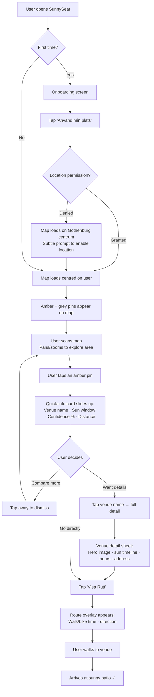
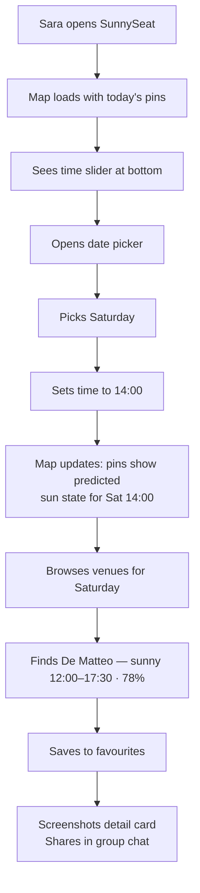

---
stepsCompleted:
  - 1
  - 3
  - 4
  - 7
  - 10
  - 11
  - 12
stepsToExecute:
  - 3
  - 4
  - 7
  - 10
  - 11
  - 12
inputDocuments:
  - '_bmad-output/planning-artifacts/brief/project-brief.md'
  - '_bmad-output/planning-artifacts/prd.md'
  - 'project-context.md'
  - '_bmad-output/planning-artifacts/architecture.md'
  - '_bmad-output/planning-artifacts/epics.md'
  - 'nextjs-app/docs/design/DESIGN.md'
  - '_bmad-output/planning-artifacts/design/references/screens/mobile/ (13 screen images)'
  - '_bmad-output/planning-artifacts/design/references/screens/desktop/ (8 screen images)'
  - '_bmad-output/planning-artifacts/design/references/components/ (41 component images)'
documentCounts:
  briefs: 1
  prd: 1
  projectContext: 1
  architecture: 1
  designSystem: 1
  screenReferences: 21
  componentReferences: 41
  epics: 1
workflowType: 'ux-design'
project: 'sunnyseat'
author: 'Rasmus'
date: '2026-04-08'
---

# UX Design Specification — SunnySeat

**Author:** Rasmus
**Date:** 2026-04-08
**MVP scope correction:** 2026-05-19 — planner, date picker, future sun simulation, and favourites are free MVP functionality. Season Pass, Swish, paywalls, payment states, and premium recovery are preserved as Future Monetization references only.
**Visual source refresh:** 2026-05-21 — MVP visual validation uses the refreshed Claude Design MVP Unlocked pages only: `SunnySeat MVP Mobile Unlocked.html` and `SunnySeat MVP Desktop Unlocked.html`. Post-MVP Unlocked/Locked pages are future-only.

---

<!-- Steps to execute: 3 (Core Experience), 4 (Emotional Response), 7 (Defining Experience), 10 (User Journey Flows), 11 (Component Strategy), 12 (UX Patterns) -->

## Core User Experience

### Defining Experience

SunnySeat's core experience is opening a map and instantly seeing which venue patios are in direct sun right now. The map is not a feature of the product — it is the product. Every other interaction (venue details, free planner, favourites, feedback) layers on top of this persistent map canvas. The defining user action is the visual scan: open the app, see amber pins on sunny venues, pick the closest one, go.

### Platform Strategy

- **Mobile-first PWA:** Designed at 390px, responsive to desktop at 1024px+. Mobile is the primary context — users are outside, deciding where to go now.
- **Touch-primary:** Core interactions (map pan/zoom, pin tap, sheet drag) are touch-optimized. Desktop uses mouse equivalents with the same interaction model.
- **Geolocation-dependent:** Location permission is the critical onboarding gate. The map centers on the user's position; distance to venues is a primary decision factor.
- **Always-online:** Real-time sun predictions require connectivity. No offline data caching — the app shell loads offline with a connection-required message.
- **Persistent map canvas:** MapLibre GL JS renders the map as the root-level element, never unmounted during navigation. All UI layers (bottom sheets, panels, modals) overlay the map.

### Effortless Interactions

- **Visual scan answers the question:** Amber pins = sunny, grey pins = shaded. No interaction required to understand venue sun state.
- **Distance is immediate:** Users can see how far venues are from their position without tapping. The map's spatial layout is the primary comparison tool.
- **One-tap depth:** Tapping a pin reveals venue name, sun window, confidence, and distance in a quick-info card. One more tap opens full detail.
- **No forced engagement on grey days:** When no venues are sunny, the map shows grey pins honestly. No upsell prompts, no "check back later" nudges — a quiet, boring experience is the correct experience when the sun isn't out.

### Critical Success Moments

1. **The amber moment:** User grants location, the map loads, and amber pins appear on sunny venues within seconds. This is the single most important moment in the entire product. If this feels instant and clear, the user is hooked.
2. **The redirect:** User's first choice is full or unavailable. They glance at the map and see another amber pin 200m away. The transition from disappointment to discovery happens on the map itself — no search, no filter, just a visual scan.
3. **The confirmation:** User arrives at the venue. The patio is sunny, exactly as the app predicted. Trust is established. They tap "Ja" on the feedback prompt.

### Experience Principles

1. **The Map Is the Product** — The map isn't a feature, it's the entire experience. Everything else layers on top of the persistent map canvas.
2. **Instant Clarity** — Sun state is visible at a glance through amber vs grey pins. No legend, no learning curve.
3. **Honest Data** — SunnySeat reflects reality without editorial spin. Grey day means grey pins. Confidence percentages set expectations, not promises.
4. **Zero-Tap Discovery** — Which venues are sunny and how far away they are is visible without tapping anything.
5. **Layered Depth** — Simple at the surface (map + pins), rich underneath (venue detail, sun timeline, confidence). Users who just want a sunny seat never have to go deeper.

## Desired Emotional Response

### Primary Emotional Goals

- **Excitement about possibility:** When the map loads with amber pins, users should feel a spark of "there are sunny places near me right now." The amber colour palette and pin density create visual abundance that fuels this feeling.
- **Effortless confidence:** The dominant ongoing emotion is ease — users should feel like finding a sunny venue requires zero effort. The smoothness of the experience is the product's emotional signature.
- **Trust through accuracy:** When the prediction matches reality, trust compounds. Each accurate visit builds emotional loyalty that no feature can replicate.

### Emotional Journey Mapping

| Stage | Target Emotion | Design Driver |
|-------|---------------|---------------|
| Onboarding | Curiosity + anticipation | Warm brand palette, clear value promise |
| Map loads (amber pins) | Excitement + possibility | Amber pins on the map — visual abundance of sunny options |
| Scanning the map | Confidence + ease | Distance visible spatially, sun state at a glance, no interaction needed |
| Tapping a venue | Satisfaction + certainty | Sun timeline, confidence %, clear information hierarchy |
| Route / walking | Momentum + purpose | Decision made, direction clear, ETA visible |
| Arriving sunny | Delight + trust | Prediction confirmed. Credibility earned. |
| Grey day (no sun) | Neutral acceptance | Grey pins only. No editorial, no nudges. Quiet honesty. |

### Micro-Emotions

- **Confidence over confusion:** The map should never feel overwhelming. Pin colours, spatial layout, and information hierarchy eliminate guesswork.
- **Trust over skepticism:** Confidence percentages and transparent weather data build trust incrementally. Never overpromise.
- **Ease over accomplishment:** Users shouldn't feel clever for using SunnySeat — they should feel like finding sun was obvious. The tool disappears behind the result.

### Design Implications

- **Warm palette sells the feeling before the data:** The amber/sand/cream colour system (from DESIGN.md) isn't decorative — it's emotional infrastructure. The interface should feel sunny even before the user reads a single data point.
- **Smoothness > features:** Every interaction that adds friction undermines the core emotional payoff. Animation timing (150ms–300ms from design tokens), sheet transitions, and map responsiveness must feel fluid.
- **No emotional manipulation on grey days:** When there's no sun, the app is quiet. No push to check back, no "sunny tomorrow!" prompts. The absence of forced optimism builds more trust than any engagement tactic.
- **The share moment is about ease, not novelty:** When Lina screenshots the venue detail for her group chat, she's sharing how easy the decision was, not how impressive the technology is. The detail card must be scannable and screenshot-friendly.

### Emotional Design Principles

1. **Excitement lives in the amber pins** — The map scan moment is where emotional energy peaks. Protect it.
2. **Smoothness is the feeling** — Word-of-mouth will be "it was so easy," not "it was so cool." Design for effortless, not impressive.
3. **Trust compounds silently** — Each accurate prediction deepens loyalty. Never spend trust on overpromising.
4. **Grey days need no design** — Neutral acceptance is the correct emotional state when the sun isn't out. Handle it by reflecting reality, nothing more.
5. **Warmth is structural** — The amber colour system, sun-tinted shadows, and sand map background are emotional infrastructure, not decoration.

## 2. Core User Experience

### 2.1 Defining Experience

**"Open the map, browse sunny venues, pick one."**

SunnySeat's defining experience is a 1–2 minute map browse where users scan amber and grey pins, tap a few to compare, and decide where to go. The interaction mirrors how people already use map apps — pan, zoom, tap pins — with one critical difference: the pins reflect real-time sun exposure state. Amber means sunny right now. Grey means shaded right now. The map is alive.

This is SunnySeat's Shazam moment: a familiar interaction pattern (map with pins) that delivers an answer no other tool can provide (which patio is in direct sun right now). The innovation is invisible — users don't learn a new interaction, they just get a new kind of answer from a pattern they already trust.

### 2.2 User Mental Model

Users approach SunnySeat with a **"where should I go?" map app** mental model, not a weather app or data dashboard. They expect:

- A map centred on their location
- Pins representing places they can go
- Tapping a pin reveals more info
- Spatial reasoning (proximity, clustering) as the primary comparison method
- The ability to pan and explore beyond their immediate area

**Key mental model implications:**
- The map must feel like a map, not an infographic. No chart overlays, no data density.
- Pin interaction must match established map-app conventions (tap to reveal, tap away to dismiss).
- Distance is felt spatially through the map, not read from a number. The number confirms what the spatial layout already suggests.

### 2.3 Success Criteria

| Criterion | Target | Signal |
|-----------|--------|--------|
| Time to first amber pin visible | <5 seconds after location grant | Performance timing |
| Session duration (browse) | 1–2 minutes | Analytics |
| Venues inspected per session | 2–3 quick-info cards viewed | Tap analytics |
| Decision confidence | User taps "Visa Rutt" or opens detail without hesitation | Funnel conversion |
| Return behaviour | User opens SunnySeat next sunny day without prompting | D7 retention |

**"It worked" signals:**
- User knew which venues were sunny without reading anything — colour told them
- User compared 2–3 options by tapping pins, not by scrolling a list
- User made a decision in under 2 minutes
- User arrived at a sunny patio

### 2.4 Novel UX Patterns

**What's established (leverage, don't reinvent):**
- Map with location-based pins (Google Maps, Airbnb, Uber)
- Bottom sheet for detail (Apple Maps, Google Maps)
- Pin tap → quick-info card → detail view (universal map pattern)
- Time slider for temporal exploration (transit apps, weather radar)

**What's novel (the SunnySeat innovation):**
- **Real-time sun-state pins:** Pin colour reflects live conditions (amber = sunny, grey = shaded). No other map app changes pin colour based on a real-time environmental calculation. This is time-sensitive data visualisation disguised as familiar map UI.
- **The "recovery redirect" pattern:** Deliberately optimising for the user's *second* choice — the moment their first pick falls through and the map instantly shows nearby sunny alternatives. Most map apps optimise for the first choice; SunnySeat optimises for the pivot.
- **Confidence as a first-class element:** Surfacing prediction uncertainty (confidence %) as a visible, trustworthy decision factor rather than hiding it.

**Teaching the novel patterns:**
No teaching required. Users already know how map pins work. The amber/grey distinction is self-evident. The confidence percentage is readable without explanation. The novel elements ride on established mental models — users discover the innovation by using the app, not by reading instructions.

### 2.5 Experience Mechanics

**1. Initiation**
- **Trigger:** User wants a sunny outdoor seat. Opens SunnySeat (PWA or browser).
- **First-time:** Onboarding screen → "Använd min plats" → location permission.
- **Returning:** App opens directly to map, centred on last/current location.
- **Fallback:** If location denied, map centres on Gothenburg centrum with a gentle prompt to enable location.

**2. Interaction (the 1–2 minute browse)**
- Map loads with amber and grey pins. User pans and zooms to explore.
- Tapping an amber pin opens a quick-info card: venue name, sun window (e.g. "Sol 13:00–18:30"), confidence %, distance.
- User taps away to dismiss, taps another pin to compare. This scan-compare-scan loop is the core interaction.
- Time slider (bottom of screen) lets users scrub forward to see how sun states change later today.
- Venue list (bottom sheet peek / side panel) provides an alternative linear view ranked by sun relevance.

**3. Feedback**
- Pin colour is instant, continuous feedback — the map always shows current state.
- Quick-info card confirms spatial intuition with data (distance number matches what the map showed).
- Sun timeline in venue detail gives temporal confidence ("sunny until 18:30").
- Confidence % sets expectation calibration ("85% means I should go, 55% means maybe").

**4. Completion**
- User taps "Visa Rutt" — routing appears with walk/bike time. Decision is final.
- Or user taps venue name to open full detail, reads more, then decides.
- Or user simply notes the venue name and location, closes the app, and walks there.
- After visiting: feedback prompt ("Var det soligt?") closes the trust loop.

## User Journey Flows

### Journey 1: "Sun Right Now" — Lina (Core Discovery Loop)

**Goal:** Find a sunny venue nearby, get there.
**Entry:** First-time or returning user opens SunnySeat wanting a sunny seat now.
**Expected duration:** ~1–2 minutes.



**Key design decisions:**
- Onboarding is a single screen with one CTA — no multi-step tutorial
- Quick-info card is the primary comparison tool — users tap 2–3 pins before deciding
- "Visa Rutt" is accessible from both quick-info card and venue detail — two paths to the same action
- The scan → tap → dismiss → scan loop is the core interaction pattern; it must feel instant (card appear/dismiss <200ms)

---

### Journey 2: "The Redirect" — Erik (Engagement + Depth)

**Goal:** First choice is full. Find an alternative, explore venue detail, leave feedback and a review.
**Entry:** Returning user who already knows SunnySeat.
**Expected duration:** ~3–5 minutes (includes detail reading, feedback, review).

```mermaid
flowchart TD
    A[Erik opens SunnySeat\nat his usual spot] --> B[Map loads centred on location]
    B --> C[Sees amber pin on Bar Himmel\n+ 2 other amber pins nearby]
    C --> D[Arrives at Bar Himmel — full, no seats]

    D --> E[Glances at map:\n2 amber pins within 200m]
    E --> F[Taps nearest amber pin]
    F --> G[Quick-info card:\nRestaurang Bellora · Sol 15:00–19:15 · 92% · 180m]

    G --> H[Taps venue name for full detail]
    H --> I[Venue detail sheet opens:\nHero image · description · sun timeline\nOpening hours · address · distance]
    I --> J[Reads venue description and hours]
    J --> K[Scrolls to sun timeline —\nsolid amber through 19:15]

    K --> L["Taps 'Visa Rutt'"]
    L --> M[Route: 2 min walk]
    M --> N[Walks to Restaurang Bellora]
    N --> O[Arrives — tables available, patio sunny ✓]

    O --> P{Feedback prompt appears:\n'Var det soligt när du kom?'}
    P --> Q["Taps 'Ja'"]
    Q --> R{Outdoor seating confirmation:\n'Har stället uteservering?'}
    R --> S["Taps 'Ja'"]

    S --> T[User browses venue detail again after visit]
    T --> U["Taps 'Lämna ett omdöme'"]
    U --> V[Review form opens:\nText input · optional rating]
    V --> W[Writes review:\n'Bra uteservering, perfekt eftermiddagssol']
    W --> X["Taps 'Skicka'"]
    X --> Y[Confirmation: review submitted ✓]
```



**Key design decisions:**
- The redirect happens on the map itself — Erik doesn't search or filter, he scans nearby amber pins. The "recovery from disappointment" is spatial, not textual.
- Venue detail is designed for browsing — hero image, readable description, sun timeline, and practical info (hours, address) in a scannable layout.
- Feedback prompt appears contextually after the user has been near the venue — not as a modal, but as a gentle inline prompt.
- Outdoor seating confirmation is a secondary question, piggy-backing on the feedback moment.
- Review flow is a separate intentional action ("Lämna ett omdöme" CTA button) — not forced, not prompted.

---

### Journey 3: "Planning Saturday Fika" — Sara (Free MVP Planner)

**Goal:** Plan ahead for a future date without payment or account friction.
**Entry:** User wants to explore future sun predictions.
**Expected duration:** ~30–60 seconds.



**Key design decisions:**
- **Planner and date picker are free MVP functionality** — no gate, no lock badge, no partial teaser, no payment screen.
- **Date/time changes update all venue surfaces** — map pins, QuickInfo, list cards, and venue detail remain synchronized.
- **Favourites are free** — saving a venue never opens a paywall or lock prompt.
- **Future Monetization is inactive** — paywall/payment references are preserved for later but not part of the MVP flow.
- **The screenshot moment** is a natural sharing point — the venue detail card must be visually complete and scannable as an image.

---

### Partner Features in Consumer Experience

Partner venues (B2B) appear within the normal consumer map experience with visual enhancements. No separate consumer-facing flow exists — the admin panel handles partner onboarding and pin configuration.

**How partners appear to consumers:**

| Feature | Consumer-Visible Behaviour |
|---------|---------------------------|
| **Golden Pin** | Partner venues display a larger, more prominent amber pin with a warm glow effect. Visually elevated above standard pins without breaking the map's readability. |
| **SOL NU Badge** | When a partner venue's patio is in direct sun, a "SOL NU" badge appears on their venue card in the list view. Standard venues show sun state but without the badge emphasis. |
| **Partner Deep-Links** | External links (from partner websites, social media) can deep-link directly to a partner's venue detail page in SunnySeat. URL format: `sunnyseat.se/?venue=[slug]`. |
| **No consumer-facing distinction label** | Partner status is not explicitly labelled — the visual enhancements (Golden Pin, SOL NU badge) speak for themselves. No "Sponsored" or "Partner" tag. |

---

### Journey Patterns

**Common patterns extracted across all journeys:**

**Navigation Patterns:**
- **Map-first entry:** Every journey starts and returns to the map. The map is home.
- **Layered reveal:** Map → quick-info card → venue detail. Each layer adds depth without losing context (the map remains visible behind sheets).
- **Dismiss to return:** Tapping away from a card/sheet returns to the previous layer. No explicit "back" button needed for the first layer (quick-info).

**Decision Patterns:**
- **Scan-compare-scan:** Users tap multiple pins before deciding. The quick-info card is designed for rapid comparison, not deep reading.
- **Spatial comparison over list comparison:** Users compare venues by their position on the map (proximity, clustering) before comparing data.
- **Confidence as a tiebreaker:** When two venues are similarly close and both sunny, confidence % and sun window duration tip the decision.

**Feedback Patterns:**
- **Contextual prompts:** Feedback ("Var det soligt?") appears after likely venue visit, not randomly.
- **Two-tap feedback:** Yes/no binary first, optional detail second. Never more than two taps for the core feedback.
- **Intentional reviews:** Review submission is a separate, user-initiated action — never prompted or forced.

**Conversion Patterns:**
- **Free planning loop:** Planner/date/favourites stay in the core loop so users can build habit before monetization.
- **Future device-aware payment:** If Season Pass is reintroduced, Swish should adapt to mobile (deep-link) vs desktop (QR code) automatically.

### Flow Optimisation Principles

1. **Minimise taps to value:** Lina goes from app open to "I know where I'm going" in 3–5 taps. Every additional tap must earn its existence.
2. **The map is the undo button:** Dismissing any overlay returns to the map. Users can never get lost because the map is always there.
3. **Errors don't break flow:** Payment failure → retry on the same screen. Location denied → default map position. No dead ends.
4. **Feedback is earned, not extracted:** Prompts appear at contextually appropriate moments (after a venue visit), not at engagement-maximising moments (mid-browse).
5. **Screenshots are a feature:** Venue detail cards and sun timelines should look good as screenshots — users share these in group chats as decision artifacts.

## Component Strategy

### Design System Foundation

SunnySeat uses a custom design system extracted from Figma (documented in DESIGN.md) with no third-party component library. All tokens are mapped to a custom Tailwind CSS theme configuration as the single source of truth.

**Token Mapping Strategy:**
- All DESIGN.md colour tokens → `tailwind.config.ts` custom colours (e.g., `colors.amber.pin`, `colors.surface.cream`)
- Typography tokens → custom font size utilities with font family, weight, and line-height bundled (e.g., `text-display-xl` = 28px / ExtraBold / Plus Jakarta Sans / 36px)
- Spacing tokens → extended spacing scale (e.g., `space-3` = 6px, `space-5` = 10px)
- Shadow tokens → custom box-shadow utilities (e.g., `shadow-card`, `shadow-route-button`)
- Border radius tokens → custom radius scale (e.g., `rounded-pill`, `rounded-sheet-full`)
- Transition tokens → custom transition utilities (e.g., `duration-fast` = 150ms)
- Gradient tokens → CSS custom properties referenced in Tailwind classes

**Font Loading:** Plus Jakarta Sans and Manrope loaded via `next/font`. No system font fallbacks in rendered UI.

### Component Architecture

**Approach:** In-app component library in a `components/` directory within the Next.js app. No Storybook overhead — components are built, tested, and iterated in context. Extractable to a standalone library if needed later.

> **Note:** The domain folders below (map/, venue/, time/, etc.) live inside `components/custom/` per the project's three-layer architecture: `components/ui/` (shadcn/ui primitives) → `components/composed/` (multi-primitive compositions) → `components/custom/` (feature components by domain). The `shared/` group maps to `components/composed/`. See CLAUDE.md and the architecture document for the full layer model.

**File Structure:**
```
components/custom/
├── map/
│   ├── MapCanvas.tsx              # MapLibre GL JS wrapper (persistent, never unmounted)
│   ├── VenuePin.tsx               # Sunny/shaded/selected/partner pin states
│   ├── MapControls.tsx            # Zoom +/-, location button (floating glass)
│   └── MapOverlay.tsx             # Gradient overlay, decorative map elements
├── venue/
│   ├── VenueQuickInfo.tsx         # Quick-info card (tap pin → slide-up)
│   ├── VenueDetail.tsx            # Full venue detail (bottom sheet / side panel)
│   ├── VenueList.tsx              # Venue list (bottom sheet peek / side panel)
│   ├── VenueCard.tsx              # Single venue in list (thumbnail + sun info)
│   ├── SunTimeline.tsx            # Horizontal sun exposure timeline bar
│   └── SunBadge.tsx               # Amber badge overlay on venue image
├── time/
│   ├── TimeSlider.tsx             # Free time scrubber
│   ├── DatePicker.tsx             # Free future date picker
│   └── TimeSliderPanel.tsx        # Glass panel containing slider + date
├── favourites/
│   ├── FavouriteButton.tsx        # Free heart toggle
│   └── FavouritesList.tsx         # Saved venue list
├── feedback/
│   ├── FeedbackPrompt.tsx         # "Var det soligt?" inline prompt
│   ├── OutdoorSeatingConfirm.tsx  # "Har stället uteservering?" follow-up
│   ├── ReviewForm.tsx             # Text review submission form
│   └── ReviewCard.tsx             # Displayed review from another user
├── future-premium/                # Future Monetization only — inactive for MVP
│   ├── UpsellCard.tsx
│   ├── PaywallScreen.tsx
│   ├── SwishPayment.tsx
│   ├── PaymentProcessing.tsx
│   └── PaymentFailed.tsx
├── navigation/
│   ├── BottomNavBar.tsx           # Mobile bottom navigation (40px)
│   ├── DesktopNavBar.tsx          # Desktop top navbar with logo + search
│   └── SearchBar.tsx              # Venue search input
├── routing/
│   └── RouteOverlay.tsx           # Walk/bike route with ETA
├── shared/
│   ├── GlassButton.tsx            # Frosted-glass floating button (48px/40px)
│   ├── AmberCTAButton.tsx         # Gradient amber CTA (multiple sizes)
│   ├── RouteButton.tsx            # Gold-to-dark gradient "Visa Rutt"
│   ├── BottomSheet.tsx            # Reusable bottom sheet (peek/full/dismiss)
│   ├── DragHandle.tsx             # Sheet drag handle pill
│   └── InfoCard.tsx               # Rounded info section card (e.g., "Soltider idag")
└── pages/
    ├── OnboardingScreen.tsx       # First-visit onboarding
    ├── AboutPage.tsx              # How it works, data sources
    └── NotFoundPage.tsx           # 404 with redirect to map
```

### Animation Strategy

**Framer Motion — for gesture-driven and complex state transitions:**
- Bottom sheet drag-to-dismiss (snap points: peek → full → dismiss)
- Quick-info card slide-up / slide-down
- Upsell card and paywall screen enter/exit
- Sheet peek ↔ full expansion
- `AnimatePresence` for mount/unmount transitions
- Spring easing: `cubic-bezier(0.22, 1, 0.36, 1)` for drag-release settle

**CSS Transitions (Tailwind utilities) — for micro-interactions:**
- Button hover/press states (`transition-colors duration-200 ease-in-out`)
- Pin colour transitions (`transition-colors duration-150`)
- Tab switches (`duration-fast`)
- Opacity fades (`transition-opacity duration-200`)
- Badge/icon state changes

**`prefers-reduced-motion`:** All Framer Motion animations wrapped in a motion-safe check. CSS transitions simplified to instant state changes. Sheet transitions reduced to opacity fade only.

### Custom Component Specifications

#### VenuePin

**Purpose:** Represents a venue on the map. The primary visual element of the entire product.
**States:**

| State | Shape | Background | Border | Shadow | Content |
|-------|-------|-----------|--------|--------|---------|
| Sunny (default) | Pill with pointer | `color-amber-pin` (#f1b100) | 2px white | `shadow-card` | Sun icon (16.5px) + percentage text (white) |
| Sunny + Selected | Perfect circle (no pointer) | `color-amber-pin` (#f1b100) | 2px white | `shadow-card` | Sun icon + percentage text (white) |
| Shaded | Pill with pointer | `color-pin-shaded` (#e4e1e5) | 1px rgba(255,255,255,0.2) | `shadow-subtle` | Percentage text (`color-text-body`) at 0.8 opacity |
| Partner (sunny) | Larger pill with glow | `color-amber-pin` | 2px white | `shadow-card` + warm glow | Sun icon + percentage + golden pin styling |

**Interaction:** Tap opens VenueQuickInfo. Tap on selected pin deselects (returns to default). The shape transition from pill-with-pointer to perfect circle on selection should animate smoothly (duration-default, 200ms).

#### BottomSheet

**Purpose:** Reusable sheet container for venue list (peek), venue detail (full), planner/favourites surfaces, and future monetization flows if reactivated.
**States:**

| State | Height | Radius | Shadow | Drag Handle |
|-------|--------|--------|--------|-------------|
| Peek | ~100px above nav bar | `radius-panel` (32px) | `shadow-sheet-peek-up` | 40px wide, `color-drag-handle-map` at 40% opacity |
| Full | Full screen minus status bar | `radius-sheet-full` (40px) | `shadow-sheet-full-up` | 48px wide, `color-drag-handle` |
| Dismissed | Off-screen | — | — | — |

**Behaviour:** Drag handle enables drag-to-expand (peek → full) and drag-to-dismiss (full → peek → off-screen). Snap points at peek height and full height. Framer Motion spring easing for settle animation. Map remains visible and interactive behind peek state. Map dimmed but visible behind full state.

#### VenueQuickInfo

**Purpose:** Compact venue summary that appears when tapping a map pin. The primary comparison tool.
**Content:** Venue name, sun time range ("Sol 13:00–18:30"), confidence %, distance, "Visa Rutt" CTA.
**Behaviour:** Slides up from bottom on pin tap (<200ms). Tapping venue name navigates to full VenueDetail. Tapping "Visa Rutt" opens RouteOverlay. Tapping map (outside card) dismisses. Only one QuickInfo visible at a time — tapping a new pin replaces the current one.
**Responsive:** Mobile: full-width card above bottom nav. Desktop: positioned near the selected pin or in the side panel area.

#### TimeSliderPanel

**Purpose:** Glass panel containing the free time scrubber and free date picker.
**Background:** `color-glass-slider` (rgba(255,255,255,0.9)) with `blur-heavy` (12px) backdrop.
**Behaviour:** Time slider scrubs through today's hours and selected future dates. Date picker opens a calendar for future dates. Interacting with either element never triggers a premium gate in MVP.
**Responsive:** Mobile: floating panel within page padding. Desktop: integrated into the top header bar.

#### SunTimeline

**Purpose:** Horizontal bar showing when a venue has sun exposure throughout the day.
**Visual:** Gradient bar (`gradient-timeline-bar`) on a track background. Height: `size-timeline-h` (12px). Time markers at key points (sunrise, current time, sunset).
**Content:** Solid amber segments for sun windows. Gap/transparent for shaded periods. Current time indicated with `text-time` styling.

### Implementation Roadmap

**Phase 1 — Core Map Experience (Critical path):**
- MapCanvas + VenuePin (all states including selected circle)
- VenueQuickInfo
- BottomSheet (peek state with VenueList)
- BottomNavBar (mobile) + DesktopNavBar
- GlassButton (map controls)
- OnboardingScreen (location permission)

**Phase 2 — Venue Depth:**
- VenueDetail (full bottom sheet / desktop overlay)
- SunTimeline + SunBadge
- RouteButton + RouteOverlay
- VenueCard (list item)
- InfoCard (reusable section container)
- SearchBar

**Phase 3 — Engagement:**
- FeedbackPrompt + OutdoorSeatingConfirm
- ReviewForm + ReviewCard
- AmberCTAButton (shared across feedback, review, and future premium if reactivated)

**Phase 4 — Free Planner + Favourites:**
- TimeSliderPanel + TimeSlider + DatePicker
- FavouriteButton + FavouritesList

**Future Monetization — preserved, inactive for MVP:**
- UpsellCard
- PaywallScreen
- SwishPayment (mobile deep-link + desktop QR)
- PaymentProcessing + PaymentFailed

**Phase 5 — Polish:**
- AboutPage + NotFoundPage
- Partner Golden Pin variant
- MapOverlay (gradient, decorative elements)
- Animation refinement + reduced motion support

This roadmap follows the user journey priority: the map experience must work before anything layers on top of it.

## UX Consistency Patterns

### Button Hierarchy

Three tiers of button importance, each with a distinct visual treatment from the design system:

| Tier | Component | Visual | Usage |
|------|-----------|--------|-------|
| **Primary action** | RouteButton | `gradient-route-button` (gold-to-dark), `shadow-route-button`, pill shape | The ONE action per screen that moves the user forward: "Visa Rutt", main navigation CTAs. Only one primary button visible at a time. |
| **Secondary action** | AmberCTAButton | `gradient-cta-amber` (gold-to-amber), `shadow-cta`, pill shape | Important but not the primary: "Lämna ett omdöme", "Ge oss feedback", "Skicka". Future Monetization may reuse it for "Betala med Swish" / "Visa Säsongskortet". Multiple can coexist on a screen. |
| **Tertiary / utility** | GlassButton | `color-glass-standard` (frosted white 80%), `blur-standard`, `shadow-button-float`, pill shape | Map controls (zoom +/−, location), share, favourite, close. Always circular or pill. Visually recede behind primary/secondary actions. |

**Button rules:**
- Never place two primary buttons on the same screen. If two actions compete, one becomes secondary.
- Disabled buttons use 40% opacity of their normal fill. No grey-out — maintain the colour identity at reduced intensity.
- All buttons use `radius-pill` (9999px). No squared or rounded-rectangle buttons anywhere in the product.
- Touch targets: minimum 44×44px on mobile (even if the visual button is smaller, the hit area expands).

### Sheet & Overlay Behaviour

Sheets are the primary container for all non-map content. Consistent behaviour across all sheet types:

**Stacking Rules:**
- Only one sheet visible at a time. Opening a new sheet replaces the current one (with appropriate transition).
- Exception: VenueQuickInfo can coexist with the BottomSheet in peek state — the quick-info card sits above the peek sheet.
- Future Monetization flows (UpsellCard, PaywallScreen) replace the current sheet entirely only if reactivated post-MVP.

**Dismiss Patterns:**
- **Drag down** on the drag handle dismisses the sheet (full → peek → off-screen).
- **Tap outside** (on the map) dismisses VenueQuickInfo cards.
- **Swipe down** on the sheet body also initiates dismiss (not just the handle).
- **Back gesture / button** dismisses the top-most overlay and returns to the previous state.
- Dismissing always returns to the map. The map is the universal "home" state.

**Transition Timing:**
- Peek → Full: 300ms, `easing-spring` (cubic-bezier(0.22, 1, 0.36, 1))
- Full → Peek: 300ms, `easing-spring`
- Full → Dismissed: 250ms, `easing-exit` (ease-in)
- QuickInfo appear: 200ms, `easing-enter` (ease-out)
- QuickInfo dismiss: 150ms, `easing-exit`

**Desktop Adaptation:**
- Mobile bottom sheets → desktop side panels (390px wide for detail, 190px for venue list)
- Desktop panels do not use drag — they open/close with click and transition
- Same content hierarchy, different container

### Loading & Empty States

**Principle:** The map is always the first thing visible. Data populates progressively.

| State | Behaviour |
|-------|-----------|
| **Initial map load** | Map canvas renders immediately with sand background and tiles. Pins fade in as venue data arrives (150ms fade per pin). No spinner, no skeleton. |
| **Slow connection (>3s)** | Small loading pill at top of map: "Laddar platser..." in `text-body-sm` / `color-text-muted`. Disappears when first pin renders. |
| **Venue detail loading** | Sheet opens immediately with venue name and placeholder layout. Sun timeline and details populate as API responds. Subtle shimmer on placeholder areas. |
| **Search — no results** | Search bar shows "Inga resultat för '[query]'" inline below the input. Map view unchanged. No full-page empty state. |
| **No venues in view area** | Map shows no pins. No message needed — the user can pan to find venues. The map is self-explanatory. |
| **No sunny venues (grey day)** | All pins grey. No banner, no message, no prompt. The map reflects reality. |

### Error & Degradation Patterns

**Principle:** Silently degrade. Only surface errors when the core experience (seeing pins) is completely broken.

| Scenario | User-Facing Behaviour | Technical Response |
|----------|----------------------|-------------------|
| Sun API slow | No visible change | Serve cached/precomputed data |
| Weather data stale (>2h) | Confidence shows "~85%" instead of "85%" (tilde prefix) | Cap confidence scores per NFR34 |
| Weather API down | Confidence % hidden on affected venues | Serve geometry-only predictions |
| Venue API failure | Inline map message: "Kunde inte ladda platser" + retry button | Retry with exponential backoff |
| Future Swish payment timeout | PaymentFailed screen with "Försök igen" button | Stop polling after 5 min per NFR36 if payment flow is reactivated |
| Location API failure | Map centres on Gothenburg centrum | Subtle "Aktivera plats" prompt |
| Network offline | App shell visible, map tiles from cache if available, "Ingen anslutning" banner at top | Service worker serves cached shell |

**Error message tone:** Matter-of-fact Swedish. No exclamation marks, no apologies, no emoji. Example: "Kunde inte ladda platser. Försök igen." Not: "Oj! Något gick fel!"

### Feedback & Confirmation Patterns

**Feedback prompt ("Var det soligt?"):**
- Appears as an inline card within the venue detail view, not as a modal or push notification.
- Triggered contextually — when the user reopens a venue they likely visited (based on proximity + time since last view).
- Binary first: "Ja" / "Nej" buttons. Single tap completes the core feedback.
- Optional follow-up: outdoor seating confirmation ("Har stället uteservering?") appears only after the sun feedback is submitted.
- Dismissible: user can ignore or swipe away. Never blocks content.

**Review submission:**
- Intentional action: user taps "Lämna ett omdöme" CTA in the venue detail view.
- Single text input field + optional star rating. No multi-page form.
- Submit button ("Skicka") uses AmberCTAButton styling.
- Success: inline confirmation replaces the form ("Tack för ditt omdöme"). No toast, no modal. Confirmation visible for 3 seconds, then fades.
- Failure: inline error below the form ("Kunde inte skicka. Försök igen.") with retry.

**Payment confirmation:**
- Future payment success: dedicated confirmation screen with checkmark and "Premium aktiverat" message. Auto-returns to map after 2 seconds or on tap if payment flow is reactivated.
- Failure: dedicated PaymentFailed screen with clear message and retry button. No auto-dismiss — user controls when to retry or go back.

### Map Interaction Conventions

**Pin interactions:**
- **Tap pin** → VenueQuickInfo slides up. Pin transitions to selected state (perfect circle if sunny).
- **Tap selected pin** → Deselects. QuickInfo dismisses. Pin returns to default state.
- **Tap map (no pin)** → Deselects current pin, dismisses QuickInfo. Returns to pure map view.
- **Tap different pin** → Previous pin deselects, new pin selects, QuickInfo swaps (no dismiss + re-appear — crossfade content, 150ms).

**Map gestures:**
- **Pan** (drag): Moves the map. Standard map behaviour.
- **Pinch zoom**: Two-finger zoom. Standard map behaviour.
- **Double-tap**: Zoom in one level. Standard map behaviour.
- **Two-finger tap**: Zoom out one level. Standard map behaviour.

**Map controls (GlassButton):**
- **Zoom +** / **Zoom −**: Top-right stack on mobile. Increment one zoom level per tap.
- **My location**: Recentres map on user's current position with smooth pan animation (500ms).
- Controls fade to 60% opacity during active map drag to reduce visual clutter. Return to full opacity on drag end.

**Re-centre behaviour:**
- On app open: map centres on user's location (or Gothenburg centrum if no permission).
- After panning away: my-location button visible. Tap recentres with animation.
- After viewing venue detail and dismissing: map does NOT recentre — preserves the user's last pan position. Spatial context is precious.

### Navigation Patterns

**Mobile:**
- BottomNavBar (40px) with tab icons: Karta (map), Favoriter (favourites), Om (about).
- Active tab: `color-tab-active` (#d97706). Inactive: `color-tab-inactive` (#a8a29e).
- Tab labels uppercase, `text-label-sm`.
- Bottom nav is always visible except when a full-screen sheet covers it (venue detail full state, paywall, onboarding).

**Desktop:**
- DesktopNavBar (84px) fixed top with logo + search bar.
- No bottom nav — navigation through header and direct map interaction.
- Venue list as persistent 190px side panel (overlaying map, not reducing canvas).
- Venue detail as 390px overlay panel.

**Universal:**
- No traditional page-to-page navigation. The app is a single-screen map with layered overlays.
- URL reflects state for deep-linking: `sunnyseat.se/?venue=[slug]&t=[time]`.
- Browser back button dismisses the current overlay (not navigate to a previous "page").

### Typography Consistency Rules

- **Venue names** always use `text-heading-md` (18px/Bold/Plus Jakarta Sans) in lists, `text-display-xl` (28px/ExtraBold/Plus Jakarta Sans) in detail view.
- **Sun data** (time ranges, percentages) always use `text-label-lg` (14px/Bold/Manrope) with `color-amber-dark` (#735c00).
- **Body descriptions** always use `text-body-lg` (16px/Medium/Manrope) with `color-text-body` (#4d4635).
- **CTA button labels** always use `text-label-lg` (14px/Bold/Manrope) with `color-amber-cta-text` (#554300).
- **Badge labels** (SOL NU, SOL IDAG) always uppercase, `text-label-md` (12px/Bold/Manrope).
- Numbers (confidence %, distance) always use Manrope Bold for tabular consistency.

## Screen Inventory

This section maps every Figma screen frame to its specific interactions, states, and animations. Cross-references point to the relevant sections above where patterns are defined in full. Implementers should use this as their entry point per screen, then follow cross-references for shared pattern details.

---

### Screen: onboarding (mobile)

**Reference:** `design/references/screens/mobile/onboarding-mobile.png`
**Route:** `/` (first visit only, gated by localStorage flag)
**Purpose:** First-time user welcome. Single goal: obtain location permission.

**Layout:**
- Full-screen warm amber gradient background (no map visible)
- "SunnySeat" logo text centred top
- Headline: "Hitta uteplatser i solen — just nu." (`text-display-xl` / white / Plus Jakarta Sans)
- Subtitle: "Platsen sparas aldrig." (`text-body-md` / white at 70% opacity)
- Primary CTA: "Använd min plats" with location pin icon (AmberCTAButton, `gradient-cta-amber`, pill shape)
- Secondary link: "Hoppa till Göteborgs centrum" (`text-body-sm` / white / underline)

**Interactions:**
- Tap "Använd min plats" → triggers browser geolocation permission dialog. On grant → navigate to map-primary centred on user location (300ms fade transition). On deny → navigate to map-primary centred on Gothenburg centrum.
- Tap "Hoppa till Göteborgs centrum" → navigate to map-primary centred on Gothenburg centrum (skips location prompt).
- No back navigation. No dismiss. This screen only appears once.

**States:**

| State | Behaviour |
|-------|-----------|
| Default | As described above |
| Location permission pending | CTA shows subtle pulse animation while browser dialog is open (opacity 0.8 → 1.0, 1s loop) |
| Location granted | Screen fades out (250ms, `easing-exit`), map-primary fades in |
| Location denied | Same transition as granted, map centres on Gothenburg centrum |

**Animations:**
- Screen entrance: fade-in from white (400ms, `easing-enter`). Headline and CTA stagger in (headline at 200ms, CTA at 400ms).
- Screen exit: full-screen fade-out (250ms, `easing-exit`)
- CTA button: standard AmberCTAButton hover/press states (see **Button Hierarchy**)
- `prefers-reduced-motion`: no stagger, instant appear, opacity-only exit

---

### Screen: onboarding (desktop)

**Reference:** `design/references/screens/desktop/onboarding-desktop.png`
**Route:** Same as mobile
**Purpose:** Identical to mobile — obtain location permission.

**Layout:**
- Same as mobile but full viewport width. Headline and CTA centred both horizontally and vertically.
- "SunnySeat" wordmark centred top (not in navbar — this is pre-app).
- CTA button width: auto (content-sized), not full-width.

**Interactions & States:** Identical to mobile onboarding.

**Animations:** Identical to mobile onboarding.

---

### Screen: map-primary (mobile)

**Reference:** `design/references/screens/mobile/map-primary-mobile.png`
**Route:** `/` (returning users) or post-onboarding
**Purpose:** The core screen. Map with sun-state venue pins. Everything layers on top of this.

**Layout (top to bottom):**
- Floating glass search bar at top (within safe area): `color-glass-standard`, `blur-standard`, `radius-pill`. Placeholder text: "Sök plats eller område i Göteborg..."
- Map canvas (MapLibre GL JS): `color-surface-sand` base, decorative road lines, `gradient-map-overlay`. Fills entire viewport behind all other elements.
- Venue pins: amber (sunny) and grey (shaded) scattered on map. See **VenuePin** component spec for all states.
- Map control buttons (right edge): zoom +/− stack + my-location button. GlassButton 48×48px, `shadow-button-float`.
- Time slider panel (bottom, above nav): `color-glass-slider`, `blur-heavy`, `radius-panel`. Contains time scrubber track + current time indicator. See **TimeSliderPanel** component spec.
- Quick-info card (when pin selected): slides up from bottom above the time slider. See **VenueQuickInfo** component spec.
- Bottom nav bar (fixed, 40px): Karta / Favoriter / Om tabs. See **Navigation Patterns**.

**Interactions:**
- Tap amber/grey pin → pin transitions to selected state (perfect circle if sunny, see **VenuePin**), VenueQuickInfo slides up (200ms, `easing-enter`). See **Map Interaction Conventions**.
- Tap selected pin → deselects, QuickInfo dismisses (150ms, `easing-exit`).
- Tap map (no pin) → deselects current pin, dismisses QuickInfo.
- Tap different pin → previous deselects, new selects, QuickInfo content crossfades (150ms).
- Pan/zoom map → standard MapLibre gestures. Map controls fade to 60% opacity during drag. See **Map Interaction Conventions**.
- Tap zoom +/− → increment zoom level.
- Tap my-location → smooth pan to user position (500ms).
- Tap search bar → search input focuses, keyboard opens. Results inline below input.
- Interact with time slider/date picker → planner updates selected date/time directly. No premium gate or lock state appears in MVP. See **Journey 3: Sara**.
- Tap bottom nav tabs → switch view (Karta active by default).

**States:**

| State | Behaviour |
|-------|-----------|
| Loading (initial) | Map canvas renders immediately with sand background + tiles. Pins fade in individually as venue data arrives (150ms per pin). See **Loading & Empty States**. |
| Slow connection (>3s) | Loading pill at top: "Laddar platser..." in `text-body-sm` / `color-text-muted`. Disappears on first pin render. |
| No pins in viewport | Map shows empty area. No message — user can pan to find venues. |
| All pins grey (no sun) | Grey pins only. No banner, no message. See **Emotional Design Principles** #4. |
| Pin selected | Selected pin becomes perfect circle (sunny) or stays pill (shaded). QuickInfo card visible. |
| Venue API failure | Inline message on map: "Kunde inte ladda platser. Försök igen." + retry button. See **Error & Degradation Patterns**. |
| Network offline | App shell visible, "Ingen anslutning" banner at top. |

**Animations:**
- Pin appearance: fade-in (opacity 0 → 1, 150ms, `easing-enter`) as data arrives. Pins appear individually, not all at once.
- Pin selection: shape morph from pill-with-pointer to circle (200ms, `easing-default`). Colour unchanged for sunny; shaded pins get a subtle border emphasis.
- QuickInfo enter: translateY from 100% to 0 (200ms, `easing-enter`).
- QuickInfo dismiss: translateY from 0 to 100% (150ms, `easing-exit`).
- QuickInfo swap (tap new pin): content crossfade (opacity out 100ms, opacity in 100ms). Card stays in position.
- Map controls fade: opacity transition during drag (200ms, `easing-default`).
- Time slider thumb: follows drag position. Snap-to-tick on release with spring easing (`easing-spring`, 200ms).
- `prefers-reduced-motion`: no pin fade (instant appear), no shape morph (instant state), QuickInfo uses opacity only.

---

### Screen: map-primary (desktop)

**Reference:** `design/references/screens/desktop/map-primary-desktop.png`
**Route:** Same as mobile
**Purpose:** Same as mobile — core map experience with desktop layout.

**Layout differences from mobile:**
- Top navbar (84px fixed): SunnySeat logo (left), search bar (384px, centre-left), filter/location/settings icon buttons (right). `color-surface-cream` background, `shadow-card`.
- Left side panel (190px, overlays map): "TOPPVAL NÄRA DIG" header. Venue list with compact cards (thumbnail + name + distance). Scrollable. See **VenueList** in component spec.
- No bottom nav bar.
- Map controls (zoom +/−, my-location): right edge, same as mobile.
- Time slider: integrated into bottom bar spanning full width. Date picker (left), time scrubber (centre), current time display (right).
- QuickInfo: appears as a floating popover card near the selected pin (not a bottom card). Contains venue photo, name, time slider preview, "Visa Rutt" + "Mer Info" buttons.

**Interactions:** Same as mobile, plus:
- Tap venue in left side panel → selects that venue's pin on map, opens QuickInfo popover.
- Search bar: full keyboard input, results dropdown below.
- QuickInfo "Mer Info" button → opens venue-detail as right side panel (390px).

**States:** Same as mobile.

**Animations:** Same as mobile, except:
- QuickInfo: fade-in + scale from 0.95 to 1.0 (200ms, `easing-enter`) near the pin, not slide-up.
- Side panels: slide-in from left/right edge (300ms, `easing-spring`).

---

### Screen: map-panel-venues (mobile)

**Reference:** `design/references/screens/mobile/map-panel-venues-mobile.png`
**Route:** `/` (bottom sheet expanded from peek)
**Purpose:** Venue list as expanded bottom sheet. Alternative to pin-by-pin browsing.

**Layout:**
- Bottom sheet in full state: `radius-sheet-full` (40px), `shadow-sheet-full-up`, `color-surface-cream`.
- Drag handle: 48px wide, `color-drag-handle`.
- Header: "Hitta solen nu" headline (`text-heading-xl`), subtitle with location context.
- Venue cards list: each card has thumbnail (87×72px, `radius-venue-image`), sun badge overlay, venue name (`text-heading-md`), sun time range + confidence in `color-amber-dark`, distance. See **VenueCard** component spec.
- Map partially visible and dimmed behind sheet.

**Interactions:**
- Drag handle down → sheet transitions to peek state (300ms, `easing-spring`). See **Sheet & Overlay Behaviour**.
- Tap venue card → sheet dismisses to peek, map centres on venue, pin selects, QuickInfo appears.
- Scroll venue list → standard scroll within sheet body.

**States:**

| State | Behaviour |
|-------|-----------|
| Default | List of venues sorted by sun relevance (sunny first, closest first within sunny) |
| Loading | Venue cards show shimmer placeholder (thumbnail + text lines) |
| Empty (no venues in area) | "Inga platser hittades i det här området." message. No illustration. |
| Scrolled to bottom | Subtle fade-out at bottom edge indicating end of list |

**Animations:**
- Sheet peek → full: 300ms, `easing-spring`. See **Sheet & Overlay Behaviour** transition timing table.
- Sheet full → peek: 300ms, `easing-spring`.
- Venue cards: stagger fade-in on sheet expand (50ms delay between cards, 150ms fade each).
- `prefers-reduced-motion`: no stagger, instant card appear, sheet uses opacity transition only.

---

### Screen: map-with-selected-venue (mobile)

**Reference:** `design/references/screens/mobile/map-with-selected-venue-mobile.png`
**Route:** `/` (pin selected state)
**Purpose:** Map with a venue selected, showing QuickInfo card and expanded pin.

**Layout:**
- Same as map-primary-mobile, plus:
- Selected pin: perfect circle (sunny) — no pointer tail. See **VenuePin** selected state.
- QuickInfo card above time slider: venue thumbnail photo, venue name, sun time range ("Sol 13:00–18:30"), confidence %, distance, "Visa Rutt" (RouteButton) + "Mer Info" button.
- Time slider visible below QuickInfo, showing date navigation arrows + date label + time scrubber.

**Interactions:**
- Tap "Visa Rutt" → opens native maps app or in-app route overlay with walk/bike ETA. See **Journey 1: Lina** completion step.
- Tap "Mer Info" → transitions to venue-detail screen (bottom sheet full state, 300ms `easing-spring`).
- Tap map outside card → deselects pin, dismisses QuickInfo. See **Map Interaction Conventions**.
- Tap different pin → swap QuickInfo content (crossfade 150ms).

**States:**

| State | Behaviour |
|-------|-----------|
| Default | As described — pin selected, QuickInfo visible |
| Route loading | "Visa Rutt" button shows spinner replacing icon (duration-default) |
| Venue data loading | QuickInfo shows venue name immediately, sun data shimmer placeholder |

**Animations:**
- QuickInfo card: see map-primary animations.
- Pin shape transition: pill → circle (200ms, `easing-default`).
- Photo thumbnail in QuickInfo: fade-in on load (150ms).

---

### Screen: venue-detail (mobile)

**Reference:** `design/references/screens/mobile/venue-detail-mobile.png`
**Route:** `/?venue=[slug]`
**Purpose:** Full venue information — the "deep dive" before deciding to go.

**Layout (top to bottom within full bottom sheet):**
- Drag handle: 48px wide, `color-drag-handle`, `radius-pill`.
- Hero image: full-width venue photo. Sun badge overlay top-right (28×28px circle, `color-amber-primary`, "85%" text + sun icon). See **SunBadge** component spec.
- Venue name: `text-display-xl` (28px/ExtraBold/Plus Jakarta Sans, tracking -0.75px).
- Description: `text-body-lg` / `color-text-body`.
- "SOLTIDER IDAG" section (InfoCard, `radius-card`, `color-surface-muted`):
  - Section label: `text-heading-sm` / uppercase / tracking +1.4px
  - "Toppar kl 15:30" note in `color-amber-dark`
  - SunTimeline bar: `gradient-timeline-bar`, `size-timeline-h` (12px). Current time marker.
- Opening hours row: clock icon + hours text + shadow warning ("Blir skuggigt om 45 min" in `color-error`).
- Address row: pin icon + address + "ÖPPNA I KARTOR" link in `color-amber-dark` with external link icon.
- "Visa Rutt" button: full-width RouteButton (`gradient-route-button`, `shadow-route-button`). See **Button Hierarchy** primary tier.

**Interactions:**
- Drag handle down → dismiss to peek state or off-screen (see **Sheet & Overlay Behaviour**).
- Tap hero image → no action (no lightbox/zoom in V1).
- Tap sun badge → no action (informational only).
- Tap "ÖPPNA I KARTOR" → opens venue location in device native maps app.
- Tap "Visa Rutt" → opens route overlay / native maps routing with walk/bike ETA.
- Scroll down → reveals additional sections (feedback prompt, review CTA if applicable).
- Back gesture → dismiss sheet, return to map with pin still selected.

**States:**

| State | Behaviour |
|-------|-----------|
| Default | Full venue data loaded, sun timeline rendered |
| Loading | Sheet opens immediately with venue name + placeholder shimmer for image, timeline, and detail rows |
| Sun data stale | Confidence shows "~85%" (tilde prefix). See **Error & Degradation Patterns**. |
| Shadow imminent | Warning text "Blir skuggigt om X min" in `color-error` below opening hours |
| No shadow warning | Hours row shows normal text only |
| Partner venue | "SOL NU" badge appears next to venue name (see **Partner Features in Consumer Experience**) |

**Animations:**
- Sheet entrance: slide-up from peek to full (300ms, `easing-spring`). Or slide-up from off-screen if opened from QuickInfo "Mer Info" (300ms, `easing-spring`).
- Hero image: fade-in on load (200ms).
- SunTimeline bar: gradient fill animates from left to current-time position (400ms, `easing-enter`) on first render.
- Sheet dismiss: slide-down (250ms, `easing-exit`).
- `prefers-reduced-motion`: no timeline animation, sheet uses opacity only.

---

### Screen: venue-detail (desktop)

**Reference:** `design/references/screens/desktop/venue-detail-desktop.png`
**Route:** `/?venue=[slug]`
**Purpose:** Same as mobile — full venue detail in a right-side panel.

**Layout differences from mobile:**
- Right side panel (390px) overlaying map. Not a bottom sheet — static panel position.
- Hero image at top of panel with sun badge (85%) + favourite heart button (GlassButton, top-right) + share button below heart.
- "SOL NU" badge inline after venue name.
- Same content sections as mobile, adapted to 390px width.
- "Visa Rutt" button full-width within panel.
- "Hjälp andra hitta solen." feedback CTA section at bottom with "Vad tyckte du om Kafé Magasinet?" prompt.
- Map remains interactive behind the panel (not dimmed on desktop).
- Left venue list panel remains visible.

**Interactions:** Same as mobile, plus:
- Close button (top-right of panel) → panel slides out (300ms, `easing-exit`), returns to map-primary with venue list.
- Map behind panel remains pannable/zoomable.

**States:** Same as mobile.

**Animations:**
- Panel entrance: slide-in from right edge (300ms, `easing-spring`).
- Panel exit: slide-out to right (250ms, `easing-exit`).
- Content animations same as mobile within the panel.

---

### Screen: feedback (mobile)

**Reference:** `design/references/screens/mobile/feedback-mobile.png`
**Route:** Inline within venue-detail (not a separate page)
**Purpose:** Collect sun accuracy feedback and outdoor seating confirmation.

**Layout:**
- Venue name header: "Kafé Magasinet" + address + "Hitta hit/visa kartan" link.
- Outdoor seating question: "Har det här stället uteservering?" with "Ja" / "Nej" buttons (AmberCTAButton style).
- Sun accuracy question: "Var det soligt när du kom?" with "Ja" / "Nej" / clock icon buttons.
- Optional text area: "Om du vill ge oss feedback om..." placeholder text.
- "Skicka" CTA button (AmberCTAButton).
- "Stäng" text link below.

**Interactions:**
- Tap "Ja"/"Nej" for outdoor seating → button fills to selected state (amber background), other dims. Single selection.
- Tap "Ja"/"Nej"/clock for sun accuracy → same single-selection pattern.
- Type in text area → standard text input. Optional, not required.
- Tap "Skicka" → submits feedback. See **Feedback & Confirmation Patterns**.
- Tap "Stäng" → dismisses feedback, returns to venue detail scroll position.

**States:**

| State | Behaviour |
|-------|-----------|
| Default | Both questions unanswered, "Skicka" button disabled (40% opacity) |
| Partially answered | At least one question answered, "Skicka" enabled |
| Submitting | "Skicka" button shows subtle spinner, inputs disabled |
| Success | Inline confirmation: "Tack för din feedback." replaces the form. Fades after 3 seconds. |
| Failure | Inline error below form: "Kunde inte skicka. Försök igen." |

**Animations:**
- Button selection: fill transition (150ms, `easing-default`).
- Submit → success: form crossfade to confirmation text (200ms).
- Confirmation fade-out: opacity 1 → 0 (300ms, `easing-exit`) after 3s delay.
- `prefers-reduced-motion`: instant state changes, no crossfade.

---

### Screen: review (mobile)

**Reference:** `design/references/screens/mobile/review-mobile.png`
**Route:** Inline within venue-detail (opened via "Lämna ett omdöme" CTA)
**Purpose:** Submit a written review for a venue.

**Layout:**
- Venue name header: "Kafé Magasinet" + "Plats inom SunnySeat" subtitle.
- "Skriv ett omdöme" heading (`text-heading-lg`).
- Prompt: "Hur var din upplevelse på Kafé Magasinet?"
- Text area: multi-line input with placeholder text. `color-surface-muted` background, `radius-card`.
- "Lägg till foto (valfritt)" link with camera icon.
- "Skicka" CTA button (AmberCTAButton, full-width).
- "Stäng" text link.

**Interactions:**
- Tap text area → keyboard opens, text area expands to accommodate input.
- Tap "Lägg till foto" → device camera/photo picker (native). Optional.
- Tap "Skicka" → submit review. See **Feedback & Confirmation Patterns** — review submission.
- Tap "Stäng" → dismiss review form, return to venue detail.

**States:**

| State | Behaviour |
|-------|-----------|
| Default | Empty text area, "Skicka" button disabled (40% opacity) |
| Text entered | "Skicka" enabled |
| Submitting | "Skicka" shows spinner, input disabled |
| Success | Inline confirmation: "Tack för ditt omdöme." replaces form. |
| Failure | Inline error: "Kunde inte skicka. Försök igen." |

**Animations:**
- Text area focus: border colour transition to `color-amber-dark` (150ms).
- Submit → success: same crossfade pattern as feedback screen.
- `prefers-reduced-motion`: instant state changes.

---

### Future Monetization Screens (inactive for MVP)

The following premium/paywall/payment screens are preserved as future references only. They are not active MVP routes or expected states. MVP visual validation must not require a Season Pass prompt, Swish CTA, payment status, premium recovery, or lock badge for planner/date/favourites.

### Screen: premium-upsell (mobile, future reference)

**Reference:** `design/references/screens/mobile/premium-planner-uppsell.png`
**Route:** Future-only state. Not triggered by MVP time slider, date picker, or favourites.
**Purpose:** Soft premium gate for a future paid feature boundary. Introduce Säsongskortet before navigating to paywall.

**Layout:**
- Map visible behind (not dimmed).
- QuickInfo card still visible at bottom.
- Upsell card slides down from top: `color-surface-cream`, `radius-panel`, `shadow-card`. Contains:
  - Close button (X) top-right.
  - "Lås upp Framtidsplanering" heading.
  - Feature description: "Välj datum, simulera klockslag, hitta sol i framtiden." in `text-body-sm`.
  - No CTA button directly on this card — tapping the card or a "Visa Säsongskortet" link navigates to paywall.

**Interactions:**
- Tap close (X) → card dismisses (200ms slide-up + fade, `easing-exit`). Returns to map. Future paid-only feature remains locked.
- Tap card body / "Visa Säsongskortet" → navigate to premium-paywall screen.
- Tap map behind card → card dismisses (same as close).

**States:**

| State | Behaviour |
|-------|-----------|
| Default | Card visible with feature description |
| Dismissed | Card animates out, not shown again for current session (re-triggers on next session if future paid status is still inactive) |

**Animations:**
- Card entrance: slide-down from top + fade-in (250ms, `easing-enter`).
- Card dismiss: slide-up + fade-out (200ms, `easing-exit`).
- `prefers-reduced-motion`: opacity-only transitions.

---

### Screen: premium-paywall (mobile, future reference)

**Reference:** `design/references/screens/mobile/premium-paywall-mobile.png`
**Route:** Future-only overlay screen (replaces current sheet content if reactivated)
**Purpose:** Säsongskortet purchase screen with Swish payment.

**Layout:**
- Full-screen card over map: `color-surface-cream`, `radius-sheet-full`.
- "SunnySeat" logo top.
- "SEASON PASS" tag: `color-amber-pale` background, `radius-premium-tag`.
- "Säsongskortet" heading (`text-display-lg`).
- "Planera solstunder i förväg." subtitle.
- Feature list with lock icons: "Välj datum" + "Simulera klockslag". Lock icons in `color-amber-dark`.
- Price: "39 kr" large display + "ENGÅNGSKÖP" label.
- Fine print: "INGEN PRENUMERATION · INGET KONTO KRÄVS · GILTIGT FÖR INNEVARANDE ÅR"
- "Betala med Swish" CTA button (AmberCTAButton with Swish icon).
- Progress/step indicator dots at bottom.

**Interactions:**
- Tap "Betala med Swish" → on mobile: opens Swish app via `swish://` deep-link with amount pre-filled. Transitions to premium-paywall-processing state if Future Monetization is reactivated.
- Swipe down / back gesture → dismiss paywall, return to map. No payment initiated.
- Progress dots: informational only, not tappable.

**States:**

| State | Behaviour |
|-------|-----------|
| Default | Feature list + price + Swish CTA visible |
| CTA pressed | Button press state (scale 0.98, 100ms) before Swish launch |

**Animations:**
- Screen entrance: slide-up from bottom (300ms, `easing-spring`).
- Screen exit (dismiss): slide-down (250ms, `easing-exit`).
- Lock icons: subtle bounce on screen enter (one-time, 300ms).
- `prefers-reduced-motion`: no icon bounce, opacity-only transitions.

---

### Screen: premium-paywall (desktop, future reference)

**Reference:** `design/references/screens/desktop/premium-paywall-desktop.png`
**Route:** Modal overlay on map
**Purpose:** Same as mobile, with QR code instead of deep-link.

**Layout:**
- Dark overlay (rgba(0,0,0,0.6)) over map. Map not interactive.
- Centred modal card (`color-surface-cream`, `radius-panel`, `shadow-sheet-full-up`), two-column layout:
  - Left column: "SEASON PASS" tag, "Säsongskortet" heading, feature list with lock icons, "39 kr ENGÅNGSKÖP", fine print.
  - Right column: "Scanna med Swish" heading, QR code image (rendered in-app), "Öppna Swish på din telefon och scanna för att låsa upp direkt." instruction text, "GENERERA NY QR-KOD" link.
- Close button (X) top-right of modal.
- Progress dots at bottom.

**Interactions:**
- Close button (X) → modal dismisses, overlay fades out. Return to map.
- "GENERERA NY QR-KOD" → regenerates QR code (new payment session). QR image swaps with fade (200ms).
- QR scanned by user → payment processing begins. Transitions to processing state. App polls `/api/payments/status/[id]`.
- Click outside modal → dismisses (same as close).

**States:**

| State | Behaviour |
|-------|-----------|
| Default | QR code visible, waiting for scan |
| QR expired | QR code dims (40% opacity), "GENERERA NY QR-KOD" link pulses subtly |

**Animations:**
- Modal entrance: overlay fade-in (200ms) + modal scale from 0.95 to 1.0 + fade-in (300ms, `easing-spring`).
- Modal exit: modal fade-out + scale to 0.95 (200ms, `easing-exit`) + overlay fade-out.
- QR code swap: crossfade (200ms).

---

### Screen: premium-paywall-processing (mobile, future reference)

**Reference:** `design/references/screens/mobile/premium-paywall-processing-mobile.png`
**Route:** Same screen as paywall, processing state
**Purpose:** Swish payment in progress. Polling for confirmation.

**Layout:**
- Same as premium-paywall-mobile, but:
- "Betala med Swish" button replaced by Swish icon + processing indicator (progress bar beneath button area, animated).
- Swish icon visible and prominent.

**Interactions:**
- No user interaction available during processing. Screen is in a waiting state.
- Back gesture → cancel payment polling, return to paywall default state (with warning: "Avbryt betalning?").
- Auto-transition on success → premium-activated confirmation.
- Auto-transition on timeout (5 min) → payment-failed screen. See **NFR36**.

**States:**

| State | Behaviour |
|-------|-----------|
| Processing | Progress bar animates (indeterminate). Swish icon visible. No CTA button. |
| Success (auto) | Transitions to confirmation screen |
| Timeout (5 min) | Transitions to payment-failed screen |

**Animations:**
- Progress bar: indeterminate animation (repeating gradient sweep, continuous).
- Success transition: paywall fades out (200ms), confirmation fades in (200ms).
- `prefers-reduced-motion`: progress bar uses pulsing opacity instead of sweep.

---

### Screen: premium-paywall-processing (desktop, future reference)

**Reference:** `design/references/screens/desktop/premium-paywall-processing-desktop.png`
**Route:** Same modal as desktop paywall, processing state
**Purpose:** Same as mobile — waiting for QR-based Swish payment.

**Layout:** Same as desktop paywall modal, but:
- QR code area replaced by or overlaid with Swish processing indicator.
- "Väntar på betalning..." status text.

**Interactions & States:** Same as mobile processing.

**Animations:** Same as mobile processing, within the desktop modal container.

---

### Screen: payment-failed (mobile, future reference)

**Reference:** `design/references/screens/mobile/payment-failed-mobile.png`
**Route:** Overlay screen (replaces paywall-processing)
**Purpose:** Payment failure. Clear error, retry option.

**Layout:**
- "SunnySeat" logo top.
- "Betalningen gick inte igenom" heading (`text-heading-xl`).
- Explanation text: "Swish-betalningen kunde inte slutföras. Vänligen försök igen." (`text-body-md` / `color-text-body`).
- "Försök igen" primary CTA (AmberCTAButton, full-width).
- "Kontakta oss" text link below.

**Interactions:**
- Tap "Försök igen" → return to premium-paywall default state. New payment session.
- Tap "Kontakta oss" → opens email client or contact form.
- Back gesture → dismiss, return to map. No retry.

**States:**

| State | Behaviour |
|-------|-----------|
| Default | Error message + retry CTA |

**Animations:**
- Screen entrance: fade-in (200ms, `easing-enter`). No slide — this is an error state, should feel immediate.
- "Försök igen" tap → fade-out (200ms), paywall fades in.
- `prefers-reduced-motion`: instant transitions.

---

### Screen: not-found (mobile)

**Reference:** `design/references/screens/mobile/notfound_mobile.png`
**Route:** Any invalid route (404)
**Purpose:** Friendly dead-end with redirect back to map.

**Layout:**
- "SunnySeat" logo top-left.
- Centred content: amber pin icon with "?" inside (rounded square background, `color-amber-gold`).
- "Den här platsen hittades inte" heading (`text-display-xl`, centred).
- "Hitta soliga platser nu →" CTA (RouteButton, full-width, `gradient-route-button`).

**Interactions:**
- Tap CTA → navigate to map-primary (300ms fade transition).
- No other interactions. No back navigation to invalid route.

**States:** Single state only.

**Animations:**
- Icon: subtle float animation (translateY ±4px, 2s loop, ease-in-out). Adds life to otherwise static page.
- `prefers-reduced-motion`: no float animation.

---

### Screen: not-found (desktop)

**Reference:** `design/references/screens/desktop/notfound_desktop.png`
**Route:** Same as mobile
**Purpose:** Same as mobile with desktop navbar.

**Layout:** Same as mobile, plus:
- DesktopNavBar visible at top (logo + search bar).
- Content centred in viewport.
- CTA button: auto-width (not full-width).

**Interactions, States, Animations:** Same as mobile.

---

### Screen: about (mobile)

**Reference:** `design/references/screens/mobile/about-mobile.png`
**Route:** `/about` or via "Om" tab in bottom nav
**Purpose:** Explain how SunnySeat works, data sources, accuracy stats.

**Layout (scrollable page):**
- "← Tillbaka" back link at top.
- "Hur fungerar SunnySeat?" heading.
- Hero photo (sunset/outdoor scene).
- "ALGORITMEN" section: explanation of sun position calculations, shadow modeling, weather integration.
- "DATAKÄLLOR" section: Lantmäteriet, Met.no, OpenStreetMap — each as a list item with icon.
- "TRÄFFSÄKERHET" section: large "85%" stat display with warm gradient background, explanation text about accuracy tracking.
- "Kontakt & feedback" section at bottom.
- "Tillbaka till kartan" CTA link.

**Interactions:**
- Tap "← Tillbaka" → return to map (back navigation).
- Tap data source names → no action (informational only).
- Tap "Tillbaka till kartan" → navigate to map-primary.
- Scroll → standard page scroll.

**States:** Single state. Content is static/informational.

**Animations:**
- 85% stat: number counts up from 0 to 85 on first scroll into view (800ms, `easing-enter`). One-time animation.
- `prefers-reduced-motion`: no count-up, instant display.

---

### Screen: about (desktop)

**Reference:** `design/references/screens/desktop/about_desktop.png`
**Route:** `/about`
**Purpose:** Same as mobile with desktop layout.

**Layout differences from mobile:**
- DesktopNavBar at top.
- Content max-width ~720px, centred.
- Two-column layout for data sources section.
- Footer visible at bottom: "sunnyseat" wordmark + "KONTAKT" link + "Tillbaka till kartan ↗" CTA button.
- No "← Tillbaka" link — navigation via navbar.

**Interactions, States, Animations:** Same as mobile (adapted to layout).
